# A tour of B#

**Every language construct the compiler builds today, in code you can run.**

B# is a BEAM-targeting language with C#-family brace syntax whose defining feature is
Erlang-style multi-clause function heads with pattern destructuring, statically checked by a
set-theoretic type system that proves clause exhaustiveness. This document is the guided
walk through what that buys you.

## How to read this

This is a **tour**, not the reference. [`LANGUAGE.md`](LANGUAGE.md) states the rules;
[`CONTEXT.md`](CONTEXT.md) defines the vocabulary; [`PRELUDE.md`](PRELUDE.md) says what
you get without importing anything. This file walks the constructs in the order they make
sense to meet, each one in a small program with a job to do, and shows what the compiler
actually says.

Three ground rules, because a tour that drifts from the compiler is worse than no tour:

1. **Every B# block below is copied verbatim from a file in `compiler/examples/`**, and the
   file is named. Nothing here is composed for the document. Those files must compile and run
   or the build is red, so a snippet that rots takes a gate down with it.
2. **Every `$` command was run from `compiler/`, and its output is pasted, not described.**
   Where a diagnostic is shown, the edit above it was made to the corpus file in place and
   then undone — so you can reproduce any of them by editing the same line and putting it
   back. The commands that need no edit are re-run by `compiler/bin/check-tour.sh`, which
   compares what they print now against what is written here.
3. **Comments are elided** from quoted blocks where they would drown the construct. The
   originals are heavily annotated with *why* each decision went the way it did — read them
   next, they are the better half of the corpus.

### Getting a compiler

```
$ cd compiler
$ rebar3 escriptize
$ _build/default/bin/bsc --src-root examples examples/Fib Fib 10
[0, 1, 1, 2, 3, 5, 8, 13, 21, 34]
```

`bsc PATH [FUNCTION] [ARG...]` compiles a module, and runs it if you pass arguments.
**`PATH` is a directory**, because a module is a directory — chapter 11. `--src-root` names
what module paths are relative to. Throughout this tour `bsc` means
`_build/default/bin/bsc` run from `compiler/`.

---

## The map

```mermaid
flowchart TD
    SIG["signature + clause heads"] --> EX["exhaustiveness check"]
    EX --> RES["the residual"]
    RES --> DIAG["diagnostic: the missing clause"]

    SIG --> PAT["pattern grammar"]
    PAT --> LIT["literals and atoms"]
    PAT --> TUP["tuples and unions"]
    PAT --> LST["lists: [] and [h, ..t]"]
    PAT --> REC["records: tag and field"]
    PAT --> SPAN["intervals: >= 4 and <= 7"]
    PAT --> EQ["== name, matching a bound value"]

    PAT --> SW["switch, the same grammar one level down"]

    TY["the type algebra"] --> UNI["unions and atoms"]
    TY --> REF["refinements: where value >= 0"]
    TY --> PARAM["parametric types: option, result, Span"]
    TY --> EX

    BODY["a body: bindings then one expression"] --> BIND["var x = e"]
    BODY --> DES["var (a, b) = pair"]
    BODY --> PIPE["|> the pipe"]
    BODY --> VALVE["|?> the valve"]

    MOD["a module is a directory"] --> USING["using: module and namespace tiers"]
    MOD --> VIS["public and private"]
    MOD --> BEH["behaviour GenServer"]

    EDGE["the boundary"] --> FFI["using :erlang { ... }"]
    EDGE --> TRY["result with foreign_error"]
    EDGE --> VAL["ValidateAs of a type"]

    SIG --> EMIT["emitted Erlang with -spec"]
    TY --> EMIT
```



---

## 1. The shape of a program

**The job:** classify a sensor reading that either arrived or failed.

`examples/Readings/readings.bs`, in full:

```
module Readings

type Verdict = :positive | :zero | :negative | :unknown
type Reading = (:ok, int) | (:error, atom)

public Verdict Classify(Reading r)

Classify((:ok, n)) when n > 0 -> :positive
Classify((:ok, 0))            -> :zero
Classify((:ok, n))            -> :negative
Classify((:error, e))         -> :unknown
```

```
$ bsc --src-root examples examples/Readings Classify '(:ok, 5)'
:positive
$ bsc --src-root examples examples/Readings Classify '(:error, :timeout)'
:unknown
```

That is nine constructs in eleven lines, and they are the spine of everything that follows.

- **`module Readings`** — every file declares one, and it must agree with the directory.
- **`type Verdict = …`** — a type alias. **`|`** is union, and the members here are **atom
  literals**: `:positive` is a value and a type at once, the way it is on the BEAM.
- **`type Reading = (:ok, int) | (:error, atom)`** — parentheses build a **tuple**, so a
  union of two tuples with different first elements is an ordinary discriminated union with
  nothing declaring it to be one.
- **`public Verdict Classify(Reading r)`** — a **signature**, and it is mandatory. Return type
  first, C#-style; `public` or `private` decides export. The parameter name is documentation:
  nothing binds here.
- The four lines below it are **clause heads**, matched top to bottom. `(:ok, n)`
  destructures in the parameter position; `(:ok, 0)` matches a literal; **`when n > 0`** is a
  guard.

The one thing worth staring at is what is *not* there: no `else`, no fallthrough, and no
default clause. The fourth clause is not a catch-all — it names `(:error, e)` exactly.
Chapter 2 is why it has to.

<!-- ticket 01, ticket 08, ticket 12 §2, F1, F12 -->

---

## 2. Exhaustiveness, and the residual as the missing clause

This is the feature the language exists for, so it gets a chapter with no new syntax in it.

The compiler subtracts each clause head from the parameter type. What is left over is the
**residual**. If the residual is empty the function is exhaustive; if it is not, the residual
*is the missing clause*, and the compiler writes it out for you.

Delete the `4..7` clause from `examples/Wire/wire.bs` and ask for a build:

```
$ bsc --src-root examples examples/Wire
examples/Wire/wire.bs:39: error: Classify is not exhaustive
  no clause matches:
    Classify(4..7) -> ...
```

It is not "some cases are unhandled". It is the head you are missing, pasteable.

The same machinery over a union of records — delete the `Invoice` clause from
`examples/Shop/shop.bs`:

```
$ bsc --src-root examples examples/Shop
examples/Shop/shop.bs:16: error: Which is not exhaustive
  no clause matches:
    Which({ Kind: :'Shop.Invoice' }) -> ...
```

And the rule that follows from taking it seriously: **over a closed domain, `_` is an
error**. Replace `Classify(>= 9)` with `Classify(_)`:

```
$ bsc --src-root examples examples/Wire
examples/Wire/wire.bs:48: error: Classify discards cases the compiler can name
  every value left here comes from a type you declared, so `_`
  hides a case rather than admitting an unknown one:
    Classify(9..255) -> ...
  a catch-all is for a residual with an unbounded top in it — a
  `term` argument, or the open atom universe — where a foreign
  sender chooses the inhabitants and there is nothing to enumerate.
```

A catch-all is a real construct — you will see it in chapter 15, where a foreign sender
chooses what arrives. It is refused only where the compiler can enumerate what you are
throwing away.

<!-- ticket 12 §2, ticket 43, F2, F16 -->

---

## 3. Guards, and the intervals that make them count

**The job:** arithmetic that has to be total.

From `examples/Math/math.bs`:

```
public int Fib(int n)

Fib(n) when n <= 1 -> n
Fib(n) when n > 1  -> Fib(n - 1) + Fib(n - 2)
```

Neither clause is unguarded, so this compiles **only** if the checker can see that `n <= 1`
and `n > 1` partition `int`. It can: a guard the compiler can translate into a type operation
is credited to the exhaustiveness check, and integer intervals are in the algebra. Without
that, the author would have to weaken the second clause to a bare `Fib(n)` and lose the
statement of intent.

The conjunction, and a partition with a hole in the middle:

```
type Band = :low | :mid | :high

public Band Classify(int n)

Classify(n) when n < 10             -> :low
Classify(n) when n >= 10 and n < 100 -> :mid
Classify(n) when n >= 100           -> :high
```

```
$ bsc --src-root examples examples/Math Classify 42
:mid
```

**`and`** and **`or`** are the conjunctions — one spelling, in guards and in patterns alike,
which matters more here than in a language where patterns and guards live in different
constructs. The comparison family is `== != < > <= >=`; arithmetic is `+ - *`.

<!-- ticket 08, ticket 20, ticket 44, F2 -->

---

## 4. Refinements, and patterns that are relations

**The job:** decode a byte off the wire into a frame type.

`examples/Wire/wire.bs` opens with a **refinement**:

```
type Octet = int where value >= 0 and value <= 255
```

`value` names the thing being refined. It is an ordinary identifier, not a keyword — a
parameter may still be called `value`, and the word means the subject only inside a `where`.
`Octet` is a *subset* of `int`, not a type beside it, so nothing new entered the algebra.

Then the dispatch, which is the payoff:

```
public FrameType Classify(Octet)

Classify(1)             -> :method
Classify(2)             -> :header
Classify(3)             -> :body
Classify(8)             -> :heartbeat
Classify(0)             -> :reserved
Classify(>= 4 and <= 7) -> :reserved
Classify(>= 9)          -> :reserved
```

```
$ bsc --src-root examples examples/Wire Classify 6
:reserved
```

Seven clauses, no catch-all, exhaustive over 256 values. **`>= 4 and <= 7` is a pattern**,
not a guard — a relational operator in the parameter position. The spelling is deliberate:
`4..7` was refused because `..` already means "the rest" in list patterns, and the rule the
argument produced was *borrow the construct, or don't borrow the glyph*.

Note also `Classify(Octet)` — a parameter may be declared **type-only, with no name**, when
no clause needs to bind it.

The two bounds do not drift apart. `Band` below declares `Octet` *and* guards on it, and the
same translator reads both:

```
public Size Band(Octet n)

Band(n) when n > 128 -> :high
Band(n) when n > 64  -> :mid
Band(n) when n <= 64 -> :low
```

And the refinement reaches the emitted code, which is the part you can check from outside:

```
$ bsc -o /tmp/out --src-root examples examples/Wire
$ erl -noshell -eval 'io:format("~s",[begin {ok,{_,[{abstract_code,{_,AC}}]}} = beam_lib:chunks("/tmp/out/Wire.beam",[abstract_code]), [erl_pp:form(F) || F <- AC, element(1,F) =:= attribute, element(3,F) =:= spec] end]), halt().'
-spec 'Classify'(0..255) ->
                    body | header | heartbeat | method | reserved.
-spec 'Band'(0..255) -> high | low | mid.
-spec 'Sizing'(0..255) -> high | low | mid.
```

`0..255`, not `integer()`. Dialyzer and every Erlang consumer downstream see the refinement.

<!-- ticket 20 §5, ticket 42, ticket 44, F2 -->

---

## 5. Lists, recursion and tail calls

**The job:** the first *n* Fibonacci numbers.

`examples/Fib/fib.bs`:

```
public list<int> Fib(int n)

Fib(n) when n <= 0 -> []
Fib(n) when n > 0  -> Series(n, 0, 1, [])

private list<int> Series(int n, int a, int b, list<int> acc)

Series(n, a, b, acc) when n <= 0 -> Reverse(acc, [])
Series(n, a, b, acc) when n > 0  -> Series(n - 1, b, a + b, [a, ..acc])

private list<int> Reverse(list<int> xs, list<int> acc)

Reverse([], acc)          -> acc
Reverse([x, ..rest], acc) -> Reverse(rest, [x, ..acc])
```

```
$ bsc --src-root examples examples/Fib Fib 10
[0, 1, 1, 2, 3, 5, 8, 13, 21, 34]
```

- **`list<T>`** is a bracketed type the algebra knows natively, rather than an alias that is
  substituted away like the ones in chapter 9.
- **`[]`** and **`[x, ..rest]`** are the two list patterns, and they partition `list<int>`
  exactly — which is why `Reverse` needs no catch-all.
- **`[a, ..acc]`** in expression position conses.
- **`private`** withholds a function from the module's exports.

Every recursive call above is in **tail position**: the result of the call *is* the result of
the clause, with nothing wrapped around it. The accumulator-plus-reverse shape is the ordinary
BEAM idiom, and it is here rather than the naive `[a, ..Series(n - 1, …)]` because the cons in
that version happens after the call returns, so the stack grows with *n*.

<!-- ticket 08, ticket 28, F1 -->

---

## 6. Records

**The job:** an order and an invoice, which have the same fields and are not the same thing.

From `examples/Shop/shop.bs`:

```
module Shop

record Order   { Id: int, Total: int }
record Invoice { Id: int, Total: int }

type Doc = Order | Invoice

public atom Which(Doc d)

Which({ Kind: :'Shop.Order' })   -> :order
Which({ Kind: :'Shop.Invoice' }) -> :invoice
```

A record erases to a map carrying a **tag minted from its fully qualified type name**. So
aggregate identity is in the term itself, two records with identical field sets are still two
types, and a union of records is dispatched by an ordinary clause head — no new pattern form,
no runtime type dispatch.

```
$ bsc --src-root examples examples/Shop Which "{ Kind = :'Shop.Invoice', Id = 2, Total = 9 }"
:invoice
```

The four operations:

```
public int Amount(Doc d)
Amount(d) -> d.Total

public Order New(int id)
New(id) -> Order{ Id = id, Total = 0 }

public Order Pay(Order o)
Pay(o) -> o with { Total = 500 }

public atom Band(Order o)
Band({ Total: t }) when t > 0  -> :paid
Band({ Total: t }) when t <= 0 -> :unpaid
```

```
$ bsc --src-root examples examples/Shop Amount "{ Kind = :'Shop.Invoice', Id = 2, Total = 9 }"
9
$ bsc --src-root examples examples/Shop New 7
{Kind = :'Shop.Order', Id = 7, Total = 0}
```

- **The dot projects and is never a call.** `d.Total` is legal over the union because *both*
  members carry `Total`, and it emits one `map_get` whichever arrived. A field named `Total`
  and a function named `Total` coexist in this file: the dot's disambiguation is lexical, so
  nothing is resolved by type.
- **Construction supplies exactly the declared field set** — no more, no fewer. The tag is
  minted and may not be written. Drop a field and you get the field, not a stack trace:

  ```
  $ bsc --src-root examples examples/Shop
  examples/Shop/shop.bs:37: error: New builds an Order with the wrong fields
    missing, and must be supplied:
      Total
  ```

- **`with` is width-preserving.** It updates a key that is already there and raises on one
  that is not, so a record cannot grow through this construct, and the tag survives untouched.
- **A property pattern** (`{ Total: t }`) binds a field in the head; guarding on the bound
  name still refines the clause, so those two `Band` clauses are exhaustive over `Order`.

<!-- ticket 09, ticket 26, F3, F5 -->

---

## 7. Bindings, destructuring, and matching a value you already have

**A body is bindings followed by one expression.** That is the whole grammar of a body.

Reading a field once and using it twice — the shape neither a clause head nor a pipe can
express, from `examples/Shop/shop.bs`:

```
public int Squared(Order o)

Squared(o) ->
    var t = o.Total
    t * t
```

```
$ bsc --src-root examples examples/Shop Squared "{ Kind = :'Shop.Order', Id = 1, Total = 12 }"
144
```

**Destructuring**, from `examples/Math/math.bs`:

```
public bool InBand(int n, (int, int) range)

InBand(n, range) ->
    var (lo, hi) = range
    n >= lo and n <= hi
```

```
$ bsc --src-root examples examples/Math InBand 5 '(1, 10)'
:true
```

A destructuring bind is legal here for exactly one reason: **it cannot fail**. `range` is
declared `(int, int)`, so subtracting what the pattern matches leaves nothing, and the
compiler proves that before emitting. Widen the parameter to `(int, int) | atom` and the same
line becomes an error carrying the residual. Irrefutability is checked, not assumed.

`bool` is a type like any other — `:true | :false`, two atoms, no primitive — which is why
the run above prints `:true`.

**`var` binds; `=` matches.** The two jobs get two spellings, and the second is the one C#
patterns cannot express at all:

```
public int RunLength(int head, list<int> xs)

RunLength(head, [])                -> 0
RunLength(head, [== head, ..rest]) -> 1 + RunLength(head, rest)
RunLength(head, [_, ..rest])       -> 0
```

```
$ bsc --src-root examples examples/Math RunLength 3 '[3, 3, 7]'
2
```

`== head` matches the value the name **already holds**. A bare name introduces; the marker is
what asks for the match, and it reads as the equality member of the relational family from
chapter 4. It lowers to nothing at all — a repeated variable in an Erlang pattern *is* an
equality test — but B# forbids rebinding, so it needs a token where Erlang needs none.

Note the cost, which the file is careful about: a matched name credits **nothing** to the
exhaustiveness check, because the compiler does not know the value. The third clause is doing
real work, and deleting it is an error rather than a tidy-up.

<!-- ticket 34, ticket 45, F4, F5, F8 -->

---

## 8. `switch`, the only branching construct

There is no `if`, no `else`, no `cond` and no ternary. What makes that affordable is that
**a switch arm is the clause head's own pattern grammar, one level down** — everything a head
can dispatch on, an arm can, and it is the same exhaustiveness check.

**The job:** decide what to do with a message that failed to process.
`examples/Queue/queue.bs`:

```
public Disposition Decide(bool ok, bool permanent, bool redelivered)
Decide(o, p, r) -> (o, p, r) switch {
    (true,  _,     _)     => :ack,
    (false, true,  _)     => :dead_letter,
    (false, false, false) => :requeue,
    (false, false, true)  => :requeue
}
```

```
$ bsc --src-root examples examples/Queue Decide false true false
:dead_letter
```

A ladder of unrelated conditions takes a **tuple subject**, which is the clause head's own
shape. `true` and `false` are the language's two **keyword atoms**, so they are atoms here and
not variables — a distinction that is load-bearing, since as identifiers they would match
everything and the first arm would swallow the other three.

A **guard on an arm**, exhaustive over `int` with no catch-all:

```
public Verdict Attempt(int deliveries)
Attempt(n) -> n switch {
    m when m <= 1 => :fresh,
    m when m < 5  => :retried,
    m when m >= 5 => :exhausted
}
```

```
$ bsc --src-root examples examples/Queue Attempt 3
:retried
```

The subject is **any expression**, not just a parameter — so you can branch on a projection
without inventing a parameter to dispatch on:

```
public Disposition Route(Message m)
Route(m) -> m.Deliveries switch {
    n when n < 3  => :requeue,
    n when n >= 3 => :dead_letter
}
```

And interval patterns work in an arm exactly as in a head, from `examples/Wire/wire.bs`:

```
public Size Sizing(Octet n)

Sizing(n) -> n switch {
    >= 129           => :high,
    >= 65 and <= 128 => :mid,
    <= 64            => :low
}
```

```
$ bsc --src-root examples examples/Wire Sizing 200
:high
```

Every switch in this chapter is exhaustive with **no catch-all**, and that is the property
worth looking at: a `_` would satisfy the compiler in all of them and none of them needs one.

<!-- ticket 17 §6, F2, F7 -->

---

## 9. Generic types

**The job:** a parcel that may not have been weighed, and may have failed to weigh.

Two aliases come from the prelude, and the difference between them is a rule worth carrying:
**absence carries nothing, failure carries a reason.**

```
type option<T>    = T | :nothing
type result<T, E> = T | (:error, E)
```

From `examples/Parcel/parcel.bs`:

```
module Parcel

type Weighed = result<int, atom>

record Parcel { Id: int, Note: option<int> }

public atom Grade(Weighed w)
Grade((:error, e))     -> e
Grade(n) when n > 1000 -> :heavy
Grade(n)               -> :light

public int Weigh(Parcel p)
Weigh({ Note: :nothing }) -> 0
Weigh(p)                  -> p.Note
```

```
$ bsc --src-root examples examples/Parcel Grade 1500
:heavy
$ bsc --src-root examples examples/Parcel Grade '(:error, :unweighed)'
:unweighed
```

**Neither name reaches the type algebra.** `Weighed` is `int | (:error, atom)` by the time
the checker sees it, which is why the clause heads dispatch on the payload with no
bracket-aware pattern form — there isn't one, and there doesn't need to be. Drop the first
clause and the residual is `Grade((:error, e))`: the bracket produces a type the residual
printer already knows how to talk about.

`option<int>` in a record field is what *there are no absent fields* costs you: absence is a
**value**, so it is matched rather than tested for.

You can declare your own:

```
type Span<T> = (T, T)

public int Width(Span<int> s)
Width((lo, hi)) -> hi - lo
```

```
$ bsc --src-root examples examples/Parcel Width '(3, 11)'
8
```

`T` is bound at the declaration, substituted at the use, and gone before the type algebra sees
anything — `Span<int>` simply *is* `(int, int)`. Lowercase is the prelude's namespace, so a
user's alias is PascalCase like every other user type.

What is **not** built is a polymorphic *function* signature — `Map<T, U>` needs an arrow type
and the language does not have one yet.

<!-- ticket 10 §5, ticket 15, ticket 26 §4, ticket 27, F6 -->

---

## 10. Strings and binaries

**The job:** a label on a parcel.

`string` is a **refinement of `binary`**, not a second type beside it:
`string = binary where valid_utf8`. From `examples/Label/label.bs`:

```
module Label

public string Greeting()
Greeting() -> "hello"

public string Accented()
Accented() -> "héllo"

record Tag { Name: string, Weight: int }

public Tag Sample()
Sample() -> Tag { Name = "parcel", Weight = 1200 }

public list<string> Names()
Names() -> ["alpha", "beta", "gamma"]

public binary Raw()
Raw() -> "hello"
```

```
$ bsc --src-root examples examples/Label Accented
"héllo"
$ bsc --src-root examples examples/Label Names
["alpha", "beta", "gamma"]
```

A **literal is a `string` by construction**: the compiler saw the bytes and checked UTF-8 at
compile time, so nothing is validated at run time and the language does not pay per literal.
That is the sentence that makes strings affordable at all.

A `string` satisfies a declared `binary`, because the refinement is a subset — `Raw` above.
The reverse is refused, and **it has no spelling yet**: turning a `binary` into a `string`
means establishing the UTF-8 property at run time, an O(n) entry check this compiler does not
have. So `:file.read_file` cannot be declared to return a `string`, and the error you get if
you try says so.

There is no conversion anywhere in that file, and none is missing:

```
using :erlang {
    int byte_size(binary b)
}

public int Width()
Width() -> :erlang.byte_size("héllo")
```

```
$ bsc --src-root examples examples/Label Width
6
```

Six bytes, not five.

<!-- ticket 20 §3, ticket 20 §4, F9 -->

---

## 11. Modules

**A module is a directory.** Every `.bs` file in it compiles into one `.beam` whose name is
the module's full dotted path. A directory holding no `.bs` files of its own is a
**namespace**: erased entirely, no atom, nothing emitted — a way of naming, not a thing that
exists at run time.

`examples/Shop/Collections/List/List.bs`:

```
module Shop.Collections.List

public int Sum(list<int> xs, int acc)
Sum([], acc)          -> acc
Sum([x, ..rest], acc) -> Sum(rest, acc + x)

private int Length(list<int> xs, int acc)
Length([], acc)          -> acc
Length([x, ..rest], acc) -> Length(rest, acc + 1)

public int Length(list<int> xs)
Length(xs) -> Length(xs, 0)
```

**Arity overloading is permitted** — the BEAM's own identity rule, unmodified. `Length/2` and
`Length/1` are two functions, and one is private while the other is not.

Three ways to reach another module, all in `examples/Shop/Reports/Totals.bs`:

```
module Shop.Reports

using Shop.Collections.List
using Shop.Collections

public int Restate(int n)
Restate(n) -> Sum([n, n, n], 0)

public int Counted(int n)
Counted(n) -> List.Length([n, n])

public int Fully(int n)
Fully(n) -> Shop.Collections.List.Sum([n], 0)
```

```
$ bsc --src-root examples examples/Shop/Reports Restate 3
9
$ bsc --src-root examples examples/Shop/Reports Counted 5
2
```

- **The module tier** — `using Shop.Collections.List` brings names in **unqualified**. This is
  TypeScript's named-import semantics exactly.
- **The namespace tier** — `using Shop.Collections` makes `List` short for
  `Shop.Collections.List`.
- **Fully qualified** is legal regardless of what is in scope, which is why every *diagnostic*
  can print this form without knowing the call site's scope.

Nothing here names a path, a build order or an artefact. `using` is resolved to source, that
source is checked first, and its signatures are kept in the environment this module is checked
against. There is no file that could go stale.

Resolution happens at **check** time and emits a remote call; nothing is resolved at run time.

<!-- ticket 13 §3, ticket 40, ticket 41, F11, F12, F15 -->

---

## 12. The pipe and the valve

**The job:** place an order through validate → charge → confirm.

Two operators that look alike and are built in completely different places.
`examples/Pipeline/pipeline.bs`:

```
module Pipeline

using Shop.Collections

public int Restated(int n)
Restated(n) -> [n, n, n] |> List.Sum(0)

public int Chained(int n)
Chained(n) -> n |> Twice() |> Twice() |> Twice()

private int Twice(int v)
Twice(v) -> v * 2
```

```
$ bsc --src-root examples examples/Pipeline Restated 4
12
$ bsc --src-root examples examples/Pipeline Chained 3
24
```

**`|>` is a rewrite and nothing else.** The parser turns `x |> F(a)` into `F(x, a)` — the
piped value becomes the *first* argument — so the checker, the five check sites and the
emitted `-spec` never learn that the operator exists. A chain is left-associative and runs in
the order it reads.

**`|?>` branches**, so it cannot be a call:

```
type Res = int | (:error, atom)

public Res Place(int n)
Place(n) -> Validate(n) |?> Charge() |?> Confirm()

private Res Validate(int n)
Validate(n) when n > 0  -> n
Validate(n) when n <= 0 -> (:error, :bad_request)

private Res Charge(int v)
Charge(v) -> v * 2

private Res Confirm(int v)
Confirm(v) -> v + 6
```

```
$ bsc --src-root examples examples/Pipeline Place 3
12
$ bsc --src-root examples examples/Pipeline Place -1
(:error, :bad_request)
```

If `Validate` yields the error, neither later stage runs and `Place` returns it unchanged.

The detail that makes the valve worth having is in `Charge`'s signature: **the stage is
declared over the narrowed type**, `int`, not `Res`. `|?>` lowers to the two-armed `switch`
from chapter 8, so the error member has already been subtracted by the arm above, and the
residual is what reaches the signature. Writing `Res` there would claim a case the function
can never be handed.

**The escape hatch is the operator's absence.** A stage that wants to *inspect* the failure is
piped with `|>` and matches the error itself — which is also the only way to turn one error
into another.

<!-- ticket 17 §1, ticket 17 §4, ticket 31, F14 -->

---

## 13. Calling Erlang and Elixir

**The job:** use the standard library that is already there.

`examples/Interop/interop.bs`:

```
module Interop

using :erlang {
    int system_time(atom unit)
    int byte_size(binary b)
}

using :lists {
    int sum(list<int> xs)
    list<int> reverse(list<int> xs)
}

public int Total(list<int> xs)
Total(xs) -> :lists.sum(xs)
```

```
$ bsc --src-root examples examples/Interop Total '[1, 2, 3]'
6
```

**The module is an atom, because on the BEAM a module is an atom.** So the call site is
Elixir's — `:erlang.system_time(:second)` — and nothing is renamed. The declaration attaches
types to the name Erlang already has, which is why the language needs no snake_case ↔
PascalCase mapping anywhere.

<!-- ticket 11, ticket 19, F1 -->

---

## 14. Foreign failure as a value

**The job:** parse a port number that might not be a number.

`:erlang.binary_to_integer` throws `error:badarg` on anything that is not a number, and it
throws it **in this process** — the one gap a `monitor` plus a `receive` cannot close, since
there is no other process to observe the failure across.

Declaring the return type is what fills it. `examples/Foreign/foreign.bs`:

```
module Foreign

using :erlang {
    result<int, foreign_error> binary_to_integer(binary b)
    int byte_size(binary b)
}

public result<int, foreign_error> Parse(binary b)
Parse(b) -> :erlang.binary_to_integer(b)

public int Size(binary b)
Size(b) -> :erlang.byte_size(b)
```

```
$ bsc --src-root examples examples/Foreign Parse '"42"'
42
$ bsc --src-root examples examples/Foreign Parse '"abc"'
(:error, (:error, :badarg))
```

The compiler emits a `try` around the declared call, and nothing else changes. **There is no
`try` in the surface and no other way to ask for one** — the author declares the type, the
compiler generates the check. `byte_size` above has no declared channel, so it gets no
wrapper: hand it an atom and the process dies. That asymmetry is the decision, not an
omission — *fail through the channel your signature declares, and crash where it declares
none*.

The exception **class** survives the catch, so recognising it is an ordinary clause head:

```
public atom Diagnose(result<int, foreign_error> r)

Diagnose((:error, (:error, _))) -> :not_a_number
Diagnose((:error, (:throw, _))) -> :library_signalled
Diagnose((:error, (:exit, _)))  -> :callee_is_down
Diagnose(n)                     -> :parsed
```

```
$ bsc --src-root examples examples/Foreign Diagnose '(:error, (:error, :badarg))'
:not_a_number
$ bsc --src-root examples examples/Foreign PortOr '"abc"' 8080
8080
```

It is carried rather than flattened because the reasons are not self-describing:
`(:noproc, …)` needs its `:exit` tag to read as "the callee is dead" rather than as a value
the callee returned, and those are different repairs.

<!-- ticket 19, F19 -->

---

## 15. The boundary, and the one construct that crosses it

**The job:** accept a list of sensor readings from a client you do not control.

A foreign term arrives as `term` and stays one until something looks. A clause head may only
ask what a BEAM guard decides in O(1) — so `list<term>` is writable in a head and
`list<Reading>` is **not**, because that traversal is O(n) and the *sender* chooses n.

That is the whole reason the crossing is an explicit call at a visible site.
`examples/Intake/intake.bs`:

```
module Intake

record Reading { Sensor: string, Value: int }

public result<list<Reading>, ValidationError> Decode(term t)

Decode(t) -> ValidateAs<list<Reading>>(t)

public atom Verdict(term t)

Verdict(t) -> Decode(t) switch {
    (:error, e) => :rejected,
    readings    => :accepted
}
```

```
$ bsc --src-root examples examples/Intake Decode "[]"
[]
$ bsc --src-root examples examples/Intake Decode "[{ Kind = :'Intake.Reading', Sensor = \"t1\", Value = 21 }]"
[{Kind = :'Intake.Reading', Sensor = "t1", Value = 21}]
$ bsc --src-root examples examples/Intake Decode "[{ Kind = :'Intake.Reading', Sensor = \"t1\", Value = :warm }]"
(:error, (["[0]", ".Value"], "int"))
$ bsc --src-root examples examples/Intake Verdict 7
:rejected
```

Nothing in that file says how to walk a list of records. **`ValidateAs<T>` is a codegen
obligation**: the compiler reads the type argument, generates a traversal for that one
concrete type, and lowers the call site to a plain local call of it. There is no `ValidateAs`
function in the emitted `.beam`, no dispatch on a type at run time, and no type variable
anywhere — which is why this is not a generic call even though the language now has real
generics.

**And the failure is a value, not a crash.** The error carries a **path into the term** plus
the type expected there — `(["[0]", ".Value"], "int")` reads as *element 0, field `Value`,
wanted an int*. That payload is not politeness: a bare `T | :error` would **collapse** for the
very types a deep validator is generated over, because an atom is absorbed by the atom top.
The tagged member survives, and it is what lets `Verdict` be written at all.

This is also where a catch-all belongs. Chapter 2 refused `_` over a closed domain; `term` is
the opposite case, and `Verdict`'s second arm is the unbounded top the rule was carved out
for.

<!-- ticket 11 §2, ticket 15 §2, ticket 18, ticket 27 §8, F18 -->

---

## 16. Processes

**The job:** a `gen_server` holding a counter.

`examples/Counter/counter.bs`:

```
module Counter

behaviour GenServer

type Request = :get | (:add, int)
type Reply   = (:reply, int, int)

public (:ok, int) Init(int seed)

Init(seed) -> (:ok, seed)

public Reply HandleCall(Request request, term from, int state)

HandleCall(:get, from, state)      -> (:reply, state, state)
HandleCall((:add, n), from, state) -> (:reply, state + n, state + n)

type Cast     = (:add, int) | :reset
type NoReply  = (:noreply, int)

public NoReply HandleCast(Cast msg, int state)

HandleCast((:add, n), state) -> (:noreply, state + n)
HandleCast(:reset, state)    -> (:noreply, 0)
```

```
$ bsc --src-root examples examples/Counter handle_call ':get' ':from' 5
(:reply, 5, 5)
```

- **`behaviour` is the platform's own word** and literally what is emitted. Not `using
  GenServer` — the same three tokens as a single-segment import, which would need a symbol
  table to disambiguate. Not `use`, which in Elixir is a macro injecting default callback
  bodies B# will never generate.
- **Callback names lower through a compiler-known table**, so `HandleCall` emits
  `handle_call`. It is a table and not a rule: it fires only for a name *and* arity that is a
  callback of a behaviour this module declares. That is why the run above spells the function
  `handle_call` — the emitted module is an ordinary `gen_server`, callable from any Erlang.
- **Mandatory callbacks are checked at the `behaviour` line.** A module that declares
  `GenServer` and omits `handle_cast/2` is refused there, rather than declaring a contract it
  cannot satisfy and letting Dialyzer report it against an emitted file the author never
  wrote.

`HandleCall` is exhaustive over `:get | (:add, int)` with no catch-all — the exhaustiveness
check does not know or care that these are OTP callbacks.

What is **not** built: the behaviour contract checked as a *type*. Dialyzer does that at the
boundary today.

<!-- ticket 22, F10 -->

---

## 17. Asking the compiler

Three things the toolchain will tell you, all of them useful to a person and designed for a
machine.

**What does this module offer?**

```
$ bsc --api --src-root examples examples/Counter
module Counter
behaviour GenServer
(:reply, int, int) HandleCall(:get | (:add, int), term, int)
(:noreply, int) HandleCast(:reset | (:add, int), int)
(:ok, int) Init(int)
```

In B#'s own types, with nothing built. Point it at the shop and the record tags show through,
because that is what the type *is*:

```
$ bsc --api --src-root examples examples/Shop
module Shop
int Amount({ Kind: :'Shop.Invoice', Id: int, Total: int } | { Kind: :'Shop.Order', Id: int, Total: int })
atom Band({ Kind: :'Shop.Order', Id: int, Total: int })
{ Kind: :'Shop.Order', Id: int, Total: int } Bump({ Kind: :'Shop.Order', Id: int, Total: int })
{ Kind: :'Shop.Order', Id: int, Total: int } New(int)
{ Kind: :'Shop.Order', Id: int, Total: int } Pay({ Kind: :'Shop.Order', Id: int, Total: int })
int Squared({ Kind: :'Shop.Order', Id: int, Total: int })
int Total(int)
atom Which({ Kind: :'Shop.Invoice', Id: int, Total: int } | { Kind: :'Shop.Order', Id: int, Total: int })
```

**Every diagnostic is a term.** The prose is a pure function of it, at every site:

```
$ bsc --diagnostics term --src-root examples examples/Wire
#{function => 'Classify',line => 39,tag => inexhaustive,
  file => "examples/Wire/wire.bs",severity => error,
  heads => #{kind => products,products => [[["4..7"]]],
             pasteable => ["Classify(4..7) -> ..."]},
  residual => "(4..7)"}
```

The descriptor carries the residual's **parts**, not the finished display string — because the
printed prose caps a long residual at three cases while the term keeps all of them. A
descriptor holding the rendered sentence could never re-derive the prose it is supposed to
produce.

**And a REPL**, `ibs -S FILE.bs`, with `:reload`.

<!-- ticket 23 §10, ticket 43, F16, F17 -->

---

## 18. The edges

### Absent by design

- **No `if`, `else`, `cond` or ternary.** `switch` is the only branching construct, and it
  earns that by being the clause head's pattern grammar one level down.
- **No macros.** `switch`, `|>`, `|?>` and `with` are grammar, not library.
- **No type-test guards** — no `is_integer`, no `is_atom`. Those exist in Elixir because its
  runtime has no static types; here the clause head plus the checker does that job, and a
  prelude `is_integer` would be conceding that the checker does not work.
- **No optional record fields.** `Notes?: int` is *lexed* purely so the parser can refuse it
  by name rather than the scanner failing on an illegal character. Absence is a value —
  `option<T>` — so it is matched, not tested for.
- **No rebinding.** Which is why `== name` needs a token where Erlang needs none.
- **No `try` in the surface.** Chapter 14 is the only way to ask for one.

### Decided but not built

| | |
|---|---|
| binary patterns `<<…>>` and a sized-binary type | the binaries decision is still open — the one numbered feature not started |
| the UTF-8 entry check, `binary` → `string` | the one direction chapter 10 has no spelling for |
| polymorphic function signatures — `Map<T, U>` | needs an arrow type |
| the behaviour contract checked as a type | Dialyzer does it at the boundary today |
| the collection library | names, shapes and holding module all undecided |
| `float` | no decided literal syntax; `1..5` currently only lexes as a range |
| `cond`, or whatever serves a long ladder of unrelated conditions | open |
| an alias on `using` | the last open question in the module system |

The language's **name** is also open. `beam-sharp` is a working title.

<!-- ticket 30, ticket 20 §4, ticket 27, ticket 47, LANGUAGE.md §17 and §18 -->

---

## Appendix: the construct index

**The corpus gate names 44 capabilities and fails by name when one has no example to look
at.** All 44 are below, in the gate's own wording, so the two lists can be diffed by machine
— `compiler/bin/check-tour.sh` does exactly that, and this table is red the day the compiler
grows a capability the tour has not met.

| Capability | Example | Chapter |
|---|---|---|
| a module declaration | `examples/Readings/readings.bs` | 1 |
| a type alias | `examples/Readings/readings.bs` | 1 |
| a union in a type | `examples/Readings/readings.bs` | 1 |
| an atom literal | `examples/Readings/readings.bs` | 1 |
| a public function | `examples/Readings/readings.bs` | 1 |
| a private function | `examples/Fib/fib.bs` | 5 |
| a guard | `examples/Math/math.bs` | 3 |
| a conjunction in a guard | `examples/Math/math.bs` | 3 |
| a refined type declaration | `examples/Wire/wire.bs` | 4 |
| an interval pattern | `examples/Wire/wire.bs` | 4 |
| a combined interval pattern | `examples/Wire/wire.bs` | 4 |
| an interval pattern in a switch arm | `examples/Wire/wire.bs` | 8 |
| an empty-list pattern | `examples/Fib/fib.bs` | 5 |
| a list pattern with a rest | `examples/Fib/fib.bs` | 5 |
| a record declaration | `examples/Shop/shop.bs` | 6 |
| record construction | `examples/Shop/shop.bs` | 6 |
| a width-preserving update | `examples/Shop/shop.bs` | 6 |
| a field projection | `examples/Shop/shop.bs` | 6 |
| a tag or property pattern | `examples/Shop/shop.bs` | 6 |
| a local binding | `examples/Shop/shop.bs` | 7 |
| a destructuring bind | `examples/Math/math.bs` | 7 |
| a match against a bound value | `examples/Math/math.bs` | 7 |
| bool as a declared type | `examples/Math/math.bs` | 7 |
| a switch expression | `examples/Queue/queue.bs` | 8 |
| a tuple subject in a switch | `examples/Queue/queue.bs` | 8 |
| a guard on a switch arm | `examples/Queue/queue.bs` | 8 |
| the keyword atoms true and false | `examples/Queue/queue.bs` | 8 |
| a user-declared parametric alias | `examples/Parcel/parcel.bs` | 9 |
| a parametric type applied | `examples/Parcel/parcel.bs` | 9 |
| a string literal | `examples/Label/label.bs` | 10 |
| string as a declared type | `examples/Label/label.bs` | 10 |
| binary as a declared type | `examples/Label/label.bs` | 10 |
| a dotted module path | `examples/Shop/Collections/List/List.bs` | 11 |
| a native module import | `examples/Shop/Reports/Totals.bs` | 11 |
| a qualified call | `examples/Shop/Reports/Totals.bs` | 11 |
| a pipe into a call | `examples/Pipeline/pipeline.bs` | 12 |
| a valve into a call | `examples/Pipeline/pipeline.bs` | 12 |
| a foreign module declaration | `examples/Interop/interop.bs` | 13 |
| a foreign call | `examples/Interop/interop.bs` | 13 |
| a foreign declaration that fails as a value | `examples/Foreign/foreign.bs` | 14 |
| a codegen obligation instantiated | `examples/Intake/intake.bs` | 15 |
| ValidationError as a declared type | `examples/Intake/intake.bs` | 15 |
| an OTP behaviour | `examples/Counter/counter.bs` | 16 |
| an OTP callback | `examples/Counter/counter.bs` | 16 |

### And the forms the roster does not name

That list is *capabilities owing an example*, not a grammar inventory — a form nobody thought
worth gating separately is absent from it and still real. These are the ones the tour meets
that it does not name:

| Form | Example | Chapter |
|---|---|---|
| a module is a directory | `examples/Shop/Reports/Totals.bs` | 11 |
| arity overloading | `examples/Shop/Collections/List/List.bs` | 11 |
| a type-only parameter | `examples/Wire/wire.bs` | 4 |
| the wildcard `_` | `examples/Math/math.bs` | 7 |
| tuple type and tuple pattern | `examples/Readings/readings.bs` | 1 |
| `int`, `atom`, `term` | `examples/Intake/intake.bs` | 15 |
| `list<T>` | `examples/Fib/fib.bs` | 5 |
| `and`, `or`, `== != < > <= >=`, `+ - *` | `examples/Math/math.bs` | 3 |

---

*Every claim in this document was produced by running the compiler at the commit it was
written against. The rules are in `LANGUAGE.md`; the reasoning behind each of them is in the
ticket that settled it.*
