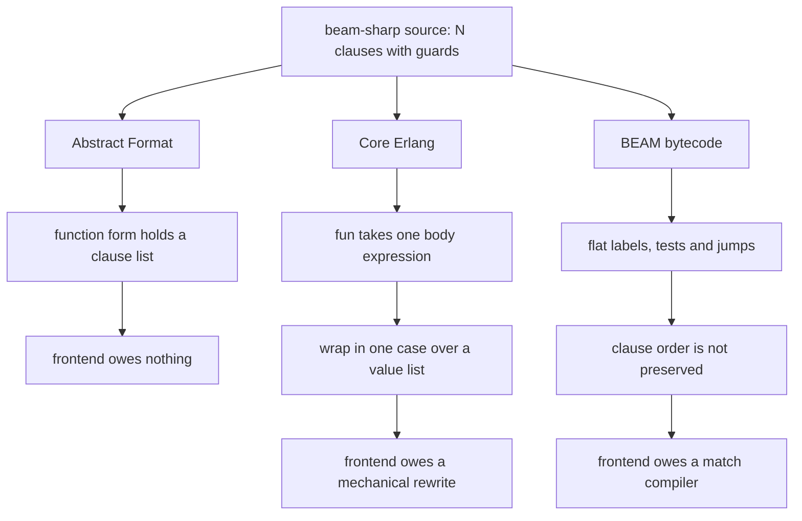

# 02 — Compilation targets: Core Erlang vs Abstract Format vs BEAM bytecode

Research for [ticket 02](../issues/02-compilation-targets.md) · 2026-08-11
Feeds ticket 13, where the decision is made. This file establishes facts, not the choice.

**Local rig for every empirical claim**: Erlang/OTP 28.5 (`erts-16.4`, `compiler-9.0.6`,
`stdlib-7.3`, `dialyzer-5.4`) at `/opt/homebrew/lib/erlang`. Where a claim is empirical the
command is given. Where a claim is documented the URL is given. Where a claim came from a
delegated search that I did not reproduce, it is labelled **[searched, not reproduced]**.

---

## The decisive answer, up front

> **Does the target form express multi-clause function heads with guards natively, or must
> the frontend merge clauses itself?**

The ticket poses this as a binary. The evidence does not support a binary — it supports
**three tiers**, and the middle tier is the one that matters, because Core Erlang lands in
it and a flat "no" would mislead ticket 13.

| Target | Multi-clause heads? | What the frontend owes |
|---|---|---|
| **Erlang Abstract Format** | **YES — natively.** A function *is* a list of clauses. | Nothing. Emit one `{clause,…}` per source clause. |
| **Core Erlang** | **NO at the function head — but YES for the underlying primitive.** `case` gives N clauses, each with a multi-pattern list *and* its own guard, tried in order. | A **mechanical wrapper**, not pattern-match compilation. One `fun` over fresh vars, one `case` over the value list, one clause each, order preserved. Plus synthesise the failure clause. |
| **BEAM bytecode** | **NO, at any level.** No clause construct exists in the instruction set. | A full pattern-match compiler: decision trees, `select_val`/`select_tuple_arity`, register allocation, fail-label wiring. |

The gap between tier 2 and tier 3 is the real cliff. The gap between tier 1 and tier 2 is a
tree rewrite of maybe fifty lines.



---

## 1. Erlang Abstract Format — native, unambiguously

A function form is `{function, ANNO, Name, Arity, [Rep(Fc_1), ..., Rep(Fc_k)]}` where each
`Fc` is a clause `(Ps) when Gs -> B`, represented as
`{clause, ANNO, [Rep(P_1), ..., Rep(P_n)], Rep(Gs), Rep(B)}`.
— [The Abstract Format, "Module Declarations and Forms" / "Clauses"](https://www.erlang.org/doc/apps/erts/absform.html)

A guard sequence `Gs` is itself a **list of lists**: the outer list is `;` (disjunction),
the inner list is `,` (conjunction) — so the format carries Erlang's full guard-sequence
structure, not a flattened boolean.

**Empirical** — `erlc +dabstr mc.erl` on a four-clause `classify/1` and a three-clause
`handle_call/3`:

```erlang
{function,{4,1},
          classify,1,
          [{clause,{4,1},
                   [{tuple,{4,10},[{atom,{4,11},ok},{var,{4,15},'N'}]}],
                   [[{call,{4,24},{atom,{4,24},is_integer},[{var,{4,35},'N'}]},
                     {op,{4,41},'>',{var,{4,39},'N'},{integer,{4,43},0}}]],
                   [{atom,{4,48},positive}]},
           {clause,{5,1},...},
           {clause,{6,1},...},
           {clause,{7,1},[{var,{7,10},'_Other'}],[],[{atom,{7,21},unknown}]}]}.
```

Four source clauses → four `{clause,…}` terms under **one** `{function,…}` form. Clause
order, per-clause patterns and per-clause guards all survive verbatim.

**You do not need an Erlang node to target it.** OTP documents two routes:
`compile:forms/2` with the terms directly, or writing the terms to a `.abstr` file and
running `compile:file(File, [from_abstr])` / `erlc File.abstr`
([`compile.erl` moduledoc](https://github.com/erlang/otp/blob/6fd122aa0b1b4dda9a189cd9a5718f2a622b042f/lib/compiler/src/compile.erl#L157-L200)).
`from_abstr` is present in the installed OTP 28 (`compiler-9.0.6/src/compile.erl:479`,
`:1463`, `:3029`). That matters for beam-sharp: an out-of-process frontend in any
implementation language can emit `.abstr` text and shell out to `erlc`. **I did not
establish which OTP release added `from_abstr`.**

---

## 2. Core Erlang — no clauses on the head, full clause dispatch one level down

### The grammar says one body per function

From the [Core Erlang 1.0.3 language specification](https://web.archive.org/web/20210308102218/https://www.it.uu.se/research/group/hipe/cerl/doc/core_erlang-1.0.3.pdf)
(Carlsson, Gustavsson, Johansson, Lindgren, Nyström, Pettersson, Virding; 26 Nov 2004),
grammar summary p.8:

```
Fun:      fun (v1, ..., vn) -> e            (n >= 0)
Case:     case e of AnnotatedClause1 ... AnnotatedClausen end   (n >= 1)
Clause:   Patterns Guard -> e
Patterns: p  |  <p1, ..., pn>               (n >= 0)
Guard:    when e
```

A `Fun` has **one** body expression `e`. Clauses appear only under `Case` (and `Receive`,
and `Try`'s variable lists). And §5.2 forecloses the obvious workaround of writing the same
name twice:

> "It is a compile-time error if the same function name a/i occurs on the left-hand side of
> two function definitions Dj, Dk, j≠k, in a ModuleBody D1···Dn."
> — spec §5.2, indexed as *"compile-time error: multiply defined function, 10, 11"*

The **implemented** grammar in OTP 28 agrees, and is the source that actually binds today
(`/opt/homebrew/lib/erlang/lib/compiler-9.0.6/src/core_parse.yrl`):

```erlang
function_definition -> anno_function_name '=' anno_fun : {'$1','$3'}.   % :135
fun_expr -> 'fun' '(' anno_variables ')' '->' anno_expression :
	#c_fun{vars='$3',body='$6'}.                                    % :377
case_expr -> 'case' anno_expression 'of' anno_clauses 'end' :
	#c_case{arg='$2',clauses='$4'}.                                 % :383
clause -> clause_pattern 'when' anno_expression '->' anno_expression :
	#c_clause{pats='$1',guard='$3',body='$5'}.                      % :396
clause_pattern -> '<' anno_patterns '>' : '$2'.                         % :401
```

`#c_fun{}` has `vars` and `body`. It has no `clauses` field. That is the answer.

### But the primitive you need is right there

A Core clause carries a **list** of patterns (`clause_pattern -> '<' anno_patterns '>'`)
and its own guard — spec §5.6: *"A Clause has the general form `<p1,...,pn> when e1 -> e2`,
where e1 is known as the guard and e2 as the body"* — and §6.6 defines selection as
left-to-right, first-match-wins over the switch value sequence `x1..xk`.

So the lowering is structure-preserving. The Erlang compiler does exactly this, and its own
output is the specification of the shape a frontend should emit. **Empirical** —
`erlc +to_core mc.erl`:

```erlang
'handle_call'/3 =
    fun (_0,_1,_2) ->
	  case <_0,_1,_2> of
	      <{'get',Key},_X_From,State>
		  when call 'erlang':'is_atom'(Key) -> {'reply',Key,State}
	      <{'put',K,V},_X_From,State> when 'true' -> {'reply','ok',[{K,V}|State]}
	      <'stop',_X_From,State> when 'true' -> {'stop','normal',State}
	      ( <_5,_4,_3> when 'true' ->
		    primop 'match_fail' ({'function_clause',_5,_4,_3})
		-| ['compiler_generated'] )
	    end
```

Three source clauses → three Core clauses, **in source order**, patterns intact, guards
intact. The recipe: `fun` over fresh vars `_0.._n`; `case` over the value list `<_0,..,_n>`;
one `#c_clause{}` per source clause; guard `'true'` where the source had none.

### The one thing the frontend must synthesise

The trailing `primop 'match_fail' ({'function_clause',...})` clause. Note that it appears
for `handle_call/3` but **not** for `classify/1` in the same compilation — because
`classify/1` ends in a catch-all `<_X_Other> when 'true'`, so the compiler knows the case is
exhaustive and omits it.

For beam-sharp this is close to free: [ticket 04](../issues/04-crossclause-exhaustiveness.md)'s
exhaustiveness checker already computes exactly the fact that decides whether to emit it.
The question it raises for ticket 12 is *what* to emit when the checker proves exhaustive —
nothing at all, or a defensive arm against untyped Erlang callers.

### Core is text-compilable

`erlc file.core` works — round trip verified: `erlc +to_core sp.erl && erlc -o fromcore
sp.core` produces a loadable beam. **But `%% Line N` in a `.core` file is a comment**,
emitted by `core_pp.erl` and discarded by the scanner. Source location in Core is an
*annotation*, `-| [Line, {file, Name}]`, in the exact shape
`beam_core_to_ssa.erl:3234-3250` destructures. See §5.

---

## 3. BEAM bytecode — nothing to inherit

There is no clause construct in the generic instruction set.
[`lib/compiler/src/genop.tab`](https://github.com/erlang/otp/blob/master/lib/compiler/src/genop.tab)
— 611 lines, the file-format contract for BEAM instructions — contains no instruction
mentioning clauses. What it has instead is `func_info/3` (opcode 2), `select_val/3`
(opcode 59) and `select_tuple_arity/3` (opcode 60): a failure landing pad and two jump
tables.

**Empirical** — `erlc -S mc.erl`, `classify/1`:

```erlang
{function, classify, 1, 2}.
  {label,1}.
    {line,[{location,"mc.erl",4}]}.
    {func_info,{atom,mc},{atom,classify},1}.
  {label,2}.
    {test,is_tuple,{f,6},[{x,0}]}.
    {test,test_arity,{f,6},[{x,0},2]}.
    {get_tuple_element,{x,0},0,{x,1}}.
    {get_tuple_element,{x,0},1,{x,0}}.
    {select_val,{x,1},{f,6},{list,[{atom,error},{f,5},{atom,ok},{f,3}]}}.
  {label,3}.
    {test,is_integer,{f,6},[{x,0}]}.
    {test,is_ge,{f,4},[{tr,{x,0},{t_integer,any}},{integer,1}]}.
    {move,{atom,positive},{x,0}}.
    return.
```

Four source clauses have become one flat instruction stream: a type test, an arity test, a
`select_val` jump table on the discriminating atom, and labels. **The `N > 0` guard has been
rewritten to `is_ge(N, 1)`** — an integer-range narrowing the frontend would have to
perform itself. And in `handle_call/3` the compiler **reordered the clauses**, emitting
`put` (label 9) before `get` (label 10). Nothing about clause order survives.

Targeting this means owning a pattern-match compiler. OTP's own view of the option is
blunt — see §4.

---

## 4. What OTP itself tells language implementors

The single most authoritative source in this file, and it is recent. OTP's
`compile.erl` moduledoc now carries a section titled **"Recommendations for Language
Implementors"**, naming exactly the four options and ranking them
([permalink, SHA `6fd122a`, 2026-05-21](https://github.com/erlang/otp/blob/6fd122aa0b1b4dda9a189cd9a5718f2a622b042f/lib/compiler/src/compile.erl#L157-L200)):

> **Erlang source code (`.erl` file)** … "the most straightforward and portable way. The
> main disadvantage is that it is hard or impossible to map each line of Erlang code back to
> the corresponding line in the original source file."
>
> **The abstract format** … "This format supports mapping every Erlang source line back to
> its corresponding line in the original source file."
>
> **Core Erlang**: "While there is a specification for Core Erlang, certain details are left
> to the implementation via the `primop` expression. Primops can be added, deleted, or
> changed in any major release without notice. Note that by generating Core Erlang directly,
> it is possible to construct code that the Core-to-BEAM backend has never encountered
> before, and there are no guarantees that the final BEAM code will be safe."
>
> **BEAM assembly code**: "Strongly discouraged, as it is very hard to get right and requires
> continuous maintenance. New instructions are typically introduced in each major release
> (and sometimes old ones are removed). In particular, note that BEAM code that does not
> follow the correct conventions can cause the runtime system to crash (segfault)."
>
> **"Our recommendation is to use either the abstract format or Erlang source code."**

**This section is guidance, not yet shipped doctrine.** It is absent at the `OTP-28.0` tag
and absent from the installed OTP 28.5 — verified by the delegated agent with
`curl -sL .../OTP-28.0/lib/compiler/src/compile.erl | grep -i "Recommendations for Language
Implementors"` returning no match, which I corroborate for the local install
(`grep` of `compiler-9.0.6/src/compile.erl` finds no such heading). Note also that beam-sharp
emits `primop 'match_fail'` under the Core option, and primops are precisely what OTP
reserves the right to change without notice.

---

## 5. Which target each existing BEAM language uses

Every row is from the project's own source or docs. No blog posts were used anywhere in
this file.

| Language | Target | Multi-clause in *its own* syntax | How it lowers them |
|---|---|---|---|
| **Gleam** | Erlang **source text** (`.erl`) | **No** | n/a — forces `case` in the source language |
| **LFE** | **Abstract Format** | Yes | N LFE clauses → N `{clause,…}` under one `{function,…}` |
| **Elixir** | **Abstract Format** | Yes | N Elixir clauses → N Erlang clauses under one function form |
| **Caramel** *(archived)* | Erlang **source text** | No (OCaml surface) | n/a |
| **purerl** | Erlang **source text** | Yes (PureScript equations) | `purs` desugars to CoreFn `Case` first; purerl emits **one** Erlang clause + `case` |
| **Hamler** *(dormant)* | **Core Erlang text** (`.core`) | Yes | desugared to CoreFn `Case`; emitted as one `FunDef` + `ECase` |
| **Alpaca** *(dormant)* | **Core Erlang terms** (`cerl:c_*`) | Yes | clauses collected as "versions", flattened into one `c_fun` + `c_case` |

Notable details:

- **Gleam has never emitted Core Erlang.** The widely-repeated "moved to Core Erlang and
  back" story is **refuted**: at tag `v0.1.0`, `gleam/src/project.rs` already did
  `format!("{}.erl", module.name)` with text-asserting tests
  ([v0.1.0 source](https://github.com/gleam-lang/gleam/blob/refs/tags/v0.1.0/gleam/src/project.rs)).
  The only Core Erlang trace in the whole history is a 2016 talk-notes commit that touched
  only `notes/talk.md`. Today: `compiler-core/src/codegen.rs` → `erlang::module(...)` →
  a `String`.
- **Gleam's stated reason** for not moving to the abstract format is testability, not
  capability: per [Discussion #3705](https://github.com/gleam-lang/gleam/discussions/3705),
  abstract format would give accurate stack-trace line numbers but is "not human readable so
  it is much harder to test and otherwise verify". *(Paraphrase-with-URL — the discussion is
  an SPA and was read via page summarisation, not raw text.)*
- **LFE did change target, Core Erlang → Abstract Format**, in
  [commit 81bd80f, 2018-01-21](https://github.com/lfe/lfe/commit/81bd80f05e27a5594a557964bc2d2c13a64214d5):
  *"Change compiler to translate LFE to erlang AST using lfe_trans. As Erlang doesn't have
  local functions we have to do the lambda lifting ourselves…"* The prior state is visible at
  [b986995](https://github.com/lfe/lfe/blob/b9869951669bad429d23678ea108420c2f779ae8/src/lfe_comp.erl):
  *"Purpose : Lisp Flavoured Erlang compiler (to core Erlang)"*, `from_core` in the options.
  A follow-up commit ([26f3066](https://github.com/lfe/lfe/commit/26f3066a197182203856105ddc9c965f30c77124))
  notes the payoff: *"Move handling of debug_info to erlang compiler. This is now easy as we
  generate erlang AST."* **No explicit "why we switched" design note exists** — only the
  costs and benefits recorded in commit messages.
- **The two languages still on Core Erlang are both inactive.** Hamler's last push was
  2022-02-03; Alpaca's 2020-06-13. Alpaca's own README lists under "What's Missing":
  *"annotations in the BEAM file output (source line numbers, etc)"* — the Core-target
  consequence, acknowledged and unfixed.
- **Do not misread the `from_core` calls in Elixir and LFE.** Both have `core_v1` branches
  (`elixir_erl.erl`, `lfe_abstract_code.erl`) — those are `debug_info` chunk callbacks
  converting stored abstract code → Core on demand, i.e. the Dialyzer path of §7. Both
  *emit* abstract format.
- **No project in the survey states a rationale for its target** except Gleam. For Elixir,
  Caramel, purerl, Hamler and Alpaca the delegated search found the *what*, never the *why*.

---

## 6. Guards

### The authoritative list, and the wording the ticket assumed

[Erlang Reference Manual, "Guard Sequences"](https://www.erlang.org/doc/system/expressions.html):
a guard sequence is guards separated by `;` (true if at least one is true); a guard is
guard expressions separated by `,` (true if all are true). Legal guard expressions are
variables, constants, term constructions, map updates, record expressions, the guard BIFs,
term comparisons, arithmetic, boolean expressions, and `andalso`/`orelse`.

The BIF set is exactly `erl_internal:guard_bif/2` — 41 entries, enumerated empirically:
`is_atom/1 is_binary/1 is_bitstring/1 is_boolean/1 is_float/1 is_function/1,2 is_integer/1
is_list/1 is_map/1 is_number/1 is_pid/1 is_port/1 is_record/2,3 is_reference/1 is_tuple/1
abs/1 bit_size/1 byte_size/1 ceil/1 element/2 float/1 floor/1 hd/1 is_map_key/2 length/1
map_get/2 map_size/1 max/2 min/2 node/0,1 round/1 self/0 size/1 tl/1 trunc/1 tuple_size/1
binary_part/2,3`.

**Correction to the ticket's framing.** The docs do *not* say a failing guard is "treated as
`false`". The actual sentence is:

> "If an arithmetic expression, a Boolean expression, a short-circuit expression, or a call
> to a guard BIF fails (because of invalid arguments), the entire guard fails. If the guard
> was part of a guard sequence, the next guard in the sequence (that is, the guard following
> the next semicolon) is evaluated."

Same operational effect, but there is no `false` value asserted anywhere.

### Core Erlang's `when` is strictly *wider* than Erlang's

From `compiler-9.0.6/src/core_lint.erl`, `gexpr/4` (lines 253–308):

| Construct | Erlang source guard | Core `when` | `core_lint.erl` |
|---|---|---|---|
| `case` inside a guard | illegal | **legal** | :302 |
| `let` inside a guard | illegal | **legal** | :270 |
| `primop` with any atom name | n/a | **legal** | :296 |
| `erlang:error/1` | illegal | **explicitly whitelisted** | :289–291 |
| protected `try … catch → 'false'` | implicit | explicit node | :298–301 |

Structural difference too: **Core has no guard *sequence***. Each `#c_clause{}` carries one
guard *expression*; the `;`/`,` structure is compiled into `erlang:and`/`or` calls or nested
cases. Visible in the `classify/1` dump above — `is_integer(N), N > 0` became
`let _1 = is_integer(N) in let _2 = N > 0 in erlang:and(_1,_2)`.

`core_lint` **runs unconditionally on `.core` input** (`compile.erl:1703-1707`,
`non_verified_core`), unlike the `.erl` path where it is opt-in (`:1709`, `{iff,clint0,…}`).
An illegal guard is caught, but the diagnostic is coarse:

```
$ erlc -o bg badguard.core
badguard: illegal guard expression in f/1
```

No line, no column — per-function only.

### Spec and implementation disagree on raising guards, and both halves matter

The **spec** (§6.7) says an exception propagates:

> "If the evaluation of a clause guard completes abruptly with exception (r,x), the
> containing expression (either case or receive) also completes abruptly with exception
> (r,x). … If a clause guard evaluates to a value other than 'true' or 'false', the
> behaviour is undefined."

**OTP's implementation is more forgiving for BIF failures.** Empirically, an unprotected
`when call 'erlang':'element'(1, X)` on a non-tuple simply fails the clause rather than
raising; the same held for `byte_size/1`, `binary_part/3`, `map_get/2`, `'+'/2` and
`length/1`. Fail-to-false is enforced by the *code generator* (guard ops become
`#cg_succeeded`-guarded SSA branching to the fail label), not by a `try` wrapper — which is
why `sys_core_fold` can strip the protected form that `v3_core` emits (`erlc +to_core0` shows
`try … catch <T,R> -> 'false'`; `erlc +to_core` shows the bare call).

**But `erlang:error/1` genuinely escapes** — the whitelist at `core_lint.erl:289-291`:

```
wide:h(x) = {'EXIT',{boom,[{wide,h,1,[]}]}}
```

So: "spec says propagate, OTP says false" is wrong as a summary. The accurate version is
*BIF argument failures fail the clause; an explicit `erlang:error/1` in a Core guard raises*.
A frontend that assumes uniform fail-to-false will be surprised by the second.

**Consequence for beam-sharp.** The Abstract Format gives native heads but confines guards to
`erl_internal:guard_bif/2` (enforced by `erl_lint`). If beam-sharp's guard language ever
exceeds Erlang's, the abstract format forces the excess into the clause body — partly
defeating the point of native heads. Core's wider `when` is the counterweight to everything
else in this file. That tension belongs to tickets 08 and 13.

*(Incidental Core syntax trap, worth recording: `<<>>` is not binary syntax in Core Erlang —
it scans as nested value lists and `gexpr` rejects it. Core binary syntax is `#{ }#`.)*

---

## 7. Tooling consequences

### Line numbers and stack traces

- **Abstract Format**: every node carries an `erl_anno:anno()`; the reported filename comes
  from `{attribute,ANNO,file,{Name,Line}}` forms
  ([absform](https://www.erlang.org/doc/apps/erts/absform.html)). Multiple `file` attributes
  in one form list interleave correctly — verified, two forms with different `file`
  attributes produced `{file,"first.src"},{line,11}` and `{file,"second.src"},{line,21}`.
  That matters for a frontend that inlines across source files.
- **Core Erlang**: location is an annotation in one exact shape,
  `beam_core_to_ssa.erl:3234-3250` — `line_anno([Line,{file,Name}])` and
  `line_anno([{Line,Column},{file,Name}])`. `-| [42]` alone is **not enough**; the
  `{file,_}` element is mandatory. With it, a foreign filename works:
  `-| [42,{'file',"mylang.src"}]` yields `{ann2,go,0,[{file,"mylang.src"},{line,42}]}`.
- **The default `.core` round trip loses everything.** Verified:
  ```
  direct .erl:  [{st,go,0,[{file,"st.erl"},{line,8}]}, ...]
  via .core:    [{st,go,0,[]}, ...]
  ```
  because `core_pp` writes `%% Line N` **comments**, which the scanner drops.
- **BEAM**: `beam_asm.erl:191-192` builds a `Line` chunk; instructions carry
  `{line,[{location,File,Line}]}` directly. Total fidelity, and you own the whole stream.

Net: **Abstract Format and Core Erlang have equal location fidelity; Erlang source text has
none.** The difference is that abstract-format location is documented and structural, while
Core location is an annotation convention you reverse-engineer from `beam_core_to_ssa.erl`.
OTP says as much itself in the §4 quote.

### Dialyzer — the sharpest single discriminator in this file

Dialyzer's IR *is* Core Erlang, but it **cannot read a `.core` file**. It reads BEAM files
via `debug_info`, or source (`dialyzer_utils.erl:141-152`, `get_core_from_beam`/
`get_core_from_src`). The `Dbgi` chunk holds **abstract code**, and Core is *derived* on
demand by re-running the compiler front half (`erl_abstract_code.erl:28-41`).

**Verified myself, and the failure is silent.** Compiling the same module both ways with
`+debug_info`:

| | `Dbgi` Data | `erlang_v1` | `core_v1` |
|---|---|---|---|
| from `.erl` | `{AbstrCode, Opts}` | `{ok,[...]}` | `{ok,{c_module,...}}` |
| from `.core` | **`{[], Opts}`** | `{ok,[]}` | **`{error,failed_conversion}`** |

```
$ dialyzer --no_check_plt --build_plt --output_plt /tmp/core_sp.plt fromcore/sp.beam
dialyzer: Analysis failed with error:
Could not scan the following file(s):
  Could not get Core Erlang code for: .../fromcore/sp.beam
```

`+debug_info` on a `.core` compile emits an **empty** abstract-code chunk and **no warning**.

There is a workaround — a custom `debug_info` backend answering `core_v1` with your own Core,
the route Elixir and LFE use — but it has a trap: `dialyzer_analysis_callgraph.erl:696-699`
`get_file/3` has clauses for `[{file,FakeFile}|_]` and `[_|Tail]` and **none for `[]`**, so a
Core call node without a `{file,_}` annotation crashes the analysis with a `function_clause`
rather than reporting a diagnostic. **[searched + delegated-empirical]** — I reproduced the
plain failure above, not the workaround.

### Hot code loading, observer, crash reports

Mostly convergent at the `.beam`, with a real exception list.

**Converges** (verified against beams built from `.core`): `code:load_file/1` →
`{module,…}`; `code:load_binary/3`; `module_info(compile)` reporting the `.core` source;
crash reports carrying the correct MFA. Process listings, message queues, `sys:get_state`,
supervision trees, logger formatting and hot upgrade are all downstream of the `.beam` and
target-independent.

**Does not converge** — tools that reach back for *abstract code specifically*:

- **Debugger** (`int:i/1`) — `debugger-6.0.3/src/int.erl:1037` calls
  `beam_lib:chunks(BeamBin, [abstract_code,exports])`.
  Empirically: `int:i("fromcore/…beam")` → `** Invalid beam file or no abstract code`.
- **cover** — `tools-4.1.4/src/cover.erl:2129-2137`. Empirically:
  `cover:compile_beam("fromcore/…beam")` → `{error,{no_file_attribute,…}}` vs `ok` from the
  `.erl`-derived beam.
- **observer** references `debug_info`/`abstract_code` for source viewing — **grep only,
  not verified empirically.**

### Stability across OTP releases

**Abstract Format.** No versioning or stability guarantee is documented — the absform
document contains no statement of which release it describes and no stability claim
**[searched at master and OTP-20.3, not reproduced by me]**. `compile.erl:479-481` on
`from_abstr` says only *"the format of such terms can change between releases"* — notably
*weaker* than the wording used for Core and asm, which adds "not documented". Real
incompatible changes are rare and old:

| Release | Change |
|---|---|
| R15B (stdlib 1.18) | representation of `fun M:F/A` changed **incompatibly** (OTP-9643) |
| OTP 18.0 (stdlib 2.5) | `erl_anno` introduced (OTP-12195); explicit parentheses in types removed (OTP-12492) |
| OTP 19.0 (stdlib 3.0) | `erl_parse` abstract-format types refined (OTP-10292) |

The OTP 21 `try … catch Class:Reason:Stk` change was **additive** — new productions, no new
node type, no arity change. *(One caution on doc trustworthiness: absform still said `LINE`
rather than `ANNO` through OTP 23, six releases after `erl_anno` shipped.)*

**Core Erlang.** OTP states outright that it is undocumented and unstable.
`compile.erl:489-491` (local, OTP 28.5), verbatim:

> "**`from_core`** - The input file is expected to be core code (default file suffix
> ".core"). Notice that the format of core files is **not documented**, and can change
> between releases."

Plus `cerl.erl`'s moduledoc: *"This module is an internal part of the compiler. Its API is
not guaranteed to remain compatible between releases."* Plus the primop warning in §4. The
local `core_parse.yrl` header comment carries no spec reference and no version number.

**Is "Core Erlang 1.0.3" still current, and does it match?** It is still the latest revision
— [announced 26 Nov 2004](http://erlang.org/pipermail/erlang-questions/2004-November/013621.html),
hosted by Uppsala University, **not an OTP artifact**. The archived PDF's
`Last-Modified` is `Fri, 26 Nov 2004 13:41:46 GMT`. It does **not** match what OTP emits:

- **Maps postdate it entirely.** `core_parse.yrl:199-203` has `~{ … }~` map syntax and it
  compiles — verified.
- **The grammar is still moving.** Master's `core_parse.yrl` carries
  `native_record_expr`/`native_record_pattern` nonterminals **absent from the local OTP 28.5
  grammar** (verified locally: `grep native_record` → no match; master side **[searched, not
  reproduced]**).

**And the pass that consumes your Core Erlang was replaced one release ago.** Verified
directly by me against the tags:

| | `v3_kernel.erl` | `beam_core_to_ssa.erl` |
|---|---|---|
| `OTP-26.0` | present (HTTP 200) | absent (404) |
| `OTP-27.0` | **absent (404)** | **present (200)** |

Kernel Erlang survived as an IR behind the SSA backend from OTP 22 to 26, then the entire
Core-to-BEAM backend was replaced in OTP 27. Earlier: `v3_codegen` removed in OTP 22.0, ten
`beam_ssa_*` passes appearing at once **[searched, not reproduced]**.

**BEAM file format / opcodes.** Better than its reputation, because of a deliberate design:

- `genop.tab` sets `BEAM_FORMAT_NUMBER=0` with the comment *"Generic instructions, generated
  by the compiler. If any of them change number, arity or semantics, the format number above
  must be bumped."* It is `0` at every tag checked, OTP-17.5 through master, and has never
  been bumped **[verified by me at master; tag history searched, not reproduced]**.
- **Two instruction sets.** `erts/emulator/beam/emu/ops.tab`: *"The instructions that follows
  are only known by the loader and the emulator. They can be changed without recompiling old
  Beam files."* The *generic* set is the file-format contract; the *specific* set churns
  freely.
- The compatibility window is a deliberately lagged max-opcode floor in `beam_load.c` —
  OTP 27 caps at `make_fun3` (OTP 24), OTP 28 at `bs_create_bin` (OTP 25), OTP 29 at
  `update_record` (OTP 26), OTP 30 at `executable_line` (OTP 27) **[searched, not
  reproduced]**.
- Stated policy, [system principles](https://www.erlang.org/doc/system/misc.html):
  *"Compiled code can be loaded on at least two subsequent releases… Loading on previous
  releases is not supported."* Note the asymmetry against distribution's ±2.

**OTP 28 chunk changes** (confirmed in the local install): the literal chunk is **no longer
compressed** (`beam_lib.erl:1265-1275`, *"Literals are not compressed in Erlang/OTP 28 and
later"* — release-noted as a potential incompatibility for tools reading it), and `AtU8`
gained a new encoding signalled by a **negative** atom count (`beam_asm.erl:295-306`). Both
are irrelevant if you go through `compile:*`; both bite anyone parsing beams by hand.

---

## 8. Does the target constrain the type system?

**All three targets are untyped term-level forms.** None of them can express beam-sharp's
set-theoretic types, and none of them needs to: type checking happens in the frontend,
before lowering, and what reaches the target is erased. In that narrow sense the answer is
"neutral" for all three.

**But the targets are not neutral about what a type checker can *interoperate* with**, and
that is the decision-relevant asymmetry. Verified myself on a module carrying
`-spec f(integer()) -> atom().`:

- **Abstract Format**: a spec is just `{attribute,ANNO,spec,…}` in the form list. It survives
  by construction, and `erlang_v1`/`core_v1` both resolve.
- **Core Erlang**: the `.core` text **does** carry the spec as a module attribute —
  `erlc +to_core` emits `'spec' = ...` in the `attributes` list. But it goes nowhere.
  Compiling that `.core` with `+debug_info`, the resulting beam's attributes chunk holds only
  `{vsn,…}`, `erlang_v1` returns `{ok,[]}`, and Dialyzer refuses the file outright (§7).

So the honest statement for ticket 13 is: **the target does not constrain beam-sharp's own
type system, but choosing Core Erlang forfeits the ability to publish types that Erlang-side
tooling can consume, unless you write a custom `debug_info` backend.** Given
[ticket 06](../issues/06-interop-surface.md) and the map's open question about *"runtime
behaviour against untyped callers"*, that forfeit is not free.

---

## 9. What could not be established

1. Which OTP release added the `from_abstr` option / `.abstr` file route.
2. Whether Gleam's 2016 pre-Rust prototype ever actually *emitted* Core Erlang. The "Core
   Erlang yo" commit touched only `notes/talk.md`; no prototype codegen was found.
3. Whether Elixir ever used a different target, and why it chose abstract format. Commit
   search found nothing; pre-1.0 history not exhaustively audited.
4. Any stated rationale for the target chosen by Elixir, Caramel, purerl, Hamler or Alpaca.
   Only Gleam has one.
5. Why LFE switched Core → AST. The commit messages record consequences, not the decision.
6. Any versioning or stability statement in the abstract-format documentation — reported
   **not found** at master and OTP-20.3; treat as "searched, not proven absent".
7. Whether **observer** specifically breaks on Core-derived beams (grep only, not executed).
8. BEAM-assembly (`from_asm`) line fidelity — not tested; only OTP's doc statement.
9. Whether `sys_core_fold`, `beam_ssa_opt` or `beam_validator` reject *other* classes of
   illegal guard that `core_lint` lets through.
10. Whether `BEAM_FORMAT_NUMBER` was ever non-zero before OTP 17.

**Sourcing hygiene.** No secondary sources (BEAM Book, blogs, Stack Overflow) were used. One
delegated claim was independently checked and found **wrong** — the absform doc URL was
reported as having no live replacement; the correct live URL is
`https://www.erlang.org/doc/apps/erts/absform.html` (HTTP 200). Delegated negatives elsewhere
carry matching uncertainty and are labelled.

---

## Claim → source

| # | Claim | Source | Kind |
|---|---|---|---|
| 1 | An Abstract Format function form holds a **list** of clauses: `{function,ANNO,Name,Arity,[Clause]}` | [absform](https://www.erlang.org/doc/apps/erts/absform.html) | doc |
| 2 | …and OTP 28 emits exactly that: 4 source clauses → 4 `{clause,…}` under one form | `erlc +dabstr mc.erl` | empirical, mine |
| 3 | Abstract Format guards are a list-of-lists carrying `;`/`,` structure | [absform](https://www.erlang.org/doc/apps/erts/absform.html) + `+dabstr` dump | doc + empirical |
| 4 | Core Erlang `Fun` takes **one** body expression: `fun (v1,…,vn) -> e` | [Core Erlang 1.0.3 spec, grammar p.8](https://web.archive.org/web/20210308102218/https://www.it.uu.se/research/group/hipe/cerl/doc/core_erlang-1.0.3.pdf) | spec |
| 5 | Duplicate `name/arity` in a Core ModuleBody is a compile-time error | Core Erlang 1.0.3 spec §5.2 | spec |
| 6 | OTP 28's implemented grammar agrees: `#c_fun{vars,body}`, no clauses field | `compiler-9.0.6/src/core_parse.yrl:135,377` | source |
| 7 | Core `case` clauses carry a multi-pattern list **and** a per-clause guard, tried in order | spec §5.6, §6.6; `core_parse.yrl:383,396,401` | spec + source |
| 8 | The Erlang compiler lowers N heads to one `fun` + one `case` over a value list, order preserved | `erlc +to_core mc.erl` | empirical, mine |
| 9 | The compiler synthesises `primop 'match_fail' ({'function_clause',…})` only when clauses are non-exhaustive | same dump: present for `handle_call/3`, absent for `classify/1` | empirical, mine |
| 10 | BEAM's generic instruction set has no clause construct; it has `func_info/3`, `select_val/3`, `select_tuple_arity/3` | [`genop.tab`](https://github.com/erlang/otp/blob/master/lib/compiler/src/genop.tab) (611 lines) | source |
| 11 | BEAM codegen rewrites guards (`N > 0` → `is_ge(N,1)`) and **reorders clauses** (`put` before `get`) | `erlc -S mc.erl` | empirical, mine |
| 12 | OTP recommends "either the abstract format or Erlang source code"; calls BEAM asm "strongly discouraged"; warns primops change without notice | [`compile.erl` @ `6fd122a`, L157-200](https://github.com/erlang/otp/blob/6fd122aa0b1b4dda9a189cd9a5718f2a622b042f/lib/compiler/src/compile.erl#L157-L200) | doc |
| 13 | …and that section is **not** in any release yet — absent at `OTP-28.0` and in local 28.5 | delegated `curl` at tag + local `grep` | searched + empirical |
| 14 | `from_abstr` / `.abstr` files let an out-of-process frontend target the Abstract Format | `compile.erl:479,1463,3029` (local); master moduledoc | source + doc |
| 15 | Gleam emits `.erl` source text and has **never** emitted Core Erlang | [`codegen.rs`](https://github.com/gleam-lang/gleam/blob/c6333e5bc463c60983712c2210e59e21b8315985/compiler-core/src/codegen.rs); [v0.1.0 `project.rs`](https://github.com/gleam-lang/gleam/blob/refs/tags/v0.1.0/gleam/src/project.rs) | source |
| 16 | Gleam's stated reason against abstract format is testability, not capability | [Discussion #3705](https://github.com/gleam-lang/gleam/discussions/3705) | doc (paraphrase) |
| 17 | Gleam does not support multiple function heads | [Gleam for Erlang users](https://gleam.run/cheatsheets/gleam-for-erlang-users/) | doc |
| 18 | LFE emits Abstract Format (`{function,L,N,Arity,Clauses}`) | [`lfe_codegen.erl:429`](https://github.com/lfe/lfe/blob/38150ec10107d5e5bbcd478261de0919830cae33/src/lfe_codegen.erl#L429) | source |
| 19 | LFE switched Core Erlang → Abstract Format in Jan 2018 | [81bd80f](https://github.com/lfe/lfe/commit/81bd80f05e27a5594a557964bc2d2c13a64214d5); prior state [b986995](https://github.com/lfe/lfe/blob/b9869951669bad429d23678ea108420c2f779ae8/src/lfe_comp.erl) | source |
| 20 | Elixir emits Abstract Format via `compile:noenv_forms` | [`elixir_erl_pass.erl`](https://github.com/elixir-lang/elixir/blob/024beb1bfcca0a24e859b2586059dd803a086615/lib/elixir/src/elixir_erl_pass.erl), [`elixir_erl.erl`](https://github.com/elixir-lang/elixir/blob/024beb1bfcca0a24e859b2586059dd803a086615/lib/elixir/src/elixir_erl.erl) | source |
| 21 | Caramel emits `.erl` source text; its `Core_erlang` target is unreachable from the CLI; repo archived, last push 2023-09-25 | [architecture.md](https://github.com/AbstractMachinesLab/caramel/blob/690f1097f87923e193d4bf0c1cc31cccb6eae76a/manual/src/contrib/architecture.md), [`cmd_compile.ml`](https://github.com/AbstractMachinesLab/caramel/blob/690f1097f87923e193d4bf0c1cc31cccb6eae76a/caramel/bin/cmd_compile.ml) | source |
| 22 | purerl emits `.erl` source text; PureScript's multi-equation heads are pre-desugared to CoreFn `Case` | [purerl README](https://github.com/purerl/purerl/blob/abe9d99b8db40d2f925466b01e0da576900dc100/README.md); [PureScript pattern matching](https://github.com/purescript/documentation/blob/master/language/Pattern-Matching.md) | doc |
| 23 | Hamler emits Core Erlang **text** and shells out to `erlc`; dormant since 2022-02-03 | [`CodeGen.hs`](https://github.com/hamler-lang/hamler/blob/97e1e2f09c2c6e8ac5c7eb2637596dfceab3b788/src/Language/Hamler/CodeGen.hs), `Make/Actions.hs:157-160` | source |
| 24 | Alpaca emits Core Erlang **terms** via `cerl:c_*`, flattening clauses into one `c_fun` + `c_case`; dormant since 2020-06-13 | [`alpaca_codegen.erl`](https://github.com/alpaca-lang/alpaca/blob/aa2bb5594dda8292ca0bffb8e8a6ebc0f60e8dbc/src/alpaca_codegen.erl) | source |
| 25 | Legal guard expressions and the 41 guard BIFs | [ERM, Guard Sequences](https://www.erlang.org/doc/system/expressions.html); `erl_internal:guard_bif/2` | doc + empirical |
| 26 | The docs say "the entire guard fails", **not** that it is treated as `false` | [ERM, Guard Sequences](https://www.erlang.org/doc/system/expressions.html) | doc |
| 27 | Core's `when` is strictly wider than Erlang's: `case`, `let`, `primop`, whitelisted `erlang:error/1` | `compiler-9.0.6/src/core_lint.erl:253-308` | source |
| 28 | Core has no guard *sequence*; `;`/`,` become `erlang:and`/`or` | `erlc +to_core` dump | empirical, mine |
| 29 | `core_lint` runs unconditionally on `.core` input; errors are per-function, no line info | `compile.erl:1703-1709`; `erlc -o bg badguard.core` | source + empirical |
| 30 | Spec §6.7 says a raising guard propagates the exception | Core Erlang 1.0.3 spec §6.7 | spec |
| 31 | …but OTP makes BIF argument failures fail the clause, while `erlang:error/1` genuinely escapes | delegated experiments over 5 guard BIFs + `wide.core` → `{'EXIT',{boom,…}}` | empirical, delegated |
| 32 | Core line info is an annotation `[Line,{file,Name}]`; `%% Line N` is a discarded comment | `beam_core_to_ssa.erl:3234-3250`; `core_pp.erl:72` | source |
| 33 | The default `.core` round trip loses all stack-trace locations | `erlc +to_core` then `erlc *.core`, compare stacktraces | empirical, delegated |
| 34 | Dialyzer reads BEAM `debug_info` or source; it cannot read a `.core` file | `dialyzer-5.4/src/dialyzer_utils.erl:141-152` | source |
| 35 | `Dbgi` holds abstract code; Core is derived on demand | `beam_lib` docs; `erl_abstract_code.erl:28-41` | doc + source |
| 36 | Compiling from `.core` with `+debug_info` yields an **empty** abstract chunk, `core_v1` → `failed_conversion`, and Dialyzer refuses — silently | `erlc +debug_info -o fromcore sp.core`; `beam_lib:chunks/2`; `dialyzer --build_plt` | empirical, mine |
| 37 | Debugger (`int:i/1`) and cover need abstract code and fail on Core-built beams | `int.erl:1037`, `cover.erl:2129-2137`; both reproduced | source + empirical, delegated |
| 38 | Hot code loading, crash-report MFAs, `module_info` and supervision tooling converge at the `.beam` | `code:load_file/1`, `code:load_binary/3` on Core-built beams | empirical, delegated |
| 39 | OTP says the Core file format is "not documented, and can change between releases" | `compiler-9.0.6/src/compile.erl:489-491` | doc |
| 40 | `cerl` is "an internal part of the compiler… not guaranteed to remain compatible" | `cerl.erl` moduledoc | doc |
| 41 | The Core Erlang 1.0.3 spec is from 2004, hosted by Uppsala, not OTP | [erlang-questions announcement](http://erlang.org/pipermail/erlang-questions/2004-November/013621.html); PDF `Last-Modified: 26 Nov 2004` | primary |
| 42 | The spec no longer matches the implementation — maps (`~{ }~`) postdate it and compile | `core_parse.yrl:199-203`; `erlc mapcore.core` | source + empirical |
| 43 | The Core-to-BEAM backend was wholesale replaced at OTP 27: `v3_kernel` out, `beam_core_to_ssa` in | `curl -sI` on `OTP-26.0` vs `OTP-27.0` raw paths (200/404 flip both ways) | empirical, mine |
| 44 | `BEAM_FORMAT_NUMBER=0`, never bumped; generic vs specific instruction sets buy the compatibility window | [`genop.tab:22`](https://github.com/erlang/otp/blob/master/lib/compiler/src/genop.tab); `erts/emulator/beam/emu/ops.tab` | source |
| 45 | Compiled BEAM code loads on "at least two subsequent releases"; loading on previous releases unsupported | [system principles](https://www.erlang.org/doc/system/misc.html) | doc |
| 46 | OTP 28 stopped compressing the literal chunk and changed `AtU8` encoding | `beam_lib.erl:1265-1275`; `beam_asm.erl:295-306` (local 28.5) | source |
| 47 | All three targets are untyped; a `-spec` survives the Abstract Format path but is lost through `.core` | `sp.erl` compiled both ways; attributes chunk holds only `{vsn,…}` from the Core path | empirical, mine |
