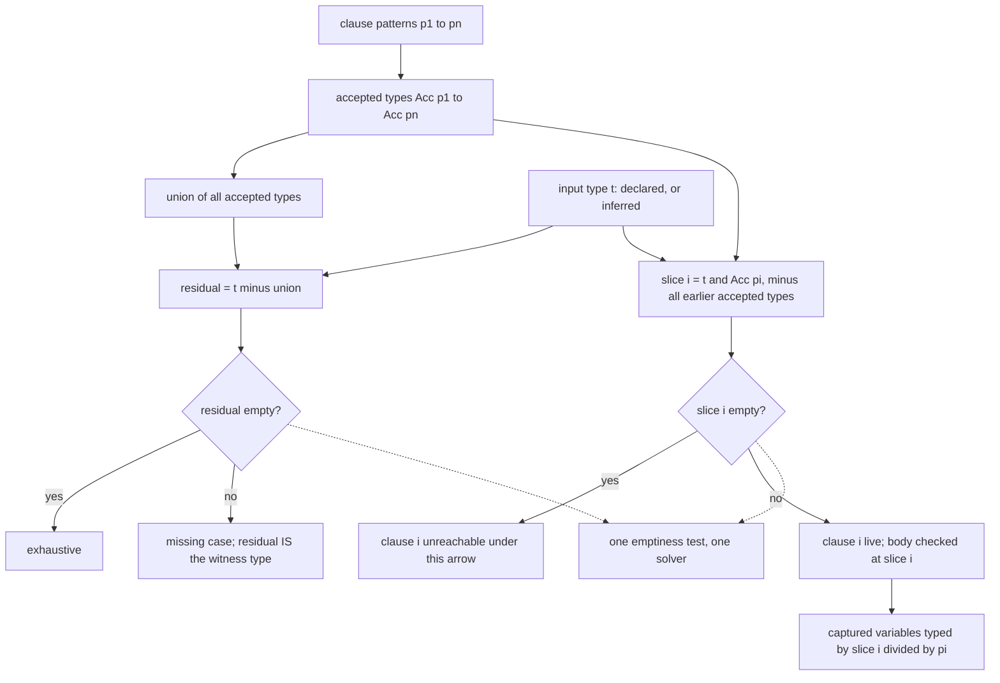

# 04 — Cross-clause exhaustiveness with set-theoretic types

Research for [ticket 04](../issues/04-crossclause-exhaustiveness.md) · 2026-08-11
Primary sources: **CDuce** (Frisch's thesis, ICFP'03, the CDuce manual and compiler source),
**Castagna's semantic subtyping** line (JACM'08, the "gentle introduction", POPL'14/'15,
POPL'24), the **Elixir type system papers** (CDV24 and its 2026 formal companion CD26), and
the **shipped Elixir v1.20** compiler, docs and changelog.

---

## 0. What this ticket found

**The arithmetic works, and it is simpler than expected.** Exhaustiveness and redundancy are
*the same operation* — an emptiness test on a difference type — run against two different
inputs. Semantic subtyping is built such that `s ≤ t` is *defined* as `s ∧ ¬t ≃ 0`
([21]), so there is one solver and two queries. CDuce has shipped this since
2003, complete with a residual type and a **sample counter-value** printed in the error
([22], [23]). This is not a research risk. It is a
solved-and-shipped mechanism.

Four findings dominate, and three of them are corrections.

1. **Exhaustiveness is only a well-posed question against a *declared* input type.**
   Redundancy is *relative* (clause `i` against clauses `j < i`); exhaustiveness is
   *absolute* (the union of all clauses against a domain someone must hand you). CDuce can
   ask it because its functions carry a mandatory interface and it checks
   `t_k ≤ Acc(p₁)|…|Acc(pₙ)` **once per arrow** of that interface ([34]).
   Elixir's shipped checker cannot, because it has no signatures at all — for a multi-clause
   `def` it *builds* the function type as `⋀ᵢⱼ(tᵢⱼ → t'ᵢⱼ)` from the clauses themselves
   ([30]), which makes "do the clauses cover the domain?" true by
   construction. **For beam-sharp this is the load-bearing consequence: the headline feature
   requires declared function domains. Inference alone does not give you cross-clause
   exhaustiveness — it makes the question vacuous.** Feeds tickets 09, 11, 12.

2. **Elixir v1.20 does *not* check exhaustiveness today, and the literature invites you to
   believe it does.** CDV24 §3.2 shows a warning reading *"this function definition is not
   exhaustive"* with the missing type computed ([27]) — that is the design,
   demonstrated on a prototype built over the CDuce type library, with a *declared* input
   type `result()`. The shipped compiler ships **redundancy only**: the v1.20 changelog entry
   is `[Kernel] Detect and warn on redundant clauses`, with no exhaustiveness entry
   ([37]), the source carries the comment *"The mode may also control
   exhaustiveness checks in the future (to be decided)"* ([38]), and five
   non-exhaustive constructions compiled silently on v1.20.1 — including a `case` on a
   scrutinee with the precise static type `binary()` ([39]). That last one is
   *not* explained away by the missing-signature argument: exhaustiveness is well-posed there
   and still is not checked. It is an implementation decision, not a structural limit.

3. **Redundancy is not a compositional property, and a checker that treats it as an error
   breaks overloading.** With intersection-typed functions the body is re-checked once per
   arrow, so a clause dead under one arrow is live under another. CD26 states it flatly:
   attainability *"cannot be decided locally… a global property, not expressible in a
   compositional system"* ([55]). Both implementations therefore accumulate
   liveness across all arrows and warn post-hoc if a branch was never live under any of them
   ([52], [55]). CDuce's `fun (Int -> Int; String -> String)`
   example is the counterexample to the naive rule ([32]).

4. **"Set-theoretic subtyping is EXPTIME-complete" is citation drift.** EXPTIME-completeness
   is *proven* for regular-expression tree types **without arrows**, by reduction to tree
   automata inclusion ([61]). A `2^O(n)` upper bound is *proven*, but for
   Gesbert et al.'s μ-calculus **encoding**, not for CDuce's algorithm ([62]).
   Frisch says outright that the complexity of the algorithms in his thesis was never studied
   and that, since types are alternating tree automata *with complement*, one should expect a
   **larger** theoretical lower bound ([64]). No complexity bound for the
   tallying problem appears in any source reached ([80]). Cite the specific
   result, not the folklore.

---

## 1. The mechanism, end to end



Read the two diamonds as the whole answer. `residual empty?` is exhaustiveness;
`slice i empty?` is redundancy; the subtraction inside `slice i` is where first-match-wins
ordering lives. Both reduce to the same emptiness query ([21]).

**Notation.** I write `Acc(p)` for the accepted type of a pattern and `t / p` for the type
environment it produces. Neither is the sources' notation: Frisch's thesis and ICFP'03 use
stmaryrd bag delimiters, `⟅p⟆` and `t /// p` ([2]). The `⌊p⌋` form the ticket
used appears in neither. CD26 additionally distinguishes a *potentially* accepted type `⌊pg⌉`
from a *surely* accepted type `⌈pg⌋` once guards are involved ([16]) — that
distinction is real and load-bearing, and I keep the paper's brackets for it.

---

## 2. How a pattern becomes a type

### 2.1 CDuce: the accepted type

CDuce's pattern algebra is deliberately tiny ([1]):

```
p ::= x                  variable (capture)
    | t                  a type — the type-test pattern
    | (q1, q2)           pair; components are pattern NODES, not patterns
    | p1 | p2            alternative, first-match
    | p1 & p2            conjunction
    | (x := c)           default value
```

Pair components are *nodes*, and that is the only place a node may appear — which is exactly
what makes recursive patterns well-founded, because every recursion cycle must cross a
product constructor ([1]). There is **no arrow pattern**: functional types
have no counterpart in patterns, and the compiler rejects type variables in patterns
outright ([1]).

The accepted type is then defined by six equations ([2]):

```
Acc(x)        = 1                          -- Any
Acc(t)        = t
Acc((q1,q2))  = Acc(q1) × Acc(q2)
Acc(p1 | p2)  = Acc(p1) ∨ Acc(p2)
Acc(p1 & p2)  = Acc(p1) ∧ Acc(p2)
Acc((x := c)) = 1
```

Now the translations the ticket asked for, mechanically:

| Pattern | Becomes |
|---|---|
| **Literal** `42`, `'a'`, `` `nil `` | The **singleton type**, via `Acc(t) = t`. Scalar constants are not a separate case — they *are* type-test patterns at a singleton type ([3]). `_` is likewise just another notation for `Any`. |
| **Tuple / pair** `(p1, p2)` | `Acc(p1) × Acc(p2)`. The product distributes over unions, so `(Int\|Bool, t)` and `(Int,t)\|(Bool,t)` are the same type. n-ary tuples are nested pairs in CDuce; Elixir needed a genuine n-ary constructor (§2.2). |
| **Record / map** `{l1=q1; …; _=q0}` | A **cofinite** map from labels to pattern nodes: `Acc(r) = {l1 = Acc(q1); …; _ = Acc(q0)}`. Open vs closed is the catch-all field. Well-formedness forbids a variable appearing under two labels, and forbids the catch-all node from capturing at all — it may only perform a type test ([4]). |
| **List / sequence** | **Not primitive.** Regexp patterns desugar to recursive pair patterns by a translation `Ψ[R; p1; p2]` carrying *two* continuations — one for "R consumed at least one element", one for "R consumed none". The second continuation exists solely to eliminate ε-transition cycles when `R` accepts the empty sequence ([5]). Recursive patterns are then handled by their infinite unfolding, which regularity keeps to a finite system of equations ([6]). |
| **Type test** `x :: T` / `x & T` | `Acc(t) = t` conjoined with the capture. Note `[x & Int]` and `[x :: Int]` both accept a one-integer sequence, but the first binds the *integer* and the second binds the *sequence* ([5]). |
| **`&` / `\|` combinators** | Intersection and union of accepted types. `\|` is first-match, and — importantly — that is encoded in the *type* operator, not only at runtime (§2.3). |
| **Constructor (nominal)** | **Does not exist.** There is no nominal constructor pattern in CDuce or in either Elixir paper. A tagged tuple `{:ok, v}` is just a tuple whose first component is a singleton atom type. Elixir structs are described as *"named and statically-defined closed record types"*, and annotating them is planned for v1.21, not shipped ([18]). BEAM data carries no nominal identity, so the structural reading is forced — which is precisely the nominal-vs-structural tension ticket 00 deferred to [ticket 09](../issues/09-union-representation.md). |

### 2.2 Elixir's departures

Elixir needed the framework *modified*, and the papers say so directly: *"There are however
several key specific characteristics of Elixir that require the semantic subtyping framework
to be modified, improved, and/or extended"* ([10]). CD26 enumerates five
novelties missing from CDuce: strong function typing, dynamic propagation, guard analysis,
multi-arity functions, and inference for anonymous functions ([10]).

- **Atoms** are singleton types, represented in the implementation as a finite-or-cofinite
  set — `{:union, {a₁…aₙ}}` or `{:minus, …}` ([10]).
- **Integers are indivisible in the implementation.** Integer singletons exist in the
  formal calculus but not in the compiler: *"every representable type in Elixir either
  contains all integer values or none"* ([90]), and there is *"no plan to
  support subsets of the `integer()` type such as positive, ranges or literals"*
  ([49]).
- **Tuples** are a genuine n-ary constructor with an open/closed flag (`{τ, ..}`), because
  CDuce's pair encoding cannot express "all binary functions" — `{none(),none()} -> term()`
  collapses to `none() -> term()` ([11]). Consequently **intersections of
  different arities are empty** ([28]), and arity is part of function
  identity — which is exactly the constraint the map already flags for BEAM function naming.
- **Maps** get required/optional keys plus an open marker: `%{age: integer(), ...}` is
  sugar for `%{required(:age) => integer(), optional(term()) => term()}`
  ([12]). Underneath, records are quasi-constant functions with a **default
  field**, so open vs closed is not a separate concept — a closed record is `⇒ 0`, an open
  one `⇒ 1` ([13]). Non-singleton key *domains* must not overlap, and the
  reason is a nice illustration of why set-theoretic types force honesty: checking each map
  type individually is not enough, because `{{1..*⇒Int}}` and `{{*..5⇒Bool}}` are each fine
  but their **intersection** is the problematic type ([14]). Typespec's
  "leftmost field wins" rule for overlapping domains is explicitly rejected as incompatible
  with an approach that *"disregards the order of the fields"* ([15]).
- **Guards become types.** The headline novelty: *"it can precisely express (most) guards in
  terms of types, in the sense that the set of values that satisfy a guard (e.g.,
  `is_integer(person.age)`) is the set of values that belong to a given type"*
  ([16]). Where exactness fails, two approximations bracket it: the
  *potentially* accepted type `⌊pg⌉` (over-approximation) and the *surely* accepted type
  `⌈pg⌋` (under-approximation). Measured exactness on real code: **64.44%** of
  guard/pattern pairs on six core codebases, **86.07%** on a wider open-source set
  ([50]).

**Three negative findings, stated because they are gaps beam-sharp inherits:**
binary/bitstring patterns (`<<>>`, with size/unit/segment typing) appear **nowhere** in
either Elixir paper; "improper" list occurs **zero** times; and lists are not a constructor
in Core/Featherweight Elixir at all — `[a]` and `list()` appear only in surface examples
([17]). The implementation's worst guard-exactness outlier (Postgrex, 34.83%)
traces directly to list-head patterns not being treated as exact ([50]). For
a BEAM-targeting language, binaries are a first-class idiom and this is untheorised ground.

### 2.3 The dual: what a pattern *produces*

Exhaustiveness gets the attention, but the operator that makes clause bodies checkable is the
other one — `t / p`, the type environment. Semantically, `(t/p)(x)` is the set of values `x`
can capture when a value of type `t` is matched against `p` ([7]):

```
(t / x)(x)         = t
(t / (q1,q2))(x)   = (π1[t] / q1)(x)                    if x only in q1
                   = (π2[t] / q2)(x)                    if x only in q2
                   = ⋃ over products (t1/q1)(x) × (t2/q2)(x)   if x in both
(t / (p1|p2))(x)   = ((t ∧ Acc(p1)) / p1)(x)  ∪  ((t \ Acc(p1)) / p2)(x)
(t / (p1&p2))(x)   = (t / p1)(x) or (t / p2)(x), whichever binds x
```

Look at the alternative case: the second branch is typed against `t \ Acc(p1)`, **not** `t`.
First-match-wins is baked into the type-level operator, not bolted on at runtime
([8]). That is the same subtraction that reappears one level up as clause
ordering (§3), and it is the single idea that makes ordered BEAM clauses tractable
set-theoretically.

This is **exact**, not approximate: *"pattern matching has exact type inference, in the sense
that the typing algorithm assigns to each capture variable exactly the set of all values it
may capture"* ([9]). Worked, for `P = ((x & Int), P) | (_, P) | (x := nil)`:

| `t` | `(t/P)(x)` |
|---|---|
| `[Int String Int]` | `[Int Int]` |
| `[Int \| String]` | `[Int?]` |
| `[Int* String Int]` | `[Int+]` |
| `[(Int String)+]` | `[Int+]` |

---

## 3. How clause domains combine, and the actual operation

### 3.1 CDuce's rule

For branches `B = p₁->e₁ | … | pₙ->eₙ` matched against a value of type `t`
([19]):

```
    t ≤ Acc(p₁) | … | Acc(pₙ)
    tᵢ = (t \ Acc(p₁) \ … \ Acc(pᵢ₋₁)) ∧ Acc(pᵢ)
    Γ, (tᵢ / pᵢ) ⊢ eᵢ : sᵢ
    ───────────────────────────────────────────
    Γ ⊢ t/B ⇒ ⋃ { sᵢ | tᵢ ≄ Empty }
```

The left premise *is* exhaustiveness: *"The exhaustivity condition states that every value
that belongs to `t` must be accepted by some pattern"* ([19]). The manual
phrases it as a subtyping check: *"the type computed for `e` must be a subtype of the union
of the types accepted by all the patterns"* ([20]).

Note the scope limit, which is a language-design choice rather than a theory one: CDuce
checks exhaustiveness *"in functions, match, and map expressions, but not for transform and
xtransform for which a default branch returning the empty sequence is always defined"*
([24]). Give a construct a total default and the obligation disappears.

### 3.2 Subtyping check or emptiness check? Both — they are the same query

This is the mechanical answer the ticket asked for. In semantic subtyping, subtyping is
*defined* by emptiness ([21]):

```
s ≤ t  ⟺  ⟦s⟧ ⊆ ⟦t⟧  ⟺  ⟦s⟧ ∩ ⟦t⟧ᶜ = ∅  ⟺  ⟦s ∧ ¬t⟧ = ∅  ⟺  s \ t ≃ 0
```

The JACM paper names this identity as one of the three pillars of the decidability proof,
alongside regularity of types and the algebraic properties of universal models
([21]). So `t ≤ Acc(p₁)|…|Acc(pₙ)` and `t \ (Acc(p₁)|…|Acc(pₙ)) ≃ 0` are
literally the same call into the same solver.

**The implementation picks the difference form, and the reason is diagnostics.** CDuce's
typer computes the residual and carries it in the exception ([22]):

```ocaml
let acc = a.fun_body.br_accept in                    (* Acc(p1) | ... | Acc(pn) *)
if not (Types.subtype t1 acc) then
  raise_loc loc (NonExhaustive (Types.diff t1 acc));
```

and the driver prints the residual type *plus a synthesised sample value* — the missing case,
as data ([22]):

```
Error at chars 228-298:
fun name (Person -> String)
| <person gender = "F">[ n ;_] -> n
This pattern matching is not exhaustive
Residual type:
<person gender = [ 'M' ]>[ Name Children ]
Sample:
<person {| gender = [ 'M' ] |}>[ <name {| |}>[ ] <children {| |}>[ ] ]
```

Elixir does the same in its design: the warning *computes the exact type whose implementation
is missing* ([27]):

```
this function definition is not exhaustive.
there is no implementation for values of type:
%{output: :error, message: {:delay, integer()}}
```

> *"the type checker is able to compute the exact type whose implementation is missing, which
> enables fast refactoring since, as the type of `result()` or the implementation of `handle`
> are modified, the type checker will issue precise new warnings"* — CDV24 §3.2

**Design note for beam-sharp:** the error message is free. If you compute the residual rather
than asking a boolean subtyping question, the missing case *is* the residual, and a witness
value can be sampled from it. That is a materially better diagnostic than "non-exhaustive
patterns" and it costs nothing extra.

### 3.3 Elixir's three-way verdict, and where guards make it interesting

Guards blur the boundary, so CD26 splits the outcome three ways ([25]):

> *"If the domain of the function is contained in the union of the **surely accepted** types
> of all the clauses, then the definition is **exhaustive**… If, instead, it is contained
> only in the union of the **possibly accepted** types, then the definition **may not be
> exhaustive, and a warning is emitted**… In all the other cases, the definition is
> considered **ill-typed**."*

The per-clause slice with guards is ([26]):

```
tᵢ = (t ∧ ⌊pᵢgᵢ⌉) \ ⋁_{j<i} ⌈pⱼgⱼ⌋
```

Note the asymmetry, and it is the right one: intersect with the **potentially** accepted type
(you might reach this clause), subtract only the **surely** accepted types of earlier clauses
(only definitely-consumed values are gone). Approximation errs toward keeping clauses alive.

**Where the domain `t` comes from is the crux.** Multi-clause definitions are equivalent to,
and compiled as, a `case` ([29]). Without an annotation, the inferred
function type is `⋀ᵢⱼ(tᵢⱼ → t'ᵢⱼ)` where the `tᵢⱼ` come from the guard analysis' OR-clause
partition — so one clause can contribute several arrows ([30]). The domain
operator on such a type is *"the domain of an intersection of arrows is the union of the
domains of the arrows… and the domain of a union is the intersection of the domains"*
([28]). Union of clause domains against a domain defined as the union of
clause domains: vacuous. **The check only bites against an independently declared `t`.**

---

## 4. CDuce's overloaded function types — the closest precedent

This is the founding use case, and it is worth reading the rule literally
([31]):

```
    t = t₁->s₁ & … & tₙ->sₙ        Γ, f:t ⊢ tᵢ/B ⇒ uᵢ ≤ sᵢ
    ────────────────────────────────────────────────────────
    Γ ⊢ fun f (t₁->s₁; … ; tₙ->sₙ) B : t
```

**What is checked:** the body `B` is type-checked **once per arrow** in the interface. Each
re-check re-runs the whole §3.1 machinery at `t := tᵢ` — so the exhaustiveness premise, the
per-clause slices `tⱼ`, the set of live clauses, and the types of the captured variables are
**all recomputed per arrow**. The manual says it plainly: *"The type system ensures this
property by type-checking the body once for each constraint"*, and adds that *"it is always
possible to add a line `x -> match x with` between the interface and the body without
changing the semantics"* ([33]) — the multi-clause head *is* a match, exactly
as in Elixir.

The compiler's fold makes the per-arrow exhaustiveness check unmistakable — `t1 ≤ br_accept`
is tested separately for each `(t1,t2)` in `fun_iface` ([34]).

**The worked example, and the reason unused branches must not be errors** ([32]):

```
fun (Int -> Int; String -> String)
  | Int          -> 42
  | (x & String) -> x
```

> *"When type-checking the body for the constraint `String -> String`, the first branch is
> not used, and even though its return type is not empty (it is `42`…), it must not be taken
> into account to check the constraint. This is not a minor point: not considering the return
> type of unused branches is **the main difference between dynamic overloading and type-case**.
> The latter always returns the union of the result types of all the branches and, as such,
> is not able to discriminate different input types."*

That sentence is the whole value proposition of this shape. A type-case returns
`Int | String` for both inputs; an overloaded function returns `Int` for `Int` and `String`
for `String`. If beam-sharp wants multi-clause heads to *mean* something to the type system
beyond a compact `switch`, this is the mechanism that buys it — and the price is
type-checking each body once per declared arrow.

The core calculus makes the same point in one sentence: discarding unattainable branches is
*"a key feature for typing overloaded functions, where the body is repeatedly checked under
different hypothesis for some of which the `sᵢ` of some typecase may be empty"*
([35]).

The rule is slightly more permissive than plain intersection: one may take `t` strictly
smaller than the intersection, dropping any finite number of arrows provided `t` stays
non-empty ([36]). And from the programmer's side the story stays simple:
*"it is simply the intersection of all the types specified in its interface"*
([31]).

---

## 5. Elixir v1.20 — shipped versus roadmap

### 5.1 What actually warns today

Three warnings, all in the redundancy family, none in the exhaustiveness family. Verbatim
from a v1.20.1 run ([40]):

**(a) Clause never matches — pattern incompatible with the inferred scrutinee type.**

```
warning: the following clause will never match:

    :error ->

because it attempts to match on the result of:

    Atom.to_string(x)

which has type:

    binary()
```

**(b) Clause shadowed — earlier clauses already matched everything.** Note this is the
*dual* of exhaustiveness, not exhaustiveness itself:

```
warning: the following clause cannot match because the previous clauses already matched all possible values:
```

**(c) Redundant `def` clause**, and the message shows `previous` as a *list of tuples*, so
partial coverage is tracked per argument ([40]):

```
warning: the following clause is redundant:

    def redundant_fun(x) when is_integer(x)

previous clauses have already matched on the following types:

    integer(), term()
    term(), integer()
```

Also shipped: incompatible arguments to a call, `badmatch` on `=`, incompatible assignment,
and always-true/always-false conditionals ([40]).

**Not shipped: any exhaustiveness warning.** Five constructions compiled silently, including
one whose scrutinee has a precise static type ([39]):

```elixir
def partial_binary(x) do
  case Atom.to_string(x) do   # scrutinee type is precisely binary()
    "a" -> 1                   # NO WARNING
  end
end

def partial_atoms(kw) do
  case Keyword.fetch(kw, :k) do
    {:ok, v} -> v              # :error unhandled — NO WARNING
  end
end

def non_exhaustive_fun(x) when is_integer(x), do: :int   # NO WARNING
def non_exhaustive_anon, do: fn :a -> 1 end              # NO WARNING
```

⚠ **A sentence in the January 2026 roadmap post invites the wrong conclusion**: *"Besides
giving us more precise types, the above will also allow us to perform exhaustiveness checks
as well as find redundant clauses (note we already warn for clauses that won't ever match
since Elixir v1.18)"* ([37]). Inference-across-clauses *did* ship in v1.20 —
exhaustiveness did not travel with it. Corroborated three ways: the changelog lists
redundancy only, the source comment says exhaustiveness is *"to be decided"*, and zero tests
in the repo mention it ([37], [38]).

### 5.2 What is roadmap, and the performance gate

No user-written signatures, no typed structs, no set-theoretic `@spec` replacement. The
compiler even reserves a stubbed mode: `#   * :strict - Requires types signatures (not
implemented)` ([41]). Roadmap order: (1) inference of all constructs — done
in v1.20; (2) typed structs; (3) set-theoretic function signatures, at which point *"the
existing Erlang Typespecs… will be phased out of the language"* ([41]).

The gate is explicit and conditional — quoted in full because it is the sharpest
performance-risk statement in the corpus ([42]):

> *"We will only introduce type signatures:*
> - *if we are satisfied with the type system performance in Elixir v1.20 (and we have done
>   extensive work optimizing it)*
> - *if we can implement **recursive types** efficiently*
> - *if we can implement **parametric types** efficiently*
> - *if we can implement traversing key-value pairs of maps as an enumerable efficiently (we
>   are still researching the possible solutions here)"*

with the blunter January framing: *"our current implementation does not yet support recursive
and parametric types and those may also directly impact performance and **make the type
system unfeasible**"* ([42]). You cannot type `tree(a)` or a generic
container without both. beam-sharp needs both from day one.

### 5.3 `dynamic()` and exhaustiveness

`dynamic()` is a **range**, and this is the design's cleverest move. Every gradual type is
equivalent to `t⇓ ∨ (? ∧ t⇑)`, the minimal and maximal materialisations, so a gradual type
is implemented as a **pair of static types** — *"this is precisely the way we implemented
gradual types in Elixir, since their introduction in the 1.18 release"* ([43]).
All three relations then reduce to ordinary static subtyping ([43]):

```
subtyping            t₁ ≤ t₂   ⟺  t₁⇓ ≤ t₂⇓  and  t₁⇑ ≤ t₂⇑
precision            t₁ ≼ t₂   ⟺  t₁⇓ ≤ t₂⇓  and  t₂⇑ ≤ t₁⇑
consistent subtyping t₁ ≤~ t₂  ⟺  t₁⇓ ≤ t₂⇑
```

Practically: static types are checked by subtyping, gradual types by **compatibility** — a
warning fires only when supplied and accepted types are **disjoint** ([43]).
Verified empirically on the same value ([43]):

```elixir
v = if flag, do: 1, else: "one"   # dynamic(binary() or integer())
Integer.to_string(v)  # no warning — integer() overlaps
String.upcase(v)      # no warning — binary() overlaps
Map.fetch!(v, :key)   # WARNS — map() is disjoint from binary()|integer()
```

Dynamic is always hoisted to the root: `{:ok, dynamic()}` is rewritten to
`dynamic({:ok, term()})` — *"you cannot make part of a tuple/map/list gradual, only the whole
tuple/map/list"* ([44]).

**Interaction with exhaustiveness, carefully:**

- **In the theory**, the gradual rule `(case⋆)` carries the side condition `t ≤~ ⋁ᵢ τᵢ`.
  Since `?⇓ = 0` and `t₁ ≤~ t₂ ⟺ t₁⇓ ≤ t₂⇑`, a scrutinee of type `?` satisfies this
  vacuously — a non-exhaustive match on a fully dynamic value is **accepted**, typed
  `? ∧ t'`. *This is my reading of the rule, not paper prose*; neither paper states it in
  words, and two independent readings of the corpus reached it the same way
  ([45]).
- **In the weak system** — the one modelling what the BEAM itself checks — the case rule
  *"does not check exhaustiveness (since if no branch match, then the case fails and the
  expression is strong)"* ([45]).
- **In the shipped compiler**, the question does not arise: there is no exhaustiveness
  warning for `dynamic()` to suppress ([38]).

**Correction to the obvious story about redundancy.** Redundancy detection is *not* gated on
the argument being non-`dynamic()`. The gate is `precise?` plus `mode != :infer` — only
*precise* patterns accumulate into `previous`. The repo's own test proves a dynamic-rooted
argument still warns, **because a guard makes the pattern precise** ([46]):

```elixir
fn x when is_binary(x) -> x
   "foo" -> "bar"          # warns "the following clause is redundant" — arg unannotated
end
```

"Dynamic kills all checks" is wrong. Guards buy back precision, which is a strong argument
for beam-sharp treating guard analysis as first-class rather than an afterthought.

**How much does gradual typing cost in findings?** Elixir ships a `--static` flag that
disables dynamic propagation; across 17 projects it raises type warnings from **94 to 158**
(+68%) — with the authors' own caveat that fixing them *"often means adding explicit checks
after function applications in a way that does not really improve the quality of the code"*
([51]). That is the measured price of the escape hatch, and a useful prior
for beam-sharp's strict-by-default stance: roughly a third of findings are being suppressed
by `dynamic()`, and a meaningful fraction of those are noise.

### 5.4 Inference scope, and `@spec`

Inference is deliberately bounded: *"our goal is to infer the types of functions considering
the current module, Elixir's standard library and your dependencies, while calls to modules
**within the same project are assumed to be `dynamic()`**. Once types are inferred, then the
whole project is type checked"* ([47]). Isolated empirically — inference
chained through a path dependency but stopped dead at the same-project edge
([47]). Positioning is explicit: *"Type inference in Elixir is best-effort:
it doesn't guarantee it will find all possible type incompatibilities"* ([48]).

**`@spec` is completely inert to the new checker** — no code path in `module/types/*` reads
typespec data, and a file whose `@spec` flatly contradicts its body compiles with zero
warnings ([49]). The two systems are disjoint today; typespecs feed Dialyzer
and ExDoc only, and *"may be phased out as the set-theoretic type effort moves forward"*
([49]). There is no Dialyzer interop story at all: Erlang/stdlib functions
get **hand-written** `{:strong, …}` signatures in `apply.ex` ([45]). That is
a real cost line for beam-sharp's interop model (ticket 11).

---

## 6. Redundancy and clause ordering

**Yes, the theory detects shadowed clauses, and it is the same subtraction as exhaustiveness.**
Clause `i` is unreachable iff its slice is empty ([19], [56]):

```
tᵢ = (t \ Acc(p₁) \ … \ Acc(pᵢ₋₁)) ∧ Acc(pᵢ)  ≃  0
```

> *"If the difference computed for some clause is empty, then the clause is redundant and a
> warning is issued."* — CD26 §1.2.4 ([56])

CDV24 gives the reader-facing version, and is explicit that the payoff is not only dead code:
useless branches *"will remove useless code, detect unused function definitions, or reveal
more complex problems as these hints can indicate areas where the programmer's expectations
and the actual logic of the program do not match"* ([57]).

CDuce walks it incrementally, and the source comments say exactly what they are doing
([53]):

```ocaml
let acc   = Types.descr (Patterns.accept p) in   (* Acc(pi) *)
let targ' = Types.cap targ acc in                (* ti      *)
if Types.is_empty targ' then
    (* this branch cannot be selected: we ignore it *)
  branches_aux ... rem
else begin
  b.br_used <- true;
  let res = Patterns.filter targ' p in           (* ti / pi *)
  ...
  let targ'' = Types.diff targ acc in            (* residual for later branches *)
```

and warns post-hoc, `"This branch is not used"` ([52]) — real transcript for
a typo'd tag, where the checker recognises `Person & <_>[_ _ <emal>s] = Empty`
([54]):

```
Warning at chars 144-167:
| <_>[_ _ <emal>;s] -> [s]
This branch is not used
```

### The non-compositionality constraint — read this before designing the checker

Both implementations warn *post-hoc* rather than erroring at the point of detection, and the
reason is structural. CD26 Remark 1, quoted in full because the mechanism lives here
([55]):

> *"The reader may wonder why the presence of a (statically detected) non-attainable branch
> does not yield a type error. The reason is that the actual attainability of a branch
> **cannot be decided locally**. For instance, to deduce the intersection type
> `(int → int) ∧ (bool → bool)` for the function
> `λ{int→int, bool→bool}x.case x (int → x+1, bool → ¬x)`, the system types the
> case-expression **twice**: once under the assumption `x:int`, making the `bool` branch
> unattainable, and once under the assumption `x:bool`, making the `int` branch unattainable.
> Thus, each branch is attainable at some point, though not at the same time. The property of
> being statically attainable is, thus, a **global property, not expressible in a
> compositional system**. The type-checker will check that every branch of every case is
> typed **at least once**, and emit an 'unused branch' warning when this condition is not
> met."*

CDuce implements exactly this: `br_used` starts false, is set true by the branch walk on the
first arrow where the slice is non-empty, and the warning is emitted afterwards over the
accumulated branch list ([52], [53]). **That mechanism was
read from the compiler source, not executed** — but CD26 states the same design independently
for a different implementation, so two codebases converged on the cross-arrow accumulator.

**Three consequences for beam-sharp:**

1. Redundancy must be a **warning, not an error**, or overloaded/intersection-typed functions
   become unwritable.
2. The checker needs a **liveness accumulator across all arrows** — a per-arrow local answer
   is wrong by construction.
3. Elixir accepts a redundancy warning even under a static annotation, explicitly because
   *"arguments with a dynamic type are possible"* ([55]) — relevant to
   beam-sharp's untyped-caller question in the map's fog list.

**Ordering is where negation types earn their keep**, and the sharpest contrast in the corpus
is with Erlang's eqWAlizer rather than with CDuce ([58]):

> *"when typing overloaded functions with overloaded specs… eqWAlizer **does not take into
> account the order of the clauses** of the functions while their applications require the
> argument to be compatible with a **unique** clause. **Thanks to negation types our approach
> takes into account the order of clauses**, and applications are correctly typed even if the
> argument is compatible with several clauses: it thus implements a more precise type
> inference."*

**Does it pay?** CD26 scanned 7,150 commits across 16 production Elixir repos and found **14
dead-code fixes across 9 projects, at least 179 deleted lines** — Postgrex 60, Livebook 35,
Phoenix LiveView 27, Phoenix 14 ([50]). Modest, but real, and on mature
codebases.

---

## 7. Decidability and performance

### 7.1 What is proven

| Result | Status | Source |
|---|---|---|
| Subtyping induced by universal models is **decidable** | Proven, JACM Thm 5.8 | [59] |
| Type checking decidable given decidable subtyping — but needs **type schemes**, because negated arrows break the minimum-typing property | Proven, JACM Thm 5.9 | [59] |
| Subtyping for regular-expression tree types **without arrows** is **EXPTIME-complete** | Proven, via Seidl 1990 tree-automata inclusion | [61] |
| `2^O(n)` upper bound — for a **μ-calculus encoding**, not for CDuce's algorithm | Proven, Gesbert et al. Lemma 5.8 | [62] |
| Complexity of **CDuce's actual algorithm** | **Unknown, never studied**; expected *worse* than EXPTIME because types are alternating tree automata with complement | [64] |
| Complexity of the **tallying** problem | **No bound in any source reached.** Decidable, yes; complexity, nothing | [80] |

The JACM paper contains **no** complexity claim at all ([60]). Castagna & Xu
imported the EXPTIME bound from Gesbert et al. and noted the lower bound comes from the
arrow-free fragment ([63]); the same statement then propagates through the
literature uncited or mis-cited ([67]). Meanwhile ICFP'03 is candid about the
practical position ([66]):

> *"Typing CDuce programs is theoretically complex (the subtyping relation itself is already
> exponential in the size of involved types), and **it is indeed possible to find short
> programs that kill the type-checker** (as it is the case for ML, for instance). In designing
> CDuce we put the emphasis on the expressiveness of the language and the efficiency of the
> produced code, accepting the theoretical complexity of type-checking."*

### 7.2 The mitigations that actually ship

- **Disjunctive normal form** as the canonical representation, chosen so the *socle* — the
  finite saturated set of type nodes — stays finite; complexity *"depends crucially on the
  size of the socle"* ([68]).
- **Memoisation with two sets**: `N` (assumed-empty, to cut recursion) and `P` (proved
  non-empty), with a subtlety — when a hypothesis turns out false you must *retract* every
  variable added to `N` during that computation ([68]). Termination is
  Theorem 7.12.
- **A backtracking-free variant** of the algorithm ([68]), removing the
  backtracking XDuce needs because of unions.
- **Lazy construction** of the emptiness formulas, since the algorithms often do not need all
  of them, plus cheap necessary/sufficient **approximations** `S₀`/`S₁` used to short-circuit
  ([69]), and early exit.
- **BDDs, then ternary BDDs with lazy unions.** The known failure mode is stated plainly:
  *"A well-known problem of BDDs is that by repeatedly applying unions we can have an
  exponential blow-up of their size. To obviate this problem the CDuce compiler uses a lazy
  implementation for unions… ternary trees `a?B₁:B₀:B₂`, where the middle child represents a
  lazy union"* ([70]).
- **Kind-partitioned records** so set operations run component-wise and emptiness of a type is
  four field checks ([70]). Elixir does the same: an 8-bit **bitmap** for
  indivisible types, **DNF** for tuples, **BDD** for functions/atoms/maps/tuples/lists
  ([71]) — a layered representation, not one uniform structure.
- **Deliberate incompleteness.** CDuce's implementation drops negative arrow types from the
  abstraction rule: the resulting algorithm is *sound but not complete* ([65]).
  A shipped set-theoretic checker is allowed to be incomplete in chosen places; that is a
  design lever beam-sharp inherits, not a defect.

### 7.3 Measured cost

| What | Numbers | Source |
|---|---|---|
| Elixir v1.19, >1M LoC project ("Remote") | type-check **19.5 s** of **228.8 s** total compile = **8.5%** | [74] |
| Elixir v1.19, Phoenix / Livebook / Credo | 6.3% / 3.3% / 2.4% of compile time | [74] |
| Elixir v1.18-rc0 (Sept 2024), same 1M-LoC project | 11.1 s of 707.6 s = **1.6%**. Read the jump to 8.5% carefully: total compile time fell 68% while the checker's absolute time rose 75%, over 35% more modules (18,059 → 24,292) — so per-module checking cost fell even as the ratio quintupled | [74] |
| One pathological case, after "eager literal intersections" | **10 s → 25 ms** | [73] |
| Modules with 1000+ clauses under redundancy checking, after "eager literal differences" | *"dozens of seconds… now do so in milliseconds"* — qualitative; no per-case figures published | [91] |
| v1.19 release candidates, before the lazy-BDD work | projects that type-checked instantly on v1.18 *"took minutes"*; anonymous-function inference became *"exponentially expensive"* | [72] |
| CDuce website generator, 2004 (Pentium 4) | ~450 LoC + XHTML Strict DTD as types, ~3500 type nodes → **< 0.2 s**, half of it in subtyping, called **19,956 times** for 70,999 iterations | [75] |
| POPL'15 local inference, curried arity | n=10 → 0.033 s; n=15 → 0.272 s; n=20 → 0.768 s; **n=25 → 2 m 39.7 s** | [76] |
| Etylizer (Erlang, with reconstruction) | average low seconds, but **2% of functions exceed a 5-minute timeout** — mostly `case` expressions with **40+ branches** | [77] |
| SSTT (2026 OCaml library) | 20% / 40% / 60% faster than CDuce on three corpora; **without semantic simplification some instances do not terminate in a minute** | [78] |

The single most useful sentence for a compiler designer, from the Elixir lazy-BDD work:
*"the BDD expansion grows exponentially in size on consecutive unions, which is particularly
troublesome because **we must expand the BDD every time we check for emptiness or
subtyping**"* ([72]). Emptiness is the inner loop; anything that makes types
grow makes every check worse.

**Do not read [72] alone — the three posts are a round trip.** Elixir left an eager DNF for
lazy BDDs to keep negation symbolic, then spent two further posts putting eagerness *back* at
the literal level: intersections in February ([73]), differences in March ([91]). The net
destination is not "adopt BDDs" but "prune eagerly on literal disjointness", which is the
property a flat DNF representation already has by construction. Both eager optimisations are
also **bounded by a degenerate class** where literal intersections are rarely empty — Elixir
names its own, restricting the February trick to *closed* maps because applying it to open ones
regressed performance ([73]). Any representation borrowing this owes an answer for its own
equivalent class.

The March post's *subject* is the one to watch rather than its mechanism: it exists because
v1.20.0-rc.2 added **clause redundancy checking**, and *"projects where modules had 1000+ of
clauses were taking too long to compile"* ([91]). That is this language's headline use case and
its known pathological input, the same overlap §7.3 flags for Etylizer's 40-branch `case`
expressions — and `compiler/src/bs_types.erl:681` already records beam-sharp's own version of
the curve, measured at a 40-record dispatch costing 6.1 ms against an 80-record one at 47 ms,
growing cubically. Same curve, three orders of magnitude further left.

**Read the numbers in the right direction.** Frisch — the one author who measured first —
refused to publish comparative benchmarks, because GC parameter tuning alone moved his
results by a **factor of 2** ([75]). And Etylizer's 40-branch `case`
expressions are precisely the shape beam-sharp is optimising *for*: a large multi-clause
`handle_info` is the headline use case and simultaneously the known pathological input.

**The honest summary**: cost is dominated by *how many unions you build before asking a
question*, not by program size. Compile-time overhead on real Elixir code sits at 2–9%, but
the tail is unbounded and the mitigations are all engineering, not theory.

---

## 8. Known open problems — where this is still research

**Inference and reconstruction.**

- **Type reconstruction is undecidable** for the annotation-free subcalculus, because it
  subsumes the Barendregt–Coppo–Dezani intersection type system ([79]).
  With recursive types it becomes *trivially* decidable, which is worse than useless
  (`μX.(X→X)∨*` types everything).
- **Tallying** — the constraint-solving core — is decidable, with a *principal set* of
  substitutions rather than a principal substitution ([80]). Complexity:
  unknown, in every source reached.
- **Whether type-substitution inference is decidable is explicitly open**: *"Whether these
  (or some coarser) halting conditions preserve completeness, that is, whether
  type-substitutions inference is decidable, is an open problem. We believe the system to be
  decidable. However, we fail to prove it when the type of the argument of an application is
  a union"* ([81]).
- **The union-elimination inversion lemma** is described as *"the most important open problem
  in the research on union and intersection types"* — and *"an inversion lemma is somehow the
  first step to define a type-inference algorithm"* ([82]).
- **Occurrence typing does not converge.** The refinement operator's fixpoint *"may not
  converge"*; the fix is a hard iteration bound, which the authors call *"unsatisfactory from
  a formal point of view"* while noting all their examples need `n₀ = 1`
  ([83]).

**Castagna's own enumeration** (ICTCS'05, §4) — eight items, of which four bear on beam-sharp
([84]): deciding **atomicity** of a type, which every polymorphic extension
reduces to and for which *"no practical algorithm is known"*; extending the marking approach
to **contravariant constructors, first and foremost arrow types**; **recursive types inside
channel/reference types have no model at all**; and *"how much the semantic subtyping approach
is bound to the presence of a type-case"* — an open question about whether the approach is
*"unfit to deal with languages that do not include a type case"*.

**The 2022 survey's conclusion is the most quotable admission** ([85]):

> *"Foremost, because of the presence of unions and of subtyping, **constraint solving is a
> potential source of computational explosion that we do not master well, yet.** Furthermore,
> constraint solving makes the generation of informative error messages very difficult for
> the case when it fails, but even pretty printing the deduced types in a form easily
> understandable by the programmer may sometimes happen to be challenging."*

Error messages and type pretty-printing are named as unsolved. For a language whose whole
pitch is "the compiler proves your clauses cover the input", a compiler that cannot say
*why* in readable terms is a product failure, not just a research gap.

**Still open, and directly on beam-sharp's path:**

| Open problem | Why it matters here | Source |
|---|---|---|
| **Row polymorphism** for maps/records — *"an open problem we are working on"*; recent work achieves tallying completeness only for restricted solutions | Every OTP state map wants it | [86] |
| **Recursive and parametric types** are not in Elixir's implementation, and signatures are gated on implementing both *efficiently* | No `tree(a)`, no generic containers, no `list(a)` | [87] |
| **Binaries/bitstrings, improper lists, list types** — untheorised in the Elixir papers | Core BEAM idioms | [17] |
| **Polymorphic recursion** inference is long known undecidable, and the system can encode polymorphic fixed-point combinators | Bounds any "just infer everything" ambition | [88] |
| **OTP behaviours** — Sesterl's functor approach is named *"a high priority in our future work list"*, with no design given | The map places OTP inside the destination | [89] |
| **Side effects** break the union-elimination rule unless occurrences are separated | A BEAM language is not pure | [85] |

---

## 9. What this means for beam-sharp

Compressed, decision-facing, all sourced above.

1. **Declare function domains or lose the feature.** Exhaustiveness needs an independently
   given input type. A fully inferred multi-clause function is exhaustive by construction and
   the check is vacuous. Either beam-sharp requires signatures on multi-clause functions
   (CDuce's stance — and Frisch argues annotations cannot be removed anyway, since patterns
   can test a function's declared type), or it accepts that the headline guarantee applies
   only to annotated functions. This is a language-surface decision, not a type-theory one.
   → tickets 09, 11, 12.
2. **Type-check each body once per declared arrow.** That is what makes overloading mean more
   than a type-case, and it is what makes `handle_call/3` return a precise type per message
   shape rather than a union of everything.
3. **Redundancy warns; it never errors.** Non-compositional by proof, not by taste.
4. **Compute the residual, not a boolean.** The missing case *is* the residual type, and a
   witness value can be sampled from it. CDuce has printed both since 2003.
5. **Guards are not a side quest.** They buy back precision that `dynamic()` loses, they are
   64–86% exact on real code, and the surely/potentially bracket is what makes ordered clauses
   with guards decidable at all.
6. **Budget for the tail, not the mean.** 2–9% compile overhead is the happy path; 40-branch
   `case` expressions are simultaneously the headline use case and the known pathological
   input. Lazy BDDs, memoisation and early exit are not optimisations to add later — they are
   the difference between "instant" and "minutes".
7. **The gaps you cannot borrow**: binaries, improper lists, recursive and parametric types,
   row polymorphism, OTP behaviours. Everything else in this ticket is engineering with a
   published blueprint.

---

## Claim → source

| # | Claim | Source |
|---|---|---|
| 1 | CDuce pattern grammar; pair components are nodes, the only way to form recursive patterns; no arrow patterns; type variables rejected in patterns | Frisch, *Théorie, conception et réalisation d'un langage de programmation adapté à XML*, PhD thesis, Univ. Paris 7, 2004, §6.1 p.115 — https://www.cduce.org/papers/frisch_phd.pdf ; https://www.cduce.org/manual_types_patterns.html |
| 2 | Accepted-type equations `Acc(p)`; the source notation is `⟅p⟆` (stmaryrd bags), not `⌊p⌋`/`Acc(p)` | Frisch thesis Thm 6.9 pp.117–118 and Lemma 6.8 p.117; Benzaken, Castagna & Frisch, *CDuce: An XML-Centric General-Purpose Language*, ICFP 2003, §4.2 p.9 — https://www.cduce.org/papers/icfp03.pdf |
| 3 | Scalar constants are type-test patterns at singleton types; `_` is notation for `Any` | ICFP'03 §3.6 p.7 |
| 4 | Record patterns as cofinite label→node maps; catch-all node may only type-test, never capture; no repeated variable across labels | Frisch thesis §9.2 pp.178–179; ICFP'03 §3.6 p.7 |
| 5 | Sequence/regexp patterns desugar to recursive pair patterns via `Ψ[R;p1;p2]` with two continuations to kill ε-cycles; `[x & Int]` vs `[x :: Int]` | Frisch thesis §10.3.3 pp.193–194; ICFP'03 §3.6 p.7 |
| 6 | Recursive patterns handled by infinite unfolding; regularity yields finite systems; records and XML elements treated like pairs | ICFP'03 §4.2 p.9 |
| 7 | The `t/p` type-environment operator: semantic definition and defining equations | Frisch thesis Def. 6.10 and Lemma 6.11 p.118; computability via least fixed point, Thm 6.12 p.119 |
| 8 | First-match is encoded in the type operator — the second alternative is typed against `t \ Acc(p1)` | Frisch thesis Lemma 6.11 p.118; ICFP'03 §4.2 p.9 |
| 9 | Capture-variable typing is *exact*, plus the worked `(t/P)(x)` table | ICFP'03 §4 p.8 and §4.2 p.9 |
| 10 | Elixir needs the framework modified; the five novelties missing from CDuce; atoms as finite/cofinite singleton sets | Castagna, Duboc & Valim, *The Design Principles of the Elixir Type System*, Programming Journal 8(2), 2024, §3 p.8 — https://www.irif.fr/_media/users/gduboc/elixir-types.pdf (arXiv:2306.06391); Castagna & Duboc, *Guard Analysis and Safe Erasure Gradual Typing: a Type System for Elixir*, arXiv:2408.14345v4 (2 Jun 2026), §1.2 p.5, §7.1 p.40 — https://arxiv.org/pdf/2408.14345 |
| 11 | n-ary tuple constructor needed because the CDuce pair encoding collapses; open tuple types `{τ,..}` | CDV24 §2.2 p.5, §3.1 p.9; CD26 Fig. 6 p.23, §7.1 p.40 |
| 12 | Map types: required/optional keys, `...` = `optional(term()) => term()`, three-valued key status, key domains must not overlap | CDV24 §3.3 pp.13–15 |
| 13 | Records as quasi-constant functions with a **default field**; open/closed collapses to `⇒1` / `⇒0` | Castagna, *Typing Records, Maps, and Structs*, PACMPL 7(ICFP) art. 196, §4 p.13 — https://www.irif.fr/~gc/papers/icfp23.pdf |
| 14 | Disjointness of key domains must be checked on *intersections*, not per type — the `{{1..*⇒Int}}` ∧ `{{*..5⇒Bool}}` counterexample | Cas23 §4.4 pp.19–20 |
| 15 | Typespec's leftmost-field-wins rule is incompatible with an approach that disregards field order | Cas23 §4.4 p.19 |
| 16 | Guards expressed as types; the *potentially accepted* `⌊pg⌉` and *surely accepted* `⌈pg⌋` approximations and their formal definitions | CDV24 §3.2 pp.10–12; CD26 fn. 7 p.8, Fig. 6 p.23 |
| 17 | **Negative findings**: no binary/bitstring pattern syntax or segment typing; "improper" appears zero times; lists are not a constructor in Core/Featherweight Elixir | CDV24 §2.3 p.7 and Fig. 2 p.30; CD26 Fig. 6 p.23, §7.1 fn. 12 p.40 |
| 18 | No nominal constructor patterns; structs are "named and statically-defined closed record types", annotations planned for v1.21 | CDV24 §7 p.25; CD26 §7.3 p.45 |
| 19 | CDuce's match rule: exhaustiveness premise `t ≤ Acc(p1)\|…\|Acc(pn)`, per-branch slice `ti`, union over non-empty slices; "every value that belongs to t must be accepted by some pattern" | ICFP'03 §4.1 pp.8–9; Frisch thesis §6.4 p.121 rule (match) |
| 20 | Manual: "the type computed for e must be a subtype of the union of the types accepted by all the patterns"; not checked for `transform`/`xtransform` | https://www.cduce.org/manual_types_patterns.html ; https://www.cduce.org/papers/manual.pdf p.18; https://www.cduce.org/papers/tutorial.pdf p.23 fn. |
| 21 | `s ≤ t ⟺ s ∧ ¬t ≃ 0`; this equivalence is one of the three pillars of the decidability proof | Castagna & Frisch, *A Gentle Introduction to Semantic Subtyping*, ICALP/PPDP 2005, §4 p.6 — https://www.cduce.org/papers/gentle.pdf ; Frisch, Castagna & Benzaken, *Semantic Subtyping…*, JACM 55(4):19, 2008, §5.4 p.21 — https://www.cduce.org/papers/semantic_subtyping.pdf |
| 22 | The compiler raises `NonExhaustive (Types.diff t1 acc)` and prints residual type + sampled witness value | CDuce compiler, `typing/typer.ml` lines ~1175–1177 and `driver/cduce.ml` lines ~127–131, master branch — https://gitlab.math.univ-paris-diderot.fr/cduce/cduce |
| 23 | Real non-exhaustiveness transcript with residual type and sample | CDuce tutorial §5.1 — https://www.cduce.org/tutorial_errors.html ; https://www.cduce.org/papers/tutorial.pdf pp.23–24 |
| 24 | Exhaustiveness is checked in functions, `match` and `map`, but **not** in `transform`/`xtransform`, which always have a default branch returning the empty sequence | CDuce tutorial §5.1 footnote — https://www.cduce.org/papers/tutorial.pdf p.23 |
| 25 | Elixir's three-way verdict: surely-accepted union ⇒ exhaustive; possibly-accepted union ⇒ warning; otherwise ill-typed | CD26 §1.2.4 p.9, §3.1 pp.24–25; CDV24 App. B Fig. 3 p.31 |
| 26 | Per-clause slice with guards: `tᵢ = (t ∧ ⌊pᵢgᵢ⌉) \ ⋁_{j<i} ⌈pⱼgⱼ⌋` | CD26 §3.1 p.24 |
| 27 | Elixir's designed exhaustiveness warning computes the exact missing type | CDV24 §3.2 p.10 |
| 28 | `dom(t) = ⋀ᵢ ⋁ sᵢ` — domain of an intersection of arrows is the union of domains; intersections of different arities are empty; gradual domain | CD26 §7.2.1 pp.42–43, §7.2.2 p.44, §4.1 p.33 |
| 29 | Multi-clause definitions are equivalent to, and compiled as, `case` expressions | CD26 §1.2.3 p.6, §5 p.36 |
| 30 | Rule (infer) builds the function type `⋀ᵢⱼ(tᵢⱼ → t'ᵢⱼ)` from the guard analysis' OR-clause partition — one clause may contribute several arrows | CD26 §5.1 pp.36–37, §1.2.4 p.9 |
| 31 | CDuce's overloaded-function rule; body checked once per arrow; the function's type is the intersection of its interface | ICFP'03 §4.1 p.9 |
| 32 | Return types of unused branches must be excluded — "the main difference between dynamic overloading and type-case"; the `(Int->Int; String->String)` example | ICFP'03 §4.1 p.9 |
| 33 | Manual: "type-checking the body once for each constraint"; `x -> match x with` may always be inserted without changing semantics | https://www.cduce.org/manual_types_patterns.html ; https://www.cduce.org/papers/manual.pdf p.19 |
| 34 | Exhaustiveness is checked **per arrow**: the fold over `a.fun_iface` tests `t1 ≤ br_accept` separately for each arrow | CDuce `typing/typer.ml` ~1173–1184 |
| 35 | Discarding unattainable branches is "a key feature for typing overloaded functions" | gentle.pdf §3.2 pp.7–8 |
| 36 | The rule permits `t` strictly smaller than the interface intersection — any finite number of arrows may be dropped while `t` stays non-empty | gentle.pdf §3.2 p.7 |
| 37 | v1.20 changelog lists "Detect and warn on redundant clauses" with **no** exhaustiveness entry; the Jan 2026 roadmap post frames exhaustiveness as future while noting never-match warnings since v1.18 | https://github.com/elixir-lang/elixir/blob/v1.20/CHANGELOG.md ; https://elixir-lang.org/blog/2026/01/09/type-inference-of-all-and-next-15/ |
| 38 | Source comment: "The mode may also control exhaustiveness checks in the future (to be decided)"; no test in the repo mentions exhaustiveness | `lib/elixir/lib/module/types.ex` L27, elixir-lang/elixir @ `31288d2` (v1.20 branch, VERSION 1.20.3, 2026-08-05) |
| 39 | Empirically verified on Elixir 1.20.1 / OTP 28: five non-exhaustive constructions compile silently, including a `case` on a precise `binary()` scrutinee | Compiled probes, Elixir 1.20.1 / OTP 28 — the five probes are reproduced verbatim in [§5.1](#51-what-actually-warns-today). Corroborated independently by [37] (changelog) and [38] (source comment + zero tests). Caveat: probes ran on 1.20.1, not 1.20.3 |
| 40 | The three shipped warning texts (never-match, already-matched-all, redundant clause) and the multi-argument `previous` list | `lib/elixir/lib/module/types/pattern.ex` L1527–1605, L1774–1789 @ `31288d2`; `lib/elixir/test/elixir/module/types/integration_test.exs` L267–284 |
| 41 | No user signatures; `:strict` mode stubbed ("not implemented"); roadmap order inference → typed structs → set-theoretic signatures; typespecs to be phased out | `lib/elixir/pages/references/gradual-set-theoretic-types.md` L16, L276–282; `lib/elixir/lib/module/types.ex` L14, L31 |
| 42 | The four explicit performance preconditions for introducing type signatures; "make the type system unfeasible" | https://elixir-lang.org/blog/2026/06/03/elixir-v1-20-0-released/ ; https://elixir-lang.org/blog/2026/01/09/type-inference-of-all-and-next-15/ |
| 43 | `dynamic()` as a range `t⇓ ∨ (? ∧ t⇑)`, implemented as a pair of static types since v1.18; subtyping/precision/consistent-subtyping all reduce to static subtyping; gradual calls warn only on **disjointness** | CD26 §2.2 p.18 (via Lanvin Thm 6.10), §7.1 pp.41–42; `gradual-set-theoretic-types.md` L12, L212–218; `lib/elixir/lib/module/types/apply.ex` L1865–1900 (`zip_compatible?`); empirical probes on 1.20.1 |
| 44 | Dynamic is hoisted to the root — `{:ok, dynamic()}` becomes `dynamic({:ok, term()})` | `gradual-set-theoretic-types.md` L218 |
| 45 | Strong arrows: definition, per-mode behaviour, hand-written `{:strong, …}` signatures for Erlang/stdlib; the weak system's case rule has no exhaustiveness condition; gradual `(case⋆)` uses `≤~`. **The claim that a non-exhaustive match on a `dynamic()` scrutinee is accepted is inference from the rule, not paper prose** | CD26 §2.2 pp.19–20, Fig. 4 p.19; CDV24 §4 p.20; `lib/elixir/lib/module/types/apply.ex` L23–27, L1510–1522; `lib/elixir/lib/module/types.ex` L9–29; https://elixir-lang.org/blog/2023/09/20/strong-arrows-gradual-typing/ |
| 46 | Redundancy is gated on `precise?` and `mode != :infer`, **not** on non-`dynamic()`; a guard makes an unannotated argument's pattern precise and it still warns | `lib/elixir/lib/module/types/pattern.ex` L183–219 (`of_head`, `concat_previous`); `lib/elixir/test/elixir/module/types/expr_test.exs` L235–248 |
| 47 | Inference covers the current module, stdlib and dependencies; same-project modules are assumed `dynamic()`; type *checking* crosses every module; `:infer_signatures` knob | `gradual-set-theoretic-types.md` L234; `lib/elixir/lib/code.ex` L1768–1774; isolated empirically with a Mix path dependency on 1.20.1 |
| 48 | "Type inference in Elixir is best-effort"; documented false positives for comprehensions and struct update | `gradual-set-theoretic-types.md` L224–274 |
| 49 | `@spec` is inert to the new checker (no code path reads typespecs; contradictory spec compiles silently); typespecs "may be phased out"; no plan for integer subsets | `lib/elixir/pages/references/typespecs.md`; grep of `lib/elixir/lib/module/types/*.ex` @ `31288d2`; empirical probe on 1.20.1 |
| 50 | Dead-code payoff: 14 fixes across 9 projects, ≥179 lines deleted from 7,150 commits over 16 repos; guard exactness 64.44% (six core codebases) and 86.07% (wider set); Postgrex outlier 34.83% from list-head patterns | CD26 §8.1 p.48 Table 1, §8.2 pp.48–49 |
| 51 | The shipped `--static` flag disables dynamic propagation: 94 → 158 warnings (+68%) across 17 projects | CD26 §8.5 pp.52–53 |
| 52 | CDuce warns "This branch is not used"; `br_used` accumulates across arrows and the warning is emitted post-hoc | CDuce `typing/typer.ml` L1541–1545 and the `br_used`/`report_unused_branches` mechanism (read from source, not executed) |
| 53 | `branches_aux` computes the slice incrementally — "this branch cannot be selected: we ignore it" — and carries the residual forward | CDuce `typing/typer.ml` ~L1447–1495 |
| 54 | Real unused-branch transcript: the typo'd `<emal>` tag, recognised because `Person & <_>[_ _ <emal>s] = Empty` | CDuce tutorial §5.3 — https://www.cduce.org/tutorial_errors.html ; tutorial.pdf pp.25–26 |
| 55 | **Remark 1**: attainability cannot be decided locally; it is a global property not expressible in a compositional system; each branch must be typed at least once; a redundancy warning is emitted rather than an error partly because "arguments with a dynamic type are possible" | CD26 Remark 1 pp.15–16, fn. 4 p.6 |
| 56 | "If the difference computed for some clause is empty, then the clause is redundant and a warning is issued" | CD26 §1.2.4 p.9, §3.1 p.25 |
| 57 | Redundancy checking described for Elixir, with the "third branch will never match" example | CDV24 §3.2 p.11 |
| 58 | eqWAlizer ignores clause order and requires a unique compatible clause; negation types let this approach take clause order into account | CDV24 §6 p.23 |
| 59 | JACM Thm 5.8 (subtyping decidable) and Thm 5.9 (type checking decidable, requiring type schemes because negated arrows break minimum typing) | JACM 2008 §5.4 p.21, proof §6.9 |
| 60 | The JACM paper states **no** complexity bound — "EXPTIME" does not occur in it | JACM 2008, verified by full-text search |
| 61 | EXPTIME-completeness proven for regular-expression tree types **without arrows**, via Seidl 1990 tree-automata inclusion | Hosoya, Vouillon & Pierce, *Regular Expression Types for XML*, TOPLAS 27(1), 2005, Thm 3.2.1 — https://www.cis.upenn.edu/~bcpierce/papers/regsub-toplas.pdf |
| 62 | `2^O(n)` upper bound proven for a μ-calculus **encoding** of semantic subtyping — "answering an open question"; the complexity of Castagna–Xu's own algorithm "is still unknown" | Gesbert, Genevès & Layaïda, *A Logical Approach to Deciding Semantic Subtyping*, TOPLAS 38(1):3, 2015, §1.3 and Lemma 5.8 §5.4, §2 — http://tyrex.inria.fr/publications/toplas15.pdf |
| 63 | Castagna & Xu import the EXPTIME result from Gesbert et al. and note the lower bound comes from the arrow-free fragment | Castagna & Xu, *Set-theoretic Foundation of Parametric Polymorphism and Subtyping*, ICFP 2011, §3.5 and fn. 8 — https://www.irif.fr/~gc/papers/icfp11.pdf |
| 64 | "We have not studied the complexity of the algorithms presented in this thesis… one should expect a larger theoretical lower bound"; complexity depends crucially on the size of the socle | Frisch thesis §11.5 p.216, §11.3 p.210 (French; translation mine) |
| 65 | CDuce's implementation deliberately drops negative arrow types in the abstraction rule — "the typing algorithm without negative arrow types is sound… but it is not complete"; errors exhibit a witness value of type `t \ t₀` | Frisch thesis §11.1 (French; translation mine) |
| 66 | "the subtyping relation itself is already exponential in the size of involved types… it is indeed possible to find short programs that kill the type-checker" | ICFP'03 §5 p.9 |
| 67 | Citation drift: POPL'15 pt2 appendix asserts EXPTIME-completeness uncited; Schimpf et al. cite Castagna & Xu (which proves decidability, importing the bound); Laurent & Nguyễn cite Gesbert (an upper bound on a different algorithm) | POPL'15 part 2 extended appendix p.63; Schimpf/Wehr/Bieniusa §4.4; Laurent & Nguyễn §2 |
| 68 | DNF representation and the socle; the memoising `eval(φ,N,P)` algorithm with retraction, Thm 7.12 (termination) and 7.14; the backtracking-free variant | Frisch thesis §3.1.2, §7.1.2 (Fig. 7.1), §7.1.3 (Fig. 7.2), §7.1.4 |
| 69 | Lazy construction of the emptiness formulas; approximations `S₀`/`S₁` as short-circuits; decision trees with subtree pruning | Frisch thesis §7.2, §7.3.1, §7.3.2 |
| 70 | BDDs, their exponential blow-up on repeated unions, and CDuce's ternary "BDD with lazy unions"; kind-partitioned records making emptiness four field checks | Castagna, *Covariance and Contravariance: a fresh look at an old issue*, LMCS 16(1):15, 2020, §4.2–§4.3 — https://www.irif.fr/~gc/papers/covcon-again.pdf ; Frisch thesis §11.3.3; gentle.pdf §4 p.6 |
| 71 | Elixir's layered representation: 8-bit bitmap for indivisible types, DNF for tuples, BDD for functions/atoms/maps/tuples/lists; orddicts for map fields | `lib/elixir/lib/module/types/descr.ex` L1–60 @ `31288d2`; CD26 §7.1 pp.39–42 |
| 72 | "projects that type checked instantaneously in Elixir v1.18 took minutes on v1.19 release candidates"; "the BDD expansion grows exponentially in size on consecutive unions… we must expand the BDD every time we check for emptiness or subtyping"; anonymous-function inference "exponentially expensive" | Valim & Duboc, *Lazier BDDs for set-theoretic types*, 2025-12-02 — https://elixir-lang.org/blog/2025/12/02/lazier-bdds-for-set-theoretic-types/ |
| 73 | "reduced the type checking time of one of the pathological cases from 10 seconds to 25ms" | Valim, *Lazy BDDs with eager literal intersections*, 2026-02-26 — https://elixir-lang.org/blog/2026/02/26/eager-literal-intersections/ |
| 74 | Measured compile-time share of type checking: v1.19 Remote 19.476 s / 228.801 s (8.5%), Livebook 3.3%, Credo 2.4%, Phoenix 6.3%; v1.18-rc0 figures for comparison | CD26 §7.3 pp.45–46 |
| 75 | CDuce website generator: <0.2 s, ~half in subtyping, 19,956 subtyping calls / 70,999 iterations; Frisch's refusal to publish comparative benchmarks (GC tuning moved results 2×) | Frisch thesis §11.5 p.216 |
| 76 | Curried-arity cliff in POPL'15 local inference: n=20 → 0.768 s, n=25 → 2 m 39.689 s | Castagna, Nguyen, Xu & Abate, *Polymorphic Functions with Set-Theoretic Types, Part 2*, POPL 2015, extended appendix — https://www.irif.fr/~gc/papers/polydeuces-part2.pdf |
| 77 | Etylizer: average low seconds but 2% of functions exceed a 5-minute timeout, mostly `case` expressions with over 40 branches; improving reconstruction performance is "still an open challenge" | Etylizer paper §4.4 — https://arxiv.org/pdf/2603.22032 |
| 78 | SSTT is 20/40/60% faster than CDuce on three corpora; without semantic simplification some tallying instances do not terminate within a minute; intermediate types peak at 50 MB | Laurent & Nguyễn, *Implementing Set-Theoretic Types*, preprint under review 2026, §7 — https://mlaurent.ovh/publications/stt_implem.pdf |
| 79 | Type reconstruction is undecidable (subsumes Barendregt–Coppo–Dezani intersection types); trivially decidable with recursive types via `μX.(X→X)∨*` | Castagna et al., *Polymorphic Functions with Set-Theoretic Types, Part 1*, POPL 2014, §3.5 after Thm 3.6 — https://www.irif.fr/~gc/papers/polydeuces-part1.pdf |
| 80 | Tallying is decidable (Thm 3.6) with a principal *set* of substitutions; **no complexity bound for tallying appears in any source reached** | POPL'15 part 2 §3.2.1 Thm 3.6; Castagna, *Programming with Union, Intersection, and Negation Types*, 2022/2023, p.31 — https://www.irif.fr/~gc/papers/set-theoretic-types-2022.pdf |
| 81 | Decidability of type-substitution inference is explicitly open; the algorithm given is a sound and complete semi-decision procedure; the union-argument case is where the proof fails | POPL'15 part 2 §3.2.3 and appendix p.55 |
| 82 | The union-elimination inversion lemma is "the most important open problem in the research on union and intersection types" | Castagna, Laurent & Nguyễn, *Polymorphic Type Inference for Dynamic Languages*, POPL 2024, §1 — https://arxiv.org/abs/2311.10426 ; 2022 survey §4.1.3 p.21 |
| 83 | Occurrence typing's refinement iteration "may not converge"; the fix is a hard iteration bound, "unsatisfactory from a formal point of view" | Castagna, Lanvin, Laurent & Nguyen, *Revisiting occurrence typing*, Science of Computer Programming 217:102781, 2022, §2.6.2 — https://www.irif.fr/~gc/papers/occurrencetyping.pdf |
| 84 | Castagna's eight open problems: atomicity, polymorphism with contravariant constructors, the nature of the approach, recursive types with no model, dependence on a type-case, deduction of negations, πDuce/CDuce relation, dependent types | Castagna, *Semantic subtyping: challenges, perspectives, and open problems*, ICTCS 2005, §4 — https://www.irif.fr/~gc/papers/ictcs05a.pdf |
| 85 | "constraint solving is a potential source of computational explosion that we do not master well, yet"; informative error messages and pretty-printing deduced types are named as hard; side effects break the `[∨]` rule | 2022 survey §6 conclusion; POPL 2024 §7 |
| 86 | Row polymorphism for maps is "an open problem we are working on"; recent work achieves tallying completeness only for restricted solution shapes | CDV24 §7 pp.25–26; Laurent, Donat-Bouillud, Křikava & Vitek, *Revisiting Row Polymorphism for Set-Theoretic Types*, under review 2026 — https://mlaurent.ovh/ |
| 87 | Recursive and parametric types are not implemented in Elixir; signatures are gated on implementing both efficiently | https://elixir-lang.org/blog/2026/06/03/elixir-v1-20-0-released/ ; Laurent & Nguyễn §8 |
| 88 | The system can encode polymorphic fixed-point combinators, giving polymorphic recursion, whose inference is long known undecidable | POPL 2024, §1 (citing Henglein 1993; Kfoury et al. 1993) |
| 89 | Typing OTP behaviours à la Sesterl's functors is "a high priority in our future work list", with no design given | CDV24 §6 p.23 |
| 90 | Integers are indivisible in Elixir's implementation — "every representable type in Elixir either contains all integer values or none"; no plan for integer subsets | CD26 §7.1 p.40; `lib/elixir/pages/references/typespecs.md` |
| 91 | The same eager-literal optimisation applied to **differences**, driven by v1.20.0-rc.2's clause redundancy checking: "projects where modules had 1000+ of clauses were taking too long to compile"; "projects that would take dozens of seconds to compile could now do so in milliseconds" | Valim, *Lazy BDDs with eager literal differences*, 2026-03-19 — https://elixir-lang.org/blog/2026/03/19/lazy-bdds-with-eager-literal-differences/ |

### Source caveats

Recorded because they change how the claims above should be cited.

- **Dead URLs in the ticket.** `irif.fr/~gc/papers/semantic-subtyping.pdf`,
  `cduce.org/papers/cduce-icfp.pdf`, `irif.fr/~gc/papers/set-theoretic-types.pdf` and
  `irif.fr/~gc/papers/occurrence-typing.pdf` all 404. Working equivalents are in the table.
  `irif.fr` returns 403 to some fetchers but serves `curl` fine.
- **The JACM paper is not a source for pattern typing.** It explicitly excludes patterns:
  *"we get rid of many features (e.g. pattern matching and pattern variable type inference)"*
  (§1 p.2). All §2 material comes from Frisch's thesis and ICFP'03.
- **Frisch's thesis is in French**; quotations from it are translations.
- **Notation.** `⌊p⌋`/`Acc(p)` is not the sources' notation — see [2]. The
  thesis evidence for `⟅p⟆` is direct (glyph names); for ICFP'03 it is strong inference from
  the loaded font, not visual confirmation.
- **CD26 supersedes CDV24 on anything roadmap-shaped.** CDV24 (2024) predicts milestones and
  describes a prototype built on the CDuce type library; CD26 (June 2026) reports what
  actually shipped. Where they differ, cite CD26 — and where either differs from the compiler,
  cite the compiler.
- **Compiler line numbers rot.** Elixir citations are pinned to commit `31288d2` (v1.20
  branch, VERSION 1.20.3, 2026-08-05) and name the function where possible. CDuce line numbers
  are from GitLab master and were read, not executed.
- **Empirical probes ran on Elixir 1.20.1, not 1.20.3.** v1.20.3 shipped *"Mark `%_{}`
  patterns as precise so subsequent redundant struct clauses are detected"*, so the probes may
  **under**-report redundancy detection. They cannot over-report it, so finding 2 stands.
- **Not read:** Castagna's ICTCS'05 slides, Seidl 1990 (used only as cited), Genevès et al.'s
  μ-calculus solver paper, Duboc's PhD thesis, the row-polymorphism paper [CP25] beyond its
  abstract, and the ElixirConf EU 2026 keynote. `hal.science` was unreachable throughout
  (anti-scraping proof-of-work).
- **One claim is inference, not quotation** — that a non-exhaustive match on a fully
  `dynamic()` scrutinee is accepted in gradual mode, derived from `(case⋆)`'s `≤~` side
  condition. Marked at [45] and in §5.3.
