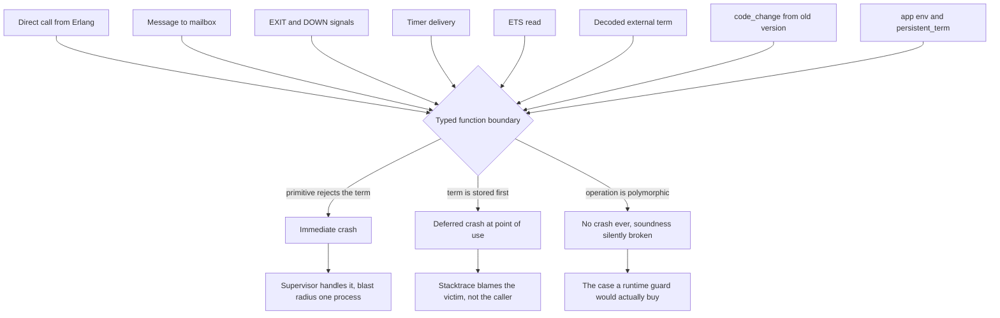

# 06 — The Erlang/Elixir interop surface a new BEAM language must satisfy

Research for [issue 06](../issues/06-interop-surface.md). Feeds tickets 12, 14 and 15, and
the map's fog item *"runtime behaviour against untyped callers"*.

## Method and provenance

Three classes of evidence, marked as such throughout and in the closing table:

| Mark | Meaning |
|---|---|
| **doc** | Official Erlang/OTP or Elixir documentation |
| **src** | Source code of OTP, Elixir, the Gleam compiler, or purerl |
| **local** | Observed directly on this machine — **Erlang/OTP 28 (erts-16.4), Elixir 1.19.5** |

Two provenance warnings that matter for how much weight to put on individual claims:

- **Elixir here is 1.19.5, not the 1.20 that ticket 00 records.** Every *observed* Elixir
  behaviour below is 1.19.5. Every claim about the v1.20 type checker is **doc** only —
  none of it was exercised.
- Gleam is **not** installed locally, so every Gleam claim is **doc** or **src**. Nothing
  about Gleam in this file was observed running.

---

# Part 1 — The requirements checklist

What a new BEAM language must produce and consume to be a first-class citizen. Phrased as
obligations on the compiler.

## A. Term types

The BEAM has one universe of terms. A new language does not get to invent a representation;
it must pick, for each of its types, an existing term type, and must be able to *receive*
every term type because an untyped caller can send any of them.

- [ ] **Atoms.** Global, interned, **never garbage collected** — "Atoms are not
      garbage-collected. Once an atom is created, it is never removed" (**doc**:
      [Common Caveats](https://www.erlang.org/doc/system/commoncaveats.html)). Default table
      limit 1,048,576, raisable with `+t`; max 255 characters
      (**doc**: [System Limits](https://www.erlang.org/doc/system/system_limits.html)).
      **Consequence for the language:** any construct that turns runtime data into atoms is
      a memory-exhaustion vector. `list_to_existing_atom/1` "Returns the atom whose text
      representation is `String`, but only if there already exists such atom" and is the
      safe primitive (**doc**:
      [erlang:list_to_existing_atom/1](https://www.erlang.org/doc/apps/erts/erlang.html#list_to_existing_atom/1)).
      This is ticket 10's problem, but the *interop* obligation is narrower: the language
      must be able to hold and compare arbitrary atoms it did not declare, because OTP
      returns them (`ok`, `error`, `noreply`, `DOWN`, `EXIT`, …).
- [ ] **Integers**, arbitrary precision — no fixed range appears in
      [System Limits](https://www.erlang.org/doc/system/system_limits.html) (**doc**,
      by absence; the "arbitrary precision" wording was not recovered verbatim from
      `data_types.html`).
- [ ] **Floats.** Note the deviation from IEEE 754: "Erlang's floats do not exactly match
      IEEE 754 floats, in that neither *Inf* nor *NaN* are supported" — operations that
      would produce them raise `badarith` (**doc**:
      [Data Types](https://www.erlang.org/doc/system/data_types.html)). A language with an
      IEEE float type cannot faithfully represent `NaN` on this target.
- [ ] **Binaries and bitstrings.** "Binary: bitstring with bit count evenly divisible by 8"
      (**doc**: [Data Types](https://www.erlang.org/doc/system/data_types.html)) — so
      **a binary *is* a bitstring**, not a sibling type. `is_bitstring(<<"bin">>)` is `true`
      (**local**). A type system that models `Binary` and `BitString` as disjoint is wrong
      about the target.
- [ ] **Charlists vs binaries.** Erlang string literals are lists of codepoints:
      `"hello" = [104,101,108,108,111]`. There is no string type. OTP's stated preference is
      UTF-8 binaries — "The default Unicode encoding in Erlang binaries is UTF-8, which is
      also the format in which built-in functions and libraries in OTP expect to find binary
      Unicode data", and "it is recommended to keep binaries in UTF-8" (**doc**:
      [unicode](https://www.erlang.org/doc/apps/stdlib/unicode.html)). But the older stdlib
      API surface takes charlists, and `unicode:chardata()` accepts either. **The language
      must produce both on demand**, and must not assume a value typed `String` from a
      foreign caller is a binary — see Part 2.
- [ ] **Lists, proper and improper.** "a list is either the empty list `[]` or consists of a
      *head* and a *tail*"; improper lists (`[a|b]`) are legal terms and "rarely practical"
      (**doc**: [Data Types](https://www.erlang.org/doc/system/data_types.html)). A `List(a)`
      type is a claim about properness that the runtime does not enforce.
- [ ] **Tuples**, up to 16,777,215 elements (**doc**:
      [System Limits](https://www.erlang.org/doc/system/system_limits.html)).
- [ ] **Maps.** Two internal representations, semantically transparent: "A map with at most
      32 elements will informally be called a *small map*" (flatmap); larger maps are
      "implemented as a Hash array mapped trie (HAMT)", and "The representation changes when
      a map grows beyond 32 elements, or when it shrinks to 32 elements or less" (**doc**:
      [Maps efficiency guide](https://www.erlang.org/doc/system/maps.html)). Matters only for
      performance claims, not semantics.
- [ ] **Pids**, **references**, **ports**. Opaque, comparable, orderable, sendable. Pids are
      reused: "a Pid of a terminated process may be reused as a Pid for a new process after a
      while" (**doc**: [Data Types](https://www.erlang.org/doc/system/data_types.html)) — so
      pid identity is not a durable key.
- [ ] **Funs**, in three distinct flavours the language must distinguish:
      anonymous closures; local `fun Name/Arity` where "the function that is referred to does
      not need to be exported"; and external `fun M:F/A` where "the function must be exported"
      and which "refers to the function `Name` with arity `Arity` in the *latest* version of
      module `Module`" (**doc**: [Funs](https://www.erlang.org/doc/system/funs.html)). The
      last point is the code-upgrade seam: a captured closure pins a code version, `fun M:F/A`
      does not.
- [ ] **External term format.** `term_to_binary/1` / `binary_to_term/2` round-trip terms
      across the wire. **The `safe` option is mandatory for untrusted input** — it prevents
      "creation of new atoms directly, creation of new atoms indirectly (as they are embedded
      in certain structures, such as process identifiers, refs, and funs), and creation of new
      external function references" (**doc**:
      [binary_to_term/2](https://www.erlang.org/doc/apps/erts/erlang.html#binary_to_term/2)).
      **Verified locally**: decoding a hand-built `SMALL_ATOM_UTF8_EXT` for an
      atom that has never existed gives `{error, badarg}` with `[safe]` and succeeds without
      it — and *then* succeeds with `[safe]`, because the atom now exists. The guard is
      "already interned", not "on an allowlist".

## B. Term ordering and equality

- [ ] **The documented total order is**
      `number < atom < reference < fun < port < pid < tuple < map < nil < list < bitstring`,
      with `nil` (`[]`) "regarded as a separate type from `list/0`. That is why `nil < list`"
      (**doc**: [Expressions](https://www.erlang.org/doc/system/expressions.html)).
      **Verified locally** with one value of each type: sorting gives
      `[integer, float, atom, reference, fun, port, pid, tuple, map, nil, list, binary]`.
      Note there is no separate `binary` and `bitstring` position — sorting `<<1:1>>` against
      `<<"bin">>` flips depending on the *bits*, not the types (**local**), consistent with a
      binary being a bitstring.
- [ ] **Cross-type number comparison.** "the term with the lesser precision is converted into
      the type of the other term, unless the operator is one of `=:=` or `=/=`" (**doc**:
      [Expressions](https://www.erlang.org/doc/system/expressions.html)). Locally,
      `lists:sort([1.0, 1, 0.5])` yields `[0.5, 1.0, 1]` — when arithmetically equal, the
      float sorts *before* the integer (**local**).
- [ ] **Map key order is not term order.** "In map key order, integer types are considered
      less than float types" (**doc**:
      [Expressions](https://www.erlang.org/doc/system/expressions.html)) — locally
      `maps:keys(#{1 => a, 1.0 => b})` gives `[1, 1.0]`, the opposite of the term order above
      (**local**). A language that implements its own comparison must reproduce **both**
      orders in the right places.
- [ ] **Maps compare by size first**, then keys ascending, then values in key order
      (**doc**, same page); `#{z=>1} < #{a=>1,b=>2}` is `true` (**local**).
- [ ] **`==` vs `=:=`.** `=:=` "return[s] whether or not there exists a way to tell the
      arguments apart"; `1 == 1.0` is `true` and `1 =:= 1.0` is `false` (**doc** + **local**).
      A single structural-equality operator in the surface language must choose one, and the
      choice is visible to Erlang callers.

## C. Module and function identity

- [ ] **A function is identified by name *and* arity.** This is the constraint the map
      already flags as disturbing multi-clause heads and optional parameters. Calling a
      name/arity that does not exist raises `undef`, which "is guaranteed to include the
      `Module`, `Function`, and `Arity` of the attempted function as the first stacktrace
      entry"; a name/arity that exists but matches no clause raises `function_clause`
      (**doc**: [Errors](https://www.erlang.org/doc/system/errors.html)).
- [ ] **The module name atom must match the BEAM file name** — "The name `Module`, an atom,
      is to be the same as the file name minus the extension `.erl`. Otherwise code loading
      does not work as intended" (**doc**:
      [Modules](https://www.erlang.org/doc/system/modules.html)). A language with nested
      namespaces must flatten them into one atom. Gleam uses `@` (`gleam/otp/actor` →
      `gleam@otp@actor`, **src**); purerl lower-snake-cases and suffixes `@ps` (`Foo.Bar` →
      `foo_bar@ps`, **doc**).
- [ ] **Exports are the whole runtime interface.** `-export([f/1])` "specifies which of the
      functions... are visible from outside the module" (**doc**:
      [Modules](https://www.erlang.org/doc/system/modules.html)). Dynamic dispatch via
      `apply/3` or `M:F(...)` reaches any exported function: "The applied function must be
      exported from `Module`" (**doc**:
      [apply/3](https://www.erlang.org/doc/apps/erts/erlang.html#apply/3)). **There is no
      mechanism to export a function to some callers and not others.** This is the root of
      Part 2.
- [ ] **`module_info/0,1` is compiler-generated and expected to exist.** `module_info(attributes)`
      "Returns a list of `{AttributeName,ValueList}` tuples", and user-defined attributes
      "are stored in the compiled code and can be retrieved by calling
      `Module:module_info(attributes)`" (**doc**:
      [Modules](https://www.erlang.org/doc/system/modules.html)). A new compiler must emit
      these or tooling breaks. Locally, a plain module's attributes are `[{vsn, ...}]`
      (**local**).
- [ ] **`-spec` / `-type` / `-opaque`.** The only thing the *compiler* enforces is shape:
      "An implementation of the function with the same name `Function` must exist in the
      current module, and the arity of the function must match the number of arguments,
      otherwise the compilation fails" (**doc**:
      [Types and Function Specifications](https://www.erlang.org/doc/system/typespec.html)).
      Type *correctness* is explicitly delegated elsewhere — the same page frames specs as
      serving "To document function interfaces. To provide more information for bug detection
      tools, such as Dialyzer. To be leveraged by documentation tools".

## D. Behaviours and callbacks

**This is the section where the folklore is wrong and the finding is cheap.**

- [ ] **`-behaviour(gen_server)` has no runtime effect whatsoever.** It is a compile-time
      lint. Verified locally three ways on OTP 28:
      1. A module with **no `-behaviour` attribute at all**, exporting only `init/1`,
         `handle_call/3`, `handle_cast/2`, starts under `gen_server:start_link/3` and answers
         a `gen_server:call/2` correctly. Its attributes chunk contains only `{vsn, …}` —
         no behaviour entry (**local**).
      2. A module that **declares `-behaviour(gen_server)` but omits `handle_cast/2`** compiles
         with exit status 0 and produces a `.beam`, emitting only
         `Warning: undefined callback function handle_cast/2 (behaviour 'gen_server')`
         (**local** — matching the format string
         `"undefined callback function ~tw/~w (behaviour '~w')"` in
         [erl_lint.erl](https://github.com/erlang/otp/blob/master/lib/stdlib/src/erl_lint.erl), **src**).
      3. `gen_server` dispatches by building `fun Mod:handle_call/3` and friends directly off
         the module atom, and gates optional callbacks with `erlang:function_exported/3` — it
         never consults behaviour metadata
         ([gen_server.erl](https://github.com/erlang/otp/blob/master/lib/stdlib/src/gen_server.erl), **src**).

      **Requirement for the new compiler: emit the right exports. The attribute is optional
      and buys only a warning you could produce yourself.** Both Gleam and purerl-family
      code emit no `-behaviour` attribute anywhere (**src**, see Part 2).

- [ ] **`gen_server`'s mandatory set is small.** Queried from the live OTP 28 runtime
      (**local**): `gen_server:behaviour_info(callbacks)` returns
      `init/1, handle_call/3, handle_cast/2, handle_info/2, handle_continue/2, terminate/2,
      code_change/3, format_status/1, format_status/2`, and
      `behaviour_info(optional_callbacks)` returns
      `handle_info/2, handle_continue/2, terminate/2, code_change/3, format_status/1,
      format_status/2`. **Only `init/1`, `handle_call/3` and `handle_cast/2` are mandatory.**
      Return shapes are documented at
      [gen_server](https://www.erlang.org/doc/apps/stdlib/gen_server.html) (**doc**).
- [ ] **`supervisor`**: `init/1` returns `{ok, {SupFlags, [ChildSpec]}} | ignore`. `sup_flags()`
      is a map with optional `strategy` (default `one_for_one`), `intensity` (default 1),
      `period` (default 5), `auto_shutdown` (default `never`). `child_spec()` is a map with
      mandatory `id` and `start` (`{M,F,A}`), plus optional `restart`, `significant`,
      `shutdown`, `type`, `modules` (**doc**:
      [supervisor](https://www.erlang.org/doc/apps/stdlib/supervisor.html)).
- [ ] **`application`**: `start(StartType, StartArgs) -> {ok, pid()} | {ok, pid(), State} |
      {error, Reason}` and `stop(State)`; the `.app` resource file carries `mod`, `modules`,
      `applications`, `registered`, `vsn` (**doc**:
      [application](https://www.erlang.org/doc/apps/kernel/application.html)). A new language
      must be able to *generate* a `.app` file, which means knowing its own module list.
- [ ] **`-callback` / `-optional_callbacks`** for *defining* a behaviour live in the design
      principles chapter, not the typespec page:
      `-callback Name1(Arg1_1, ...) -> Res1.` and
      `-optional_callbacks([OptName1/OptArity1, ...]).`. The compiler uses them to
      auto-generate `behaviour_info/1` — the function "is otherwise automatically generated by
      the compiler using the `-callback` attributes" — and `-callback` is preferred over
      hand-writing `behaviour_info/1` because "the extra type information can be used by tools
      to produce documentation or find discrepancies" (**doc**:
      [Behaviours / User-Defined Behaviours](https://www.erlang.org/doc/system/design_principles.html)).

## E. Elixir specifics

- [ ] **The `Elixir.` prefix is the whole of the name mangling.** "modules are always
      represented by atoms", `String` "translates by default to the atom `:"Elixir.String"`",
      and the docs demonstrate `:"Elixir.List".flatten([1, [2], 3])` (**doc**:
      [Modules and functions](https://hexdocs.pm/elixir/modules-and-functions.html)). So
      `defmodule Foo.Bar` is callable from any BEAM language as `'Elixir.Foo.Bar':baz(...)`.
      A new language needs no Elixir-specific machinery to *call* Elixir — just the ability
      to name an atom with a dot in it. Confirmed locally throughout the tests below
      (**local**).
- [ ] **Structs are maps.** "Structs are simply maps with a 'special' field named
      `__struct__` that holds the name of the struct", and "structs do not inherit any of the
      built-in features that maps do. For example, you can neither enumerate nor access a
      struct" (**doc**: [Structs](https://hexdocs.pm/elixir/structs.html)). Locally,
      `'Elixir.Date':new(2026,8,11)` returns
      `{ok, #{'__struct__' => 'Elixir.Date', calendar => 'Elixir.Calendar.ISO', month => 8, …}}`
      (**local**). **A new language can consume and construct Elixir structs with nothing but
      map support and the right atom key.**
- [ ] **Protocol dispatch is ordinary module dispatch after consolidation.** Consolidation
      "directly links protocols to their implementations in a way that invoking a function
      from a consolidated protocol is equivalent to invoking two remote functions", and is
      "applied by default to all Mix projects during compilation" (**doc**:
      [Protocol](https://hexdocs.pm/elixir/Protocol.html)). The implementation module atom is
      `Elixir.<Protocol>.<Target>` — built by `Protocol.__concat__/2`, which strips the
      `Elixir.` prefix from the target and appends it to the prefixed protocol name (**src**:
      [protocol.ex](https://github.com/elixir-lang/elixir/blob/main/lib/elixir/lib/protocol.ex)).
      Locally `'Elixir.Enumerable':impl_for([1,2])` returns `'Elixir.Enumerable.List'`
      (**local**) — confirming the naming and that dispatch works.
- [ ] **Reachability without an Elixir dependency: mostly yes, with a sharp edge.**
      This was undocumented, so it was **tested directly** (**local**, Elixir 1.19.5 / OTP 28):
      a bare `erl` node with only Elixir's `ebin` on the code path and the `:elixir`
      application *not started* (`application:which_applications()` shows only
      `[stdlib, kernel]`, and the `elixir_config` ETS table does not exist).

      | Call | Result with `:elixir` **not** started |
      |---|---|
      | `'Elixir.Enum':map/2`, `reduce/3` | works |
      | `'Elixir.String':upcase/1`, `split/2` | works |
      | `'Elixir.Keyword':get/2`, `'Elixir.Map':put/3` | works |
      | `'Elixir.Integer':to_string/1` | works |
      | `'Elixir.Enumerable':impl_for/1` (protocol) | works |
      | `'Elixir.Version':parse/1`, `'Elixir.Date':new/3` (structs) | works |
      | `'Elixir.Macro':camelize/1` | works |
      | `'Elixir.System':argv/0` | **`error:badarg`** |
      | `'Elixir.Code':compiler_options/0` | **`error:badarg`** |
      | `'Elixir.URI':default_port(<<"http">>)` | **returns `nil`** — after starting `:elixir`, returns `80` |

      The dividing line is whether the code path touches the `elixir_config` ETS table, which
      is created only in `elixir:start/2`, the `:elixir` application's `start/2` callback
      (**src**:
      [elixir.erl](https://github.com/elixir-lang/elixir/blob/main/lib/elixir/src/elixir.erl),
      [elixir.app.src](https://github.com/elixir-lang/elixir/blob/main/lib/elixir/src/elixir.app.src)).

      **The `URI.default_port/1` row is the one that matters**: it does not crash, it returns
      a *wrong answer*. `elixir_config:get/2` swallows the missing-table error and returns the
      default. So "Elixir works without the app started" is true for pure functions and
      **silently false** for config-backed ones. The safe rule for the new language is:
      **depend on `:elixir` and start it**; the code path alone is not a supported
      configuration, merely one that mostly works.

      *(Note: the subagent source-read predicted `Macro.camelize/1` would need the started app
      via a `persistent_term` key; the local run contradicts that. The run wins; the
      identifier-tokenizer path evidently has a fallback. Left as an open detail — it does not
      change the recommendation.)*

- [ ] **Elixir's v1.20 type checker offers a foreign language nothing.** Its stated scope is
      "to infer the types of functions considering the current module, Elixir's standard
      library and your dependencies, while calls to modules within the same project are
      assumed to be `dynamic()`" (**doc**:
      [Gradual set-theoretic types](https://hexdocs.pm/elixir/gradual-set-theoretic-types.html)),
      and the roadmap is blunter: "Elixir can infer types from function calls, but such
      inference only applies to modules from Elixir's standard library" (**doc**:
      [Type inference of all and next 15](https://elixir-lang.org/blog/2026/01/09/type-inference-of-all-and-next-15/)).
      There is **no documented interface for a non-Elixir BEAM module to supply type
      information**, and the roadmap phases the existing one out: "the existing Erlang
      Typespecs are not precise enough for set-theoretic types and they will be phased out of
      the language and have their postprocessing moved into a separate library" (**doc**,
      same page). Corroborating artefact: locally `'Elixir.Code':compiler_options()` includes
      `infer_signatures => [elixir]` — a per-language allowlist, currently containing only
      Elixir (**local**, 1.19.5).

## F. Error propagation across the boundary

- [ ] **Three classes, all of which can arrive.** `error` — "Run-time error... or the process
      called `error/1`"; `exit` — "The process called `exit/1`"; `throw` — "The process called
      `throw/1`"; `try...catch Class:Reason:Stacktrace` distinguishes them where a bare `catch`
      cannot; an uncaught throw becomes `{nocatch, V}` (**doc**:
      [Errors and Error Handling](https://www.erlang.org/doc/system/errors.html)). All four
      confirmed locally, including the uncaught-throw case surfacing as
      `{{nocatch, t}, Stacktrace}` in a `DOWN` message (**local**).
- [ ] **`erlang:raise/3`** re-raises with a chosen class and a *fabricated* stacktrace —
      "if it were not for the stacktrace, `erlang:raise(Class, Reason, Stacktrace)` is
      equivalent to `erlang:Class(Reason)`" (**doc**:
      [erlang](https://www.erlang.org/doc/apps/erts/erlang.html)). A language cannot trust a
      stacktrace to be real.
- [ ] **Errors become exit signals on links.** "When a process or port terminates, it will
      send exit signals to all processes and ports that it is linked to", carrying the exit
      reason (**doc**: [Processes](https://www.erlang.org/doc/system/processes.html)).
      Locally, a linked `exit(whatever_i_like)` arrives at a trapping process as
      `{'EXIT', Pid, whatever_i_like}`, and a monitored `erlang:error({any,term,at,all})`
      arrives as `{'DOWN', Ref, process, Pid, {{any,term,at,all}, Stacktrace}}` (**local**).
      **The reason is an arbitrary term chosen by another process. No type discipline
      constrains it.**
- [ ] **Elixir's three mechanisms map straight through.** `Kernel.throw/1` and `Kernel.exit/1`
      are direct passthroughs to `:erlang.throw/1` and `:erlang.exit/1`, and `Kernel.raise/2`
      expands to `:erlang.error(unquote(exception).exception(unquote(attributes)))` (**src**:
      [kernel.ex](https://github.com/elixir-lang/elixir/blob/main/lib/elixir/lib/kernel.ex)).
      So **an Elixir `raise` reaches an Erlang catcher as class `error` with the exception
      struct itself as the reason** — verified locally: catching
      `erlang:error('Elixir.RuntimeError':exception(<<"boom">>))` yields
      `{error, #{'__struct__' => 'Elixir.RuntimeError', '__exception__' => true,
      message => <<"boom">>}}` (**local**). Not a `{Struct, Stacktrace}` tuple; the stacktrace
      comes through the separate third binding as for any Erlang error.
- [ ] **But do not model "an error from Elixir" as "a struct".** Counterexample from the same
      run: `'Elixir.String':to_integer(<<"nope">>)` raises plain `error:badarg`, not an
      `ArgumentError` struct, because it bottoms out in a BIF (**local**). A catch-all handler
      must cope with a reason that is any term at all.

---

# Part 2 — Where an untyped caller violates the type system

The part that matters most for this effort.

## The structural reason there is no defence by construction

From Part 1 §C: a BEAM module's public interface is its export table, dispatch is by
`Module:Function/Arity` on atoms, and `apply/3` reaches anything exported. There is no
visibility modifier, no calling convention that distinguishes a checked from an unchecked
caller, and no way to publish a function to your own compiler but not to `erl`. **Any
function a typed language exports is callable by anything, with anything.** Everything below
follows from that.

## The channels

Eight ways a term the type system forbids reaches typed code. The first is the obvious one;
the rest are the ones a boundary-guard design tends to miss.

1. **Direct call.** `'my@module':f(literally_anything)` from a shell, from Erlang, from
   Elixir, from `apply/3` built out of runtime data.
2. **Process mailbox.** Any process holding your pid can `!` any term. A typed
   `receive`/`handle_info` clause set describes what you *expected*, not what arrives.
3. **`EXIT` and `DOWN` signals.** Reason is an arbitrary term chosen by the dying process
   (Part 1 §F). Trapping exits turns these into mailbox messages that no sender-side type
   discipline shaped.
4. **Timers.** `erlang:send_after/3` delivers a term into your mailbox on someone else's
   schedule. Locally, `{tick, "an untyped payload"}` — note the charlist — arrived intact
   (**local**).
5. **ETS reads.** ETS has no schema. Locally, the same key was written as `<<"a binary">>`
   and then as `an_atom`, and both reads succeeded (**local**). A typed read is a *bet* about
   what some other writer put there.
6. **Decoded external terms.** `binary_to_term/1` produces whatever the sender encoded.
   Locally, a `{circle, ok}` decoded from a binary flowed straight into a function whose
   union type admitted only `{circle, Float}` (**local**).
7. **Code upgrade.** `code_change/3` hands you a state term built by a *previous version* of
   your own types — a violation your compiler cannot see because both versions type-checked.
   Separately, old-version closures raise `badfun` after a purge, which is why
   `check_process_code/2` exists — it "returns `true` if the process contains funs that
   depend on the old version of a module" (**doc**:
   [Funs](https://www.erlang.org/doc/system/funs.html)).
8. **Ambient untyped state** — `application:get_env/2`, `persistent_term:get/1`, the process
   dictionary. Configuration crosses in as `term()` with no producer-side check.

There is also an **inverse** obligation worth naming, because a guard design that only looks
inward misses it: **OTP validates the shapes you return.** `handle_call/3` must produce one
of `{reply, R, S} | {noreply, S} | {stop, ...}`; `supervisor:init/1` must produce a
well-formed `{ok, {SupFlags, ChildSpecs}}`. A dynamically-typed checker inside OTP inspects
your output and kills the process if it is wrong. So the language's types must be *able* to
express exactly those shapes, and cannot substitute its own equivalents.

## What actually happens — the three-outcome taxonomy

A guard-versus-no-guard decision usually gets argued as "it crashes anyway, so why bother".
That is only true for two of the three outcomes. Verified locally against a module written
the way a Gleam/purerl-style compiler emits code — tagged tuples for union variants, binaries
for strings, no argument guards:

| Call | Type system said | Actual result | Outcome |
|---|---|---|---|
| `add(1, 2)` | `Int, Int -> Int` | `3` | correct |
| `add(1.5, 2.5)` | `Int, Int -> Int` | **`4.0`** | **silent** |
| `add(1, 2.0)` | `Int, Int -> Int` | **`3.0`** | **silent** |
| `add(a, b)` | `Int, Int -> Int` | `error:badarith` | immediate crash |
| `shout(<<"hi">>)` | `String -> String` | `<<"hi!">>` | correct |
| `shout("hi")` (charlist) | `String -> String` | `error:badarg` | immediate crash |
| `shout(<<1:1>>)` | `String -> String` | `error:badarg` | immediate crash |
| `area({circle, 2.0})` | `Shape -> Float` | `12.56636` | correct |
| `area({circle, ok})` | `Shape -> Float` | `error:badarith` | immediate crash |
| `area({triangle, 1})` | `Shape -> Float` | `error:function_clause` | immediate crash |
| `hold(42)` | `Int -> Box(Int)` | `{box, 42}` | correct |
| `hold(self())` | `Int -> Box(Int)` | **`{box, <0.10.0>}`** | **silent** |
| bad term into a mailbox | typed message | process survives; crashes later at point of use | deferred |
| ETS key retyped between reads | typed row | both reads succeed | deferred |

All rows **local**, OTP 28. Three outcomes, and they have different costs:

- **Immediate crash.** The BEAM's own primitives reject the term at the first operation that
  cares about its type. This is the "let it crash" case and it is genuinely fine — a
  supervisor handles it, and the blast radius is one process. `shout("hi")` failing on
  `badarg` is a correct outcome, not a bug.
- **Deferred crash.** The term is *stored* — in process state, in an ETS row — and the crash
  happens at some later point of use, in a different call stack, possibly in a different
  process. Debuggable, but the stacktrace points at the victim rather than the caller.
- **Never crashes.** `add(1.5, 2.5) -> 4.0` is the important row. `+` is polymorphic over
  numbers, so a function the type system proved returns `Int` returns a `Float`, no error,
  and every downstream function that trusts the `Int` is now reasoning about a term it has
  never seen. `hold(self())` is worse: the function never inspects its argument at all, so a
  pid sits inside a value the type system calls `Box(Int)` indefinitely. **The type system's
  soundness is broken with no runtime signal at any point.**

A guard costs one clause. Locally, `gadd(A, B) when is_integer(A), is_integer(B)` converts
the silent `4.0` into `error:function_clause` at the call site (**local**). The design
question for ticket 12 is not "does it crash anyway" — it is **which of these three outcomes
the language wants for each kind of exported function**, and the answer plainly differs
between the silent rows and the rest.

## What Gleam does about it: nothing, and says so

- **`@external` types are trusted, not verified.** "The Gleam compiler will ensure that all
  uses of the function will be correct for the annotated types, but it cannot verify that the
  function implemented in the other language returns the specified types, or even that it
  exists" (**doc**: [Externals](https://gleam.run/documentation/externals/)). The tour is
  blunter: "Gleam trusts that the type given is correct so an inaccurate type annotation can
  result in unexpected behaviour and crashes at runtime. Be careful!" (**doc**:
  [Language tour — Externals](https://tour.gleam.run/advanced-features/externals/)).
- **Codegen confirms it.** A public external function compiles to a one-line wrapper doing a
  direct remote call — the compiler's own comment: "An external function consists of just a
  remote call being passed all of the function's arguments"; private externals emit nothing at
  all and are inlined at the call site (**src**:
  [compiler-core/src/erlang.rs](https://github.com/gleam-lang/gleam/blob/main/compiler-core/src/erlang.rs)).
  No guard, no coercion, no assertion.
- **The safe path is a library, not a language feature.** `gleam/dynamic` exists for exactly
  this — "Dynamic data is data that we don't know the type of yet. We likely get data like
  this from interop with Erlang" — and `gleam/dynamic/decode` does the runtime introspection:
  "Decoders work using *runtime reflection* and the data structures of the target platform"
  (**doc**: [gleam/dynamic](https://hexdocs.pm/gleam_stdlib/gleam/dynamic.html),
  [gleam/dynamic/decode](https://hexdocs.pm/gleam_stdlib/gleam/dynamic/decode.html)).
  `gleam_otp` uses this itself, typing the incoming OTP system message as `Dynamic` rather
  than trusting a shape:
  `@external(erlang, "gleam_otp_external", "convert_system_message") fn convert_system_message(b: Dynamic) -> Message(msg)`
  (**src**: [actor.gleam](https://github.com/gleam-lang/otp/blob/main/src/gleam/otp/actor.gleam)).
- **For the *incoming* direction — Erlang calling Gleam — nothing is emitted and nothing is
  documented.** A search of the compiler's Erlang codegen found no argument-guard emission on
  ordinary function generation. **Flagged as inference**: no Gleam doc was found that states
  outright "type guarantees do not hold for foreign callers". The absence of guards in codegen
  is strong circumstantial evidence, not a first-party statement. A new language should say
  this explicitly in its own docs, since Gleam's silence on it is a documentation gap rather
  than a considered position.
- **Gleam sidesteps OTP behaviours entirely.** `gleam_otp`'s Actor is a hand-rolled recursive
  loop that reimplements the `sys` system-message protocol rather than a `gen_server` callback
  module: "Gleam's Actor is similar to Erlang's `gen_server`... but differs in that it offers a
  fully typed interface. This different API is why Gleam uses the name 'Actor'" (**src**:
  [actor.gleam](https://github.com/gleam-lang/otp/blob/main/src/gleam/otp/actor.gleam)). No
  `-behaviour` attribute is emitted anywhere in the compiler. **This is the single most
  relevant precedent for ticket 14**: Gleam's answer to "typed OTP callbacks" was to not
  implement the behaviour contract at all. Given ticket 00 names `handle_call/3` and
  `handle_info/2` as the headline feature's best showcase, that route is closed to this
  effort — which makes the question of what to do about untyped mailbox terms unavoidable
  rather than optional.
- **Gleam does emit `-spec` for every function**, including externals, derived from the
  Gleam signature — `function_spec_attribute` is called unconditionally for both the pure and
  external branches (**src**: same `erlang.rs`). Note the consequence: an `@external`'s spec
  is the *unverified* annotation, so Gleam feeds dialyzer a claim it never checked.

## What purerl does about it: opt-in, incomplete, and the only real precedent

- **Unchecked by default, and documented as such.** The purerl cookbook: "Relying on the
  types that the compiler generates is typically a bad way of doing business, they are subject
  to change and aren't remotely type-checked" (**doc**:
  [purerl-cookbook, Error handling](https://purerl-cookbook.readthedocs.io/en/latest/interop/errors.html)).
  The maintainer's own worked demo of lying about an FFI type: "Passing the variable around in
  Purescript land, nothing cares... sooner or later, every bit of data will end up getting
  somewhere where it needs to be serialized... and you'll get a runtime crash" (**doc**:
  [codeofrob.com](https://codeofrob.com/entries/purerl---some-questions-from-codemeshldn.html)).
  That is precisely the *deferred crash* row of the taxonomy above.
- **`--checked`: the one existing precedent for compiler-emitted boundary guards.** purerl has
  an off-by-default CLI flag, `"Generate wrapper modules with run-time type-checking of
  function arguments"` (**src**:
  [app/Build.hs](https://github.com/purerl/purerl/blob/master/app/Build.hs)). When enabled it
  emits a **parallel module** suffixed `@checked` — not a modification of the normal `@ps`
  module — wrapping functions with `is_integer` / `is_float` / `is_boolean` / `is_binary` and
  map-shape checks, raising `erlang:error("purerl runtime ffi type error: " ++ ...)` on
  mismatch (**src**:
  [CodeGen/CheckedWrapper.hs](https://github.com/purerl/purerl/blob/master/src/Language/PureScript/Erl/CodeGen/CheckedWrapper.hs)).
  **Three design properties worth carrying into ticket 12**: it is opt-in; it is a separate
  module so callers choose the checked entry point; and it is *incomplete* — types it cannot
  check fall through to no check at all, which means a `@checked` module is not a soundness
  guarantee, only a partial one.
- **The safe-decoding story is library-level and type-class-driven.**
  `purescript-erl-untagged-union` builds runtime discrimination out of ordinary Erlang guards
  (`isInt`, `isBinary`, `isAtom`, `isTuple1`..`isTuple10`, `isLiteralAtom` via
  `binary_to_existing_atom`) exposed through a `RuntimeTypeMatch` type class, so the type
  system checks that **all branches were considered** while each branch's test is a hand-written
  guard (**src**:
  [Union.erl](https://github.com/id3as/purescript-erl-untagged-union/blob/master/src/Erl/Untagged/Union.erl),
  [Union.purs](https://github.com/id3as/purescript-erl-untagged-union/blob/master/src/Erl/Untagged/Union.purs)).
  Note the shape of the guarantee: exhaustiveness is static, discrimination is dynamic. That is
  a close relative of what a set-theoretic system with proven clause coverage would want at
  its boundary.
- **Pinto's OTP pattern is the alternative to Gleam's.** Rather than avoiding behaviours,
  Pinto passes **closures as messages** through a single generic callback module. The compiled
  `pinto_genServer@ps` exports functions literally named `init`, `handle_call`, `handle_cast`
  etc., typed with `EffectFn1`/`EffectFn2`/`EffectFn3` so purerl emits true fixed-arity Erlang
  functions; a small hand-written `pinto_genServer@foreign` shim calls
  `gen_server:start_link(Module, ...)` with that module. What `gen_server` delivers into
  `handle_call` is the user's own typed closure to run, so per-server behaviour needs no
  per-server Erlang module (**src**:
  [GenServer.purs](https://github.com/id3as/purescript-erl-pinto/blob/main/src/Pinto/GenServer.purs),
  [GenServer.erl](https://github.com/id3as/purescript-erl-pinto/blob/main/src/Pinto/GenServer.erl)).
  `Pinto.Supervisor` inverts it — a hand-written `.erl` file is itself the callback module
  passed as `?MODULE` to `supervisor:start_link/2` (**src**:
  [Supervisor.erl](https://github.com/id3as/purescript-erl-pinto/blob/main/src/Pinto/Supervisor.erl)).
  **No `-behaviour` attribute appears in any Pinto `.erl` file** — consistent with the Part 1
  §D finding that it is purely advisory.
- **Caveat on which purerl.** purerl's own README steers production users to
  `purescript-backend-erl`, which was **not audited** for this note. Everything above is
  `purerl/purerl` and the id3as libraries.

## The precedent, summarised

| | Gleam | purerl |
|---|---|---|
| FFI types | trusted, explicitly documented as unverified | trusted, explicitly documented as unverified |
| Guards on incoming calls | none | none by default; opt-in `--checked` parallel module, incomplete |
| Safe-decode path | `gleam/dynamic` + `decode` (library) | `Foreign` + `purescript-erl-untagged-union` (library) |
| `-spec` emission | yes, for every function, including unverified externals | yes, into opt-in `.hrl` files |
| `-behaviour` emission | never | never |
| OTP strategy | reimplement the loop, avoid the behaviour contract | closures-as-messages through a generic callback module |

**Neither language defends a typed function against an untyped caller.** Both push the
problem to a library the *callee* must choose to use. The one compiler-level attempt in
existence — purerl's `--checked` — is off by default and partial. That is the state of the
art this effort would be departing from, in either direction.

---

# Part 3 — Visibility to dialyzer and to Elixir's type checker

## What must be emitted

**For dialyzer**, the mechanism is the `debug_info` chunk, and it is *pluggable* — a new
language does not have to emit Erlang abstract format. The chunk's type is
`{DbgiVersion :: atom(), Backend :: module(), Data :: term()}`, and consumers must call
`Backend:debug_info(Format, Module, Data, Opts)` where "`Format` is an atom, such as
`erlang_v1` for the Erlang Abstract Format or `core_v1` for Core Erlang". The docs are
explicit that the stored data is not to be read directly: "Developers must always invoke the
`debug_info/4` function and never rely on the `Data` stored in the `debug_info` chunk, as it
is opaque and may change at any moment" (**doc**:
[beam_lib](https://www.erlang.org/doc/apps/stdlib/beam_lib.html)). The compiler-side option
is `{debug_info, {Backend, Data}}`, where "The given module must implement a `debug_info/4`
function" (**doc**: [compile](https://www.erlang.org/doc/apps/compiler/compile.html)). This
pluggability was introduced specifically to support non-Erlang BEAM languages (**src**:
[erlang/otp#1367](https://github.com/erlang/otp/pull/1367) — the OTP release-notes page
pinning the exact version was not retrieved; flagged).

So the emission requirement splits in two:

1. **`-spec` attributes** on exported functions — cheap, mechanical, derived from signatures
   the compiler already has.
2. **A `debug_info` backend** producing `core_v1` or `erlang_v1` on demand — a real piece of
   work, and it must round-trip a lowering of the source language.

**For Elixir's type checker**: nothing can be emitted, because no interface exists. See
Part 1 §E — inference covers Elixir's own stdlib, foreign calls are `dynamic()`, and Erlang
typespecs are on the roadmap to be phased out rather than adopted as an interop surface.

## Is it worth doing? A recommendation

**Emit `-spec`. Do not build a `debug_info` backend for dialyzer's benefit.**

The reasoning turns on *who the analysis is for*:

- **`-spec` is for Erlang and Elixir callers, not for us.** Its value is that an Erlang
  developer running dialyzer over a mixed codebase gets meaningful results at the boundary
  with our modules, and that `-spec` is what the ecosystem's documentation tooling reads
  (Part 1 §C). It costs a pretty-printer over type information the compiler already has.
  Both Gleam and purerl do it. There is no argument against it.
- **Dialyzer analysis *of our own code* is largely redundant.** Dialyzer's guarantee is
  deliberately one-sided — it works by "only reporting issues which it can prove have the
  potential to cause a genuine issue at runtime. This means Dialyzer will sometimes not
  report every bug, since it cannot always find this proof" (**doc**:
  [dialyzer](https://www.erlang.org/doc/apps/dialyzer/dialyzer_chapter.html)). A
  set-theoretic system that is strict by default and proves clause exhaustiveness (ticket 00)
  is strictly stronger inside its own code. Building a `Backend:debug_info/4` to get a weaker
  checker to re-examine code a stronger one already rejected is effort spent on the wrong end.
- **One genuine caveat**, and it is the argument for revisiting this later: a `-spec` derived
  from our types is a *claim*, and at the FFI boundary it is an unverified one — exactly
  Gleam's situation, where an `@external`'s spec is emitted with the same confidence as a
  checked function's (**src**). So `-spec` emission slightly *over*-states what we know at
  precisely the boundary Part 2 says is unguarded. That is an argument for guards, not against
  specs.
- **Note also that `debug_info` has non-dialyzer consumers**: "Tools such as Debugger, Xref,
  and Cover require the debug information to be included" (**doc**:
  [compile](https://www.erlang.org/doc/apps/compiler/compile.html)). If coverage tooling ever
  becomes a requirement the calculus changes — but tooling is explicitly out of scope per the
  map, so it stays out here.

---

# Open questions and flagged-unverified items

Recorded so later tickets do not treat these as settled.

- **Gleam's stance on foreign callers is inferred, not documented.** No first-party statement
  was found that Gleam's type guarantees stop at the export boundary; the evidence is the
  absence of guard emission in the compiler.
- **Gleam's `BitArray` → bitstring mapping** was not pinned to a citable line, only to
  convention and the `<<>>` literal syntax.
- **Whether `-spec` bodies live in a chunk distinct from `debug_info`** is not stated on any
  erlang.org page retrieved. The typespec page is silent on chunk storage entirely.
- **`Macro.camelize/1` worked without `:elixir` started** (**local**), contradicting a
  source-read prediction that it needs a `persistent_term` key. Unresolved; does not change
  the "depend on `:elixir`" recommendation.
- **`purescript-backend-erl`**, purerl's recommended successor, was not audited. It may differ
  on guards and on `-behaviour` emission.
- **Elixir 1.20 was not exercised.** Local observations are 1.19.5.
- **The exact OTP version** in which the pluggable `Dbgi` chunk landed was not pinned to a
  release-notes page.

---

# Claim → source

Load-bearing claims only — the ones a later ticket would build on.

| # | Claim | Source | Class |
|---|---|---|---|
| 1 | Term order is `number < atom < reference < fun < port < pid < tuple < map < nil < list < bitstring` | [Expressions](https://www.erlang.org/doc/system/expressions.html); sorting one value of each type on OTP 28 | doc + local |
| 2 | A binary *is* a bitstring; they are not disjoint types, and binary/bitstring sorting is by content | [Data Types](https://www.erlang.org/doc/system/data_types.html); `is_bitstring(<<"bin">>)` = `true`, sort order flips between `<<1:1>>` and `<<0:1>>` | doc + local |
| 3 | Map key order puts integers before floats — the opposite of standard term order | [Expressions](https://www.erlang.org/doc/system/expressions.html); `maps:keys(#{1=>a, 1.0=>b})` = `[1, 1.0]` vs `lists:sort([1.0,1])` = `[1.0,1]` | doc + local |
| 4 | Atoms are never garbage collected; `list_to_existing_atom/1` is the safe primitive | [Common Caveats](https://www.erlang.org/doc/system/commoncaveats.html), [list_to_existing_atom/1](https://www.erlang.org/doc/apps/erts/erlang.html#list_to_existing_atom/1) | doc |
| 5 | `binary_to_term/2` with `safe` blocks creation of new atoms; the guard is "already interned" | [binary_to_term/2](https://www.erlang.org/doc/apps/erts/erlang.html#binary_to_term/2); hand-built `SMALL_ATOM_UTF8_EXT` gives `badarg` with `[safe]`, succeeds without, then succeeds with | doc + local |
| 6 | Erlang floats support neither `Inf` nor `NaN` | [Data Types](https://www.erlang.org/doc/system/data_types.html) | doc |
| 7 | Module name atom must match the BEAM file name | [Modules](https://www.erlang.org/doc/system/modules.html) | doc |
| 8 | Exports are the entire runtime interface; `apply/3` reaches any exported function | [Modules](https://www.erlang.org/doc/system/modules.html), [apply/3](https://www.erlang.org/doc/apps/erts/erlang.html#apply/3) | doc |
| 9 | **`-behaviour` has no runtime effect.** A module with no such attribute runs as a `gen_server`; one with the attribute but a missing callback still compiles (warning only) | `gen_server:start_link/3` on an attribute-less module answers a call, attributes chunk is `[{vsn,…}]`; `erlc` exits 0 with `undefined callback function handle_cast/2 (behaviour 'gen_server')` | local |
| 10 | `gen_server` dispatches via `fun Mod:handle_call/3` and `erlang:function_exported/3`, never via behaviour metadata | [gen_server.erl](https://github.com/erlang/otp/blob/master/lib/stdlib/src/gen_server.erl) | src |
| 11 | Only `init/1`, `handle_call/3`, `handle_cast/2` are mandatory gen_server callbacks | `gen_server:behaviour_info(optional_callbacks)` on OTP 28 | local |
| 12 | `-callback`/`-optional_callbacks` generate `behaviour_info/1`; the compiler checks name/arity only, not types | [User-Defined Behaviours](https://www.erlang.org/doc/system/design_principles.html), [typespec](https://www.erlang.org/doc/system/typespec.html) | doc |
| 13 | Elixir modules are the atom `:"Elixir.Foo.Bar"`; structs are maps with `__struct__` | [Modules and functions](https://hexdocs.pm/elixir/modules-and-functions.html), [Structs](https://hexdocs.pm/elixir/structs.html); `'Elixir.Date':new/3` returns a map with `'__struct__'` | doc + local |
| 14 | Consolidated protocol impls are the module `Elixir.<Protocol>.<Target>` | [protocol.ex](https://github.com/elixir-lang/elixir/blob/main/lib/elixir/lib/protocol.ex); `'Elixir.Enumerable':impl_for([1,2])` = `'Elixir.Enumerable.List'` | src + local |
| 15 | **Pure Elixir stdlib works with only the code path**, but config-backed functions fail or silently return wrong answers without `:elixir` started — `URI.default_port("http")` returns `nil` instead of `80` | Erlang node with elixir ebin on path, `:elixir` not started, Elixir 1.19.5 / OTP 28 | local |
| 16 | Elixir's type checker infers only current-module + stdlib; foreign calls are `dynamic()`; no interface exists for foreign languages; Erlang typespecs are to be phased out | [Gradual set-theoretic types](https://hexdocs.pm/elixir/gradual-set-theoretic-types.html), [roadmap post](https://elixir-lang.org/blog/2026/01/09/type-inference-of-all-and-next-15/); `compiler_options()` shows `infer_signatures => [elixir]` | doc + local |
| 17 | Elixir `raise` reaches Erlang as class `error` with the exception **struct itself** as the reason — but many Elixir functions raise raw Erlang reasons (`String.to_integer` → `badarg`) | [kernel.ex](https://github.com/elixir-lang/elixir/blob/main/lib/elixir/lib/kernel.ex); both shapes observed | src + local |
| 18 | `throw`/`error`/`exit` are distinguishable only by `try...catch Class:Reason:Stacktrace`; uncaught throw becomes `{nocatch, V}`; exit reasons are arbitrary terms delivered over links and monitors | [Errors](https://www.erlang.org/doc/system/errors.html), [Processes](https://www.erlang.org/doc/system/processes.html); `EXIT` and `DOWN` shapes observed | doc + local |
| 19 | **An untyped caller can violate types silently, not just crash**: `add(1.5, 2.5)` typed `Int,Int->Int` returns `4.0`; `hold(self())` typed `Int -> Box(Int)` returns `{box, <pid>}` | guard-free module compiled and called on OTP 28 | local |
| 20 | A single `when is_integer(A), is_integer(B)` guard converts that silent case into `function_clause` at the call site | same module with a guarded variant | local |
| 21 | Gleam does not verify FFI types: "it cannot verify that the function implemented in the other language returns the specified types, or even that it exists" | [Externals](https://gleam.run/documentation/externals/), [tour](https://tour.gleam.run/advanced-features/externals/) | doc |
| 22 | Gleam emits a bare remote call for externals — no guard, no coercion — and emits `-spec` for every function including unverified externals | [compiler-core/src/erlang.rs](https://github.com/gleam-lang/gleam/blob/main/compiler-core/src/erlang.rs) | src |
| 23 | Gleam has no documented position on foreign callers; no guard emission found in codegen | absence of evidence in `erlang.rs`, no doc located | **inferred — flagged** |
| 24 | `gleam_otp` avoids the `gen_server` behaviour contract entirely, hand-rolling the loop and the `sys` protocol; no `-behaviour` is ever emitted | [actor.gleam](https://github.com/gleam-lang/otp/blob/main/src/gleam/otp/actor.gleam) | src |
| 25 | Gleam's recommended safe path is `gleam/dynamic` + `decode`, using runtime reflection — a library, not a language feature | [gleam/dynamic](https://hexdocs.pm/gleam_stdlib/gleam/dynamic.html), [decode](https://hexdocs.pm/gleam_stdlib/gleam/dynamic/decode.html) | doc |
| 26 | purerl documents FFI types as unchecked: "they aren't remotely type-checked" | [purerl-cookbook](https://purerl-cookbook.readthedocs.io/en/latest/interop/errors.html) | doc |
| 27 | **purerl's `--checked` flag is the only compiler-emitted boundary-guard precedent** — off by default, emits a parallel `@checked` module, incomplete (unknown types unchecked) | [Build.hs](https://github.com/purerl/purerl/blob/master/app/Build.hs), [CheckedWrapper.hs](https://github.com/purerl/purerl/blob/master/src/Language/PureScript/Erl/CodeGen/CheckedWrapper.hs) | src |
| 28 | `purescript-erl-untagged-union` gives static exhaustiveness over dynamic guard-based discrimination | [Union.erl](https://github.com/id3as/purescript-erl-untagged-union/blob/master/src/Erl/Untagged/Union.erl), [Union.purs](https://github.com/id3as/purescript-erl-untagged-union/blob/master/src/Erl/Untagged/Union.purs) | src |
| 29 | Pinto implements OTP by passing typed closures through one generic callback module; the supervisor variant uses a hand-written `.erl` as the callback module; no `-behaviour` anywhere | [GenServer.purs](https://github.com/id3as/purescript-erl-pinto/blob/main/src/Pinto/GenServer.purs), [GenServer.erl](https://github.com/id3as/purescript-erl-pinto/blob/main/src/Pinto/GenServer.erl), [Supervisor.erl](https://github.com/id3as/purescript-erl-pinto/blob/main/src/Pinto/Supervisor.erl) | src |
| 30 | The `debug_info` chunk is pluggable — a backend module implements `debug_info/4` returning `erlang_v1` or `core_v1`; the stored data is opaque | [beam_lib](https://www.erlang.org/doc/apps/stdlib/beam_lib.html), [compile](https://www.erlang.org/doc/apps/compiler/compile.html) | doc |
| 31 | Dialyzer is deliberately one-sided: it reports "only... issues which it can prove", so it misses real bugs | [dialyzer](https://www.erlang.org/doc/apps/dialyzer/dialyzer_chapter.html) | doc |
| 32 | ETS has no schema; the same key can be re-written with a different type and both reads succeed | insert `<<"a binary">>` then `an_atom` at the same key | local |
| 33 | `fun M:F/A` resolves to the latest module version while a captured closure pins its version (`badfun` after purge; `check_process_code/2`) | [Funs](https://www.erlang.org/doc/system/funs.html) | doc |
