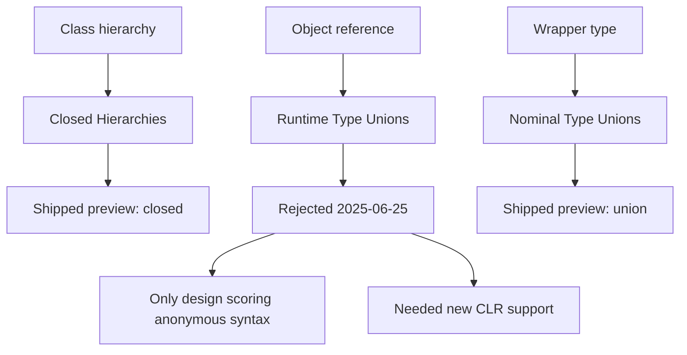

# 07 — C# 15 `union` and TypeScript discriminated unions

Research for [ticket 07](../issues/07-csharp15-and-ts-unions.md) · feeds
[ticket 09 — union representation](../issues/09-union-representation.md) · researched 2026-08-11

Primary sources: `dotnet/csharplang` at commit
[`881b703`](https://github.com/dotnet/csharplang/tree/881b703f876e73a2361e96f3b0ed3e5a38cf57df)
(HEAD on 2026-08-11), `dotnet/roslyn` feature status, the `dotnet/core` .NET 11 preview
release notes, Microsoft Learn, and the TypeScript handbook. Every proposal citation is
pinned to that commit, because the proposal text on `main` moves — which is the whole point
of §0.

---

## 0. Status first: what has shipped, what is proposal text

**The ticket's framing needs three corrections.** Ticket 07 says C# 15 unions are
"shipping in .NET 11, first preview April 2026, GA expected November 2026", sourced in
ticket 00 to a blog post. Against primary sources:

| Claim | Reality |
|---|---|
| Champion issue is [csharplang #8928](https://github.com/dotnet/csharplang/issues/8928) | 8928 is the older *union overview* issue. The current champion issue is **[#9662](https://github.com/dotnet/csharplang/issues/9662)** — cited as "Champion issue" at the top of `proposals/unions.md` and as the umbrella in the working-group overview. |
| "Shipping in .NET 11" | `union` shipped as a **preview language feature** requiring `<LangVersion>preview</LangVersion>`, first in **.NET 11 Preview 5**. Roslyn's own status table still lists Unions as **In Progress** on branch `features/Unions`. |
| "GA expected November 2026" | **No primary source found for this.** The LDM's only version statement about unions is a hedge, quoted below. Treat the GA date as unverified. |

What is actually true, with dates:

- **Preview 5** — `union` declarations and union patterns land
  ([roslyn#83705](https://github.com/dotnet/roslyn/pull/83705)). Projects had to hand-author
  `UnionAttribute` and `IUnion` themselves.
- **Preview 6** — `System.Runtime.CompilerServices.UnionAttribute` and `IUnion` ship in the
  framework; `System.Text.Json` serializes union values, **writing the active case directly**
  ([runtime#128162](https://github.com/dotnet/runtime/pull/128162)). "Unions remain a preview
  feature; enable `<LangVersion>preview</LangVersion>` to try them, and expect the surface to
  keep evolving before the feature ships."
- **Preview 7** — pattern matching switches to the **Try-Both** model: a pattern is tested
  against the union instance first, then against its `Value`. So `pet is Pet` is now `true`.
  This is a semantic change to shipped preview behaviour, three previews in.

> We'll be continuing design work here and are hopeful that C# 15 will at least have preview
> versions of features in this area.
>
> [!NOTE]
> While we will be working on many/most of these topics during the C# 15 timeframe, no release
> timeframe or guarantee is given at this time. Particularly for highly requested topics like
> unions, please keep in mind: we'll get there when we get there.
>
> — [LDM 2025-08-18](https://github.com/dotnet/csharplang/blob/881b703f876e73a2361e96f3b0ed3e5a38cf57df/meetings/2025/LDM-2025-08-18.md), lines 26-28, 36

**The design is still moving right now.** The last union decision in the snapshot —
Try-Both pattern targeting — was adopted "pending feasibility investigation. If try-both
cannot be implemented in the required timeframe, the syntactic rule is the fallback option"
([LDM 2026-06-08:120](https://github.com/dotnet/csharplang/blob/881b703f876e73a2361e96f3b0ed3e5a38cf57df/meetings/2026/LDM-2026-06-08.md)),
and the 2026 meetings agenda schedules for **Wed 12 Aug 2026** — tomorrow — a item reading
"Revisit Union Pattern Matching **after issues with 'try-both' approach**"
([meetings/2026/README.md:42](https://github.com/dotnet/csharplang/blob/881b703f876e73a2361e96f3b0ed3e5a38cf57df/meetings/2026/README.md)).
Meanwhile the LDM is already planning [C# 16 priorities](https://github.com/dotnet/csharplang/discussions/10276).

**Sibling features, separately tracked:**

| Feature | Status |
|---|---|
| Unions | Preview 5-7, `LangVersion=preview`; Roslyn state **In Progress** |
| Closed class hierarchies (`closed`) | **Merged as preview feature into .NET 11p5 and VS 18.8** ([roslyn#81039](https://github.com/dotnet/roslyn/issues/81039)) |
| Closed enums | LDM-approved; **absent from the Roslyn feature-status table entirely** — no implementation |
| Case declarations, target-typed static member access, inference for constructor calls | LDM-approved, not shipped |
| Inference for type patterns, type value conversion | **"LDM: Needs more work"** |

One documentation discrepancy worth recording: Microsoft Learn's *What's new in C# 15* says
"The runtime includes the `UnionAttribute` and `IUnion` types beginning with .NET 11 Preview 5",
while the Preview 6 release note says those types had to be hand-authored in Preview 5 and only
ship in-box in Preview 6. The release note is the more specific, dated source; prefer it.

---

## 1. C# 15 unions as they exist

### 1.1 Declaration syntax

```csharp
public record class Cat(string Name);
public record class Dog(string Name);
public record class Bird(string Name);

public union Pet(Cat, Dog, Bird);
```

The grammar, from the speclet:

```antlr
union_declaration
    : attributes? struct_modifier* 'partial'? 'union' identifier type_parameter_list?
      '(' case_types ')'  struct_interfaces? type_parameter_constraints_clause*
      (`{` struct_member_declaration* `}` | ';')
    ;
case_types
    : type (',' type)*
    ;
```

Restrictions on the body: no instance fields, auto-properties or field-like events; no
explicitly declared public single-parameter constructors; explicit constructors must
`this(...)`-delegate to a generated one.

**Syntax changes across previews and design meetings.** The parenthesised list has been
questioned repeatedly and survives on inertia rather than enthusiasm. Resolved along the way:
a union declaration is a **plain struct, not a `record struct`** (`record union` is not
supported), and the earlier ban on a base/interface clause was lifted. Still open in the
speclet itself:

> The proposed union declaration syntax isn't universally loved… Commas as separators between
> case types may seem to imply that order matters. Parenthesized lists look too much like
> primary constructors (despite not having parameter names). Too different from enums, which
> have their "cases" in curly braces.

### 1.2 Case types compose existing standalone types

This is stated as a deliberate position, not an implementation detail:

> The proposed unions in C# are unions of *types* and not "discriminated" or "tagged".
> "Discriminated unions" can be expressed in terms of "type unions" by using fresh type
> declarations as case types.
>
> — [`proposals/unions.md`](https://github.com/dotnet/csharplang/blob/881b703f876e73a2361e96f3b0ed3e5a38cf57df/proposals/unions.md), Motivation

So an F#-style tag union is *encoded* by declaring fresh record types and unioning them:

```csharp
public record class None();
public record class Some<T>(T value);
public union Option<T>(None, Some<T>);
```

The working group states the delta from F# in exactly one clause: cases are **types**, not
"tag states with associated state variables"
([`TypeUnions.md:842-844`](https://github.com/dotnet/csharplang/blob/881b703f876e73a2361e96f3b0ed3e5a38cf57df/meetings/working-groups/discriminated-unions/TypeUnions.md)),
and it names TypeScript as the ancestor of the *other* (ad-hoc) form. The reason for going
this way is continuity with existing C# code — the case types typically already exist and
cannot be re-declared as tags:

> Because of the class hierarchy implementation, the only way to include a value from a type
> that already exists is to use a class that is part of the union hierarchy to wrap the value.
> — `TypeUnions.md:44`

The case-type set is permissive to the point of being unusual:

> The *case_types* can be any type that converts to `object`, e.g., interfaces, type parameters,
> nullable types and other unions. **It is fine for resulting cases to overlap**, and for unions
> to nest or be null.

Overlapping cases are legal, which makes creation genuinely ambiguous — the compiler "picks an
arbitrary applicable constructor when there is ambiguity"
([LDM 2026-02-04:30-31](https://github.com/dotnet/csharplang/blob/881b703f876e73a2361e96f3b0ed3e5a38cf57df/meetings/2026/LDM-2026-02-04.md)),
justified by a *Creation equivalence* well-formedness assumption the compiler cannot check.
And nested unions do **not** merge: "An `Animal` is never directly a `Cat`, but it might be a
`Pet` that is a `Cat`". There is no `(A | B) | C = A | B | C` law.

### 1.3 Nominal, closed, and not ad-hoc formable

**Nominal, with no `is-a`.** The union is its own type; the case value is *inside* it.

> There is no "is-a" relationship between a union type and its case types:
> ```csharp
> _ = obj is Pet; // True only if 'obj' is an actual boxed 'Pet'
> ```
> — [`pre-unification-proposals/nominal-type-unions.md:41-45`](https://github.com/dotnet/csharplang/blob/881b703f876e73a2361e96f3b0ed3e5a38cf57df/meetings/working-groups/discriminated-unions/pre-unification-proposals/nominal-type-unions.md)

> - **A nominal type union is a distinct type from other type unions even when they share the
>   same cases.** *They are not interchangeable or structural.*
> - **A nominal type union is its own type.** *The type is not erased.*
>
> — [`original-nominal-type-unions.md:127-137`](https://github.com/dotnet/csharplang/blob/881b703f876e73a2361e96f3b0ed3e5a38cf57df/meetings/working-groups/discriminated-unions/original-nominal-type-unions.md)

Order matters and identical case sets do not unify. The BCL `Union<T1,T2>` family makes this
concrete: `Union<string, bool>` and `Union<bool, string>` are different types, and the LDM
accepted that explicitly — "since the types are not special language syntax but just library
types, hopefully it will be unsurprising that they act as such"
([LDM 2025-07-30:84](https://github.com/dotnet/csharplang/blob/881b703f876e73a2361e96f3b0ed3e5a38cf57df/meetings/2025/LDM-2025-07-30.md)).

**No ad-hoc formation.** There is no type-expression syntax for an undeclared union. The LDM
rejected the bar/`or` spelling partly *because* it would falsely suggest one:

> `union Pet(Cat or Dog or Bird)` has a nice initial symmetry with patterns, but is that
> actually a good thing? If we matched on a pattern with `val is (Dog or Cat) dogOrCat`,
> `dogOrCat` isn't going to magically become an anonymous union of `Dog or Cat`, it will still
> be a `Pet`.
> — [LDM 2025-09-29:50-51](https://github.com/dotnet/csharplang/blob/881b703f876e73a2361e96f3b0ed3e5a38cf57df/meetings/2025/LDM-2025-09-29.md)

Pattern-level `or` and type-level union are deliberately different things in C#.

**Closed by declaration, but not closed at runtime.** The case set is fixed by the constructor
set, which the compiler controls. But because the union is a struct, `default(Pet)` exists and
is in no case at all. The proposal admits this:

> - **A nominal type union is always meant to have a value of one of its case types.**
>   *The reality, however, is that a default or uninitialized state does exist that we pretend
>   does not, leading to the need to define what happens when this occurs.*
>   — `original-nominal-type-unions.md:139-141`

> A nominal type union always has a value. Yet, since it is implemented as a struct wrapper it
> may not actually have a value when the union is uninitialized or initialized to default. …
> this can lead to runtime exceptions in an exhausted switch.
> — `original-nominal-type-unions.md:772`

**But union-ness itself is retrofittable, by shape.** Any class or struct carrying
`[System.Runtime.CompilerServices.UnionAttribute]` is a union type; case types are derived
from the signatures of single-parameter constructors (or static `Create` methods on a nested
`IUnionMembers` interface), and the contents are read through a `Value` property of type
`object?`. That is structural *recognition* bolted onto a nominal design — the one place C#
lets you say "this pre-existing type is a union" without redeclaring anything. The LDM
arrived here after two reversals (§2.5, §2.6).

### 1.4 Exhaustiveness, and when `default` may be omitted

> A union type is assumed to be "exhausted" by its case types. This means that a `switch`
> expression is exhaustive if it handles all of a union's case types:
> ```csharp
> var name = pet switch
> {
>     Dog dog => ...,
>     Cat cat => ...,
>     // No warning about non-exhaustive switch
> };
> ```

Five qualifications matter more than the headline:

1. **It suppresses a warning, not an error.** The unhandled-case diagnostic is `CS8509`, a
   warning, and the precedent is old: "Should non-exhaustiveness be an error or a warning? If
   warning, what should happen at runtime? For now, it's a warning, and if you get there we
   throw a new exception type for this" —
   [LDM 2018-03-28:49-51](https://github.com/dotnet/csharplang/blob/881b703f876e73a2361e96f3b0ed3e5a38cf57df/meetings/2018/LDM-2018-03-28.md).
   An exhaustive switch still emits a throwing default arm.
2. **Null is a separate axis.** Even an otherwise-exhaustive union switch warns if `Value`'s
   null state is "maybe null" (`CS8655`). Null is not one of the cases; it is a hole beside them.
3. **Switch *statements* and `void` methods are openly unsettled.** "how will that interact
   with `switch` statements that are intentionally not exhaustive, or in `void`-returning
   methods where there isn't a 'you forgot to return' error?" —
   [LDM 2025-10-01:21-23](https://github.com/dotnet/csharplang/blob/881b703f876e73a2361e96f3b0ed3e5a38cf57df/meetings/2025/LDM-2025-10-01.md).
   Same hole TypeScript has (§3.4), reached by a different route.
4. **For closed hierarchies, exhaustiveness is bounded by the module and by the viewing
   context.** Closedness is enforced by a `[CompilerFeatureRequired("ClosedClasses")]`
   convention on constructors, not by the runtime — an unaware IL producer can still derive. And
   whether a switch *can* be exhaustive depends on what the caller can name: "if you cannot name
   all the relevant types in a given context, then exhaustive matching with only subtypes just
   does not apply there"
   ([LDM 2026-04-20:61-62](https://github.com/dotnet/csharplang/blob/881b703f876e73a2361e96f3b0ed3e5a38cf57df/meetings/2026/LDM-2026-04-20.md)).
5. **Adding a case is a deliberate compile-time break on consumers**, and this is the feature,
   not the cost: "if a dependency adds a new subtype, many users want the compiler to point out
   the switches that need to be revisited"
   ([LDM 2026-05-18:71-72](https://github.com/dotnet/csharplang/blob/881b703f876e73a2361e96f3b0ed3e5a38cf57df/meetings/2026/LDM-2026-05-18.md)).
   The escape hatch from all closed-world reasoning is to cast the switch input to `object`.

**A rejection worth flagging for a set-theoretic design.** Asked whether an empty switch over a
`closed` type with no subtypes should count as exhaustive — the mathematically regular answer —
the LDM said no:

> Treating the empty switch as exhaustive would therefore rely on the opposite assumption: that
> no instance can ever flow to the switch. **We found that tension more important than the
> mathematical regularity.**
> — LDM 2026-05-18:38-42

C# is explicitly choosing programmer intent over the set-theoretic reading at the one point
where they diverge.

### 1.5 Runtime representation, and what it costs

`public union Pet(Cat, Dog){ ... }` lowers to:

```csharp
[Union] public struct Pet : IUnion
{
    public Pet(Cat value) => Value = value;
    public Pet(Dog value) => Value = value;

    public object? Value { get; }

    ... // original body
}
```

The speclet states the cost in two bullets:

> * *Boxing*: Any value types among their case types will be boxed on entry.
> * *Compactness*: Union values only contain a single field.

Consequences, each sourced:

- **Boxing is the default, deliberately.** The generic `IUnion<TUnion>.TryCreate` existed
  "only so that it can avoid boxing when the incoming value is of a value type" and was dropped
  because it is a generic virtual method, "bad for AOT compilation". `IUnionUnboxed` was
  "summarily dismissed… we want to start from a position of **preferring potential boxing to
  the risks of GVMs**" (LDM 2025-07-30:127, 146).
- **A non-boxing opt-out exists but only for hand-written unions.** `HasValue` +
  per-case `TryGetValue(out T)`; the compiler prefers these when present. `union` declarations
  are opinionated single-reference structs and do not get them. Correctness of the opt-out is
  unchecked — the author must guarantee it matches `Value`.
- **The wrapper struct is not tear-free.** "The specification likely can't claim that a struct
  union with a single field of a reference type is set/read atomically. C# and ECMA-335 do not
  guarantee this for non-primitive types" (LDM 2025-09-10:30-33). The speclet's own last open
  question asks what degree of concurrency resilience is attainable.
- **Pattern matching indirects through `Value`,** and under Try-Both may perform up to two
  type tests per pattern — first against the wrapper, then against the contents.
- **The wrapper is visible at every runtime boundary.** Reflection, generics and serialization
  all see a `Pet`, not a `Cat`. `OfType<Dog>()` over a `List<Pet>` "will never match". JSON was
  a stated concern in 2025 and was ultimately solved by special-casing: `System.Text.Json` in
  Preview 6 writes the active case directly, unwrapping the union. That special case *is* the
  interop tax, paid once by Microsoft on behalf of one library.

---

## 2. The roads not taken — and why several of them suit a BEAM target better

The ticket asks for these with real space. They deserve it: the C# design space was fully
enumerated, and the branch C# took was chosen on constraints that are properties of the CLR,
not of unions.

### 2.0 The framing the working group used

> There are only three possible ways to represent a type that behaves like a discriminated
> union or type union in C# without a large runtime overhaul.
> — [`Trade Off Matrix.md:5`](https://github.com/dotnet/csharplang/blob/881b703f876e73a2361e96f3b0ed3e5a38cf57df/meetings/working-groups/discriminated-unions/Trade%20Off%20Matrix.md)

Class hierarchy / bare object reference / wrapper type. Each of the three headline proposals
is a hardening of exactly one:



The trade-off matrix, reproduced faithfully (blank = no value in source, *italic* = qualified):

| Feature | Runtime Type Unions | Nominal Type Unions | Closed Hierarchies |
|---|---|---|---|
| Declared Cases | **Yes** | **Yes** | **Yes** |
| Singleton Cases | **Yes** | **Yes** | **Yes** |
| Existing Cases | **Yes** | **Yes** | |
| Anonymous Syntax | **Yes** | | |
| Pattern Matching | **Yes** | **Yes** | **Yes** |
| Dynamic Pattern Matching | **Yes** | | **Yes** |
| Subtype Relationship | | | **Yes** |
| Conversion Relationship | **Yes** | | **Yes** |
| Back-Compat | | **Yes** | **Yes** |
| Non-ABI Breaking | *named only* | **Yes** | **Yes** |
| Non-Allocating/Boxing | | *future* | |
| Custom Unions | | *future* | |
| Any Time Soon | | **Yes** | **Yes** |

Read that column-wise and the finding is stark: **every capability a structural, open union
needs — anonymous syntax, dynamic pattern matching, conversion relationship — was scored as
achievable only by changing the CLR.** And that column is the only one with neither
"Back-Compat" nor "Any Time Soon".

### 2.1 Runtime type unions — rejected 2025-06-25

The design: unions supported by the runtime, formed without declaration.

```csharp
(int or string) x = 10;                               // anonymous type expression
anonymousUnionType := '(' <type> ('or' <type>)* ')';  // the grammar
```

Lowered to a runtime-known `System.Union<T1,T2>` (nested for arity > 2). The type "can never
be allocated" — a value is "actually represented at runtime as a simple object reference" —
and `ISINST`/`CASTCLASS` are special-cased so `obj is Pet` succeeds when `obj` is a `Cat` or a
`Dog`. `Type.IsUnion` and `GetUnionCaseTypes()` make it reflectable. Anonymous unions "unify
across assemblies since they are all translated to the same generic system type."

The rejection, and it is the single most load-bearing quote in the corpus:

> The other two proposals are likely mutually exclusive. We're not certain that C# has room for
> two different sets of semantics here. There is an elegance in the nominal approach in the way
> that it does not try to pretend about the cases, and that there is **no `is-a` relationship
> that would either leak through or need runtime support for**. **The timelines for it are also
> shorter**, as runtime support would take some non-trivial amount of time. Given these, we lean
> towards nominal type unions here.
> — [LDM 2025-06-25:44-47](https://github.com/dotnet/csharplang/blob/881b703f876e73a2361e96f3b0ed3e5a38cf57df/meetings/2025/LDM-2025-06-25.md)

Its own stated drawbacks: "No back-compat… Delay: Getting these features into a new runtime may
take a long time… Boxing: No non-boxing solution."

**BEAM relevance: high.** Value-level, this design *is* the BEAM. A union is an object
reference that the VM knows how to test against a case set — which is what an Erlang term
already is, tested by a guard. Every stated reason for rejection is a cost of retrofitting a
running CLR: back-compat with older runtimes, the time to ship runtime work, and not wanting two
semantics in one mature language. A greenfield language has none of those. Note the one
genuine design flaw that does transfer: even here, `Union<int,string> ≠ Union<string,int>` —
order-sensitive, because nesting is baked into the lowering.

### 2.2 Ad-hoc (erased, structural) unions — rejected on generics

This is the TypeScript-shaped design, and the working group says so: "Ad hoc unions are
similar to the kind of type unions found in Typescript" (`TypeUnions.md:844`).

```csharp
(A or B or C)                                  // no declaration; a type expression
global using U = (A or B or C);                // naming is by alias, not declaration
```

Every set-theoretic property is present and stated:

- **Order-insensitive structural identity** — "Ad hoc unions with the same member types
  (regardless of order) are understood by the compiler to be the same type."
- **Subset/superset assignability** — widening without runtime checks, narrowing with them.
- **Covariant member subtyping** — `(Chihuahua or Siamese)` is assignable to `(Cat or Dog)`.
- **Singletons as unions** — "you may consider a type that is not an ad hoc union to be an ad
  hoc union of a single type."
- **Inference from control flow** — a ternary chain over `Dog`, `Cat`, `Bird` infers
  `(Dog or Cat or Bird)`.
- **Explicitly not subtyping** — "*This assignability relationship is not intended to be a sub
  typing relationship*", which is exactly the semantic-subtyping distinction.

Implementation: full erasure to `object`, plus `[AdHocUnion([typeof(A), typeof(B)])]` metadata
and a compiler-generated per-module validator that checks assignments not statically known to be
correct.

**Why it was rejected — the first rock:**

> If you use an ad-hoc union as the type argument, it will be erased to `object` and the type
> check in `TryAdd` will always succeed, **violating the type safety of the collection!**
> — [`Union implementation challenges.md:51`](https://github.com/dotnet/csharplang/blob/881b703f876e73a2361e96f3b0ed3e5a38cf57df/meetings/working-groups/discriminated-unions/Union%20implementation%20challenges.md)

Secondary admissions: "*note: Parameters are not checked at entry of a method*"; "Since all ad
hoc unions erase to the same type, true runtime overloading of methods with ad hoc union
parameters is not possible"; ad hoc unions box value types.

And the erasure camp's own case against the wrapper, which reads as a prediction of the 2026
pattern-target arguments:

> Represented as an object, the value is in the best form to be understood by the type system at
> runtime, it is only lacking static type safety at compile time. **Using a wrapper type to
> enforce safety interferes with simple operations like type tests and casts.**
> — `TypeUnions.md:835-836`

**BEAM relevance: very high, and the rejection does not transfer.** The killer is *reified
generic type arguments* — `o is T` in a generic method, where `T` was instantiated with an
erased union. The BEAM has no reified generic type arguments to lie about. There is no `T` to
test at runtime; there is only the term. The second admission — parameters unchecked at entry —
is a real design choice a BEAM target must make consciously (ticket 09's neighbour, "runtime
behaviour against untyped callers", is exactly this question).

### 2.3 `ValueUnion<T1,T2>` — the non-erased ad-hoc variant, rejected in one sentence

> An alternative is to not erase, and instead have implementation types such as
> `ValueUnion<T1, T2>` etc. However, this has semantic consequences: Now `(string or bool)`
> will not be the same type as `(bool or string)`! We've investigated runtime approaches to
> dealing with this, but they are **imperfect and very expensive!**
> — `Union implementation challenges.md:53`

**This is the second rock, and it is the fork.** Erase → structural, but unsound under
generics. Don't erase → sound, but nominal and order-sensitive. C# took the second branch and
gave up anonymity. Note the corpus does not reconcile the fact that the *runtime* proposal makes
the same order-sensitivity trade it rejects here.

**BEAM relevance:** neither branch's cost applies. There is no nominal type identity for order
to attach to, and no generic instantiation to be unsound under.

### 2.4 Union structs — the tagged-struct design, deferred not rejected

```csharp
union struct U { A(int x, string y); B(int z); C; }
```

Lowered to a struct with a real discriminator — `public enum UnionKind { A = 1, B = 2, C = 3 };
public UnionKind Kind => {...};` — plus per-case `TryGetA(out A value)`. Pattern matching
rewrites `u is A a` to `u.TryGetA(out var a)`; a switch becomes a `Kind switch` with guards.
Zero heap allocation.

Not rejected — absorbed as the optional non-boxing access pattern. But its costs are recorded
precisely, and they are all CLR costs:

> This easily leads to large structs, with a lot of copying when values are passed around, and a
> lot of wasted memory, since all but one of the case fields is empty. There are ways of
> compacting the representation, e.g. by overlapping fields, but the more you do, the more time
> is spent packing and unpacking values… If compaction uses unsafe techniques, **the runtime
> might get confused and turn off its own optimizations.**
> — `Union implementation challenges.md:21-23`

> Any representation also needs to deal gracefully with evolution of unions… The public
> representation of a union struct **needs to be stable against recompilation.**
> — ibid.:25

And the overlap rule from the layout spec, which is a nice statement of a general principle:

> *Other value types from outside the compilation unit cannot be proven to be free of reference
> values at compile time, since compile-time metadata may not show all private fields of a type.*
> — `original-nominal-type-unions.md:1460-1465`

**BEAM relevance: this is the shape BEAM data already has.** `{ok, Value}` *is* a tagged
union with the discriminator in element 0. The costs listed — struct size, copying, unsafe
compaction, ABI stability of a layout — are consequences of C# needing to invent a tag and pack
it into a value type. A BEAM target gets the tag for free, and the layout is the VM's problem.

### 2.5 `IUnion` interfaces — adopted, tabled, un-adopted

Adopted 2025-07-30 (`IUnion { object? Value { get; } }`), tabled three weeks later, and
finally replaced by `[Union]` in Feb 2026. Grounds:

> - A type cannot implement `IUnion` without becoming a union (it might just want runtime
>   participation)
> - Derived types of a union type automatically become unions themselves, which may not be
>   intended…
> - It conflates the runtime interface (useful for generic code that handles unions) with the
>   compiler recognition mechanism
> — [LDM 2026-02-04:54-58](https://github.com/dotnet/csharplang/blob/881b703f876e73a2361e96f3b0ed3e5a38cf57df/meetings/2026/LDM-2026-02-04.md)

The richer `IUnionCreate<TUnion,TCase>` / `IUnionTryGetValue<TCase>` family is headed
"**Additional Interfaces (Not Approved)**" and dies on a CLR restriction:
`IUnionTryGetValue<T1>, IUnionTryGetValue<T2>` on one type is "error, may become ambiguous at
runtime".

**BEAM relevance: moderate, and objection 2 evaporates.** On the BEAM there is no
inheritance to propagate an interface implementation down a hierarchy, and no generic-interface
arity restriction. Objection 1 — that satisfying the shape *is* the assertion — is exactly the
structural-typing property, and on a structural target that is a feature.

### 2.6 `[UnionCase]` attribute — approved, superseded seven days later

Approved 2026-02-04; superseded 2026-02-11 by nested-`IUnionMembers` delegation. The reason is
worth carrying:

> The core problem is that existing types that want to become union types may already have
> members that would be recognized as union members, but that serve a different purpose. In some
> cases, these members even clash in such a way that **an attribute cannot resolve the
> conflict.** A common real-world example is a `Result`-like union type that has a `Value`
> property meaning something different from what the union pattern expects.
> — [LDM 2026-02-11:21-28](https://github.com/dotnet/csharplang/blob/881b703f876e73a2361e96f3b0ed3e5a38cf57df/meetings/2026/LDM-2026-02-11.md)

An attribute can *add* meaning but cannot *remove* a name collision. Also rejected in the same
meeting: implicit shape recognition of factory methods, because "a method like `Parse(string)`
returning the union type could be unintentionally picked up as defining a `string` case type" —
a general argument against structural recognition of a nominal construct.

### 2.7 `role NamedAOrB : (A | B);` — the road that was never taken at all

> Something like `role NamedAOrB : (A | B);` would give a name to the case, give us
> **equivalency with the underlying type**, and maintain discouragement of putting untagged
> unions in public type hierarchies.
> — [`DU-2022-11-07.md:13-14`](https://github.com/dotnet/csharplang/blob/881b703f876e73a2361e96f3b0ed3e5a38cf57df/meetings/working-groups/discriminated-unions/DU-2022-11-07.md)

A **nominal alias over a structural union, with the nominal name deliberately
non-load-bearing.** Two sentences in a 2022 minute, never developed, because C# roles were
themselves shelved.

**BEAM relevance: this is arguably the design ticket 09 is looking for.** It gives the C#
audience a declared name to read and write, while the type it names remains structural and
open, and the name confers no identity that interop has to strip. Nothing in the C# corpus
argues against it on its merits; it died because its host feature did.

### 2.8 Syntax roads, briefly

Weighed and set aside, each recorded with argument and counter-argument:

| Road | Shape | Why not |
|---|---|---|
| Bar / `or` list | `union Pet(Cat or Dog or Bird)` | Least support in the room; falsely implies pattern `or` yields an anonymous union |
| `allows` clause | `union Pet allows Cat, Dog;` | Reads better as a constraint than a conjunction, but collides with the `:` base clause |
| Brace syntax | `union Gate { Locked, Closed, Open(float Percent) }` | Simple names are ambiguous between *reference to an existing type* and *declaration of a fresh case*; five disambiguation schemes explored, sixteen candidate sigils listed, none clean |
| Enum-like unions | `union Gate { Locked, Closed, Open(float percent) }` | Pure sugar over the paren form; can only declare fresh cases, never reference existing ones |
| `case` declarations | `union Pet { case Cat(...); case Dog(...); }` | LDM-approved, not shipped |
| Extended enums | `enum struct PaymentResult { Success(string id), ... }` | Enum-centric direction approved 2025-09-29, sequenced *after* unions |
| Nesting case types | `union Option<T>(Option<T>.None, ...)` | Decisive argument against: nested types implicitly inherit all the enclosing type's parameters, so `Result<int,string>.Failure` cannot be passed to a `Result<string,string>` |
| Required `permits` list | Java JEP 409 style | Dropped for now — but `allows.md` notes exhaustiveness is only cheap to check if the permitted set is written at the declaration rather than discovered by scanning |
| Subtype metadata for reflection | attribute listing derived types | Rejected; closed hierarchies are knowingly compile-time-only, invisible to reflection, trimming and AOT |
| Opaque (F#-private-case) unions | `type C = private \| Case1 of int` | "We think this is probably just existing base types/interfaces in C#" |

### 2.9 The two rocks, and whether they exist on the BEAM

Every compiler-only attempt at a structural, ad-hoc, order-insensitive, erased union failed in
C# on exactly two things:

| Rock | C# consequence | Exists on BEAM? |
|---|---|---|
| Reified generic type arguments | Erasure makes `o is T` lie inside a generic method | **No.** No reified type arguments to test against |
| Nominal identity of a non-erased wrapper | `(string or bool) ≠ (bool or string)`; fixes are "imperfect and very expensive" | **No.** No nominal identity for order to attach to |

**The one C# finding that does transfer, and cuts the other way:**

> It would have limitations, such as the inability to have two different cases with the same
> type (a string result or string error, for example, couldn't be represented without a separate
> tag)
> — `DU-2022-11-07.md:12-13`

> Adding order effectively implies adding a tag, and we're specifically looking at untagged,
> anonymous unions of external types in this case.
> — `DU-2022-10-31.md:50-51`

A purely structural union cannot distinguish two cases carrying the same payload shape. C#
reached for *types* as the tag because it had no other free one. On the BEAM this is not a
problem the design has to solve — the atom in element 0 of a tuple is already a structural tag,
so `{ok, string()} | {error, string()}` is distinguishable *structurally*, no nominal identity
required.

---

## 3. TypeScript discriminated unions

### 3.1 Formation: structural, open, no declaration

> A union type is a type formed from two or more other types, representing values that may be
> _any one_ of those types. We refer to each of these types as the union's _members_.
> — [handbook, everyday-types](https://www.typescriptlang.org/docs/handbook/2/everyday-types.html)

> TypeScript will only allow an operation if it is valid for _every_ member of the union.
> — ibid.

That elimination rule is the set-theoretic reading exactly. Formation is `A | B` at a use site:
no declaration, no tag, no constructor, no registration. Compatibility is structural and open:

> Type compatibility in TypeScript is based on structural subtyping. … In nominally-typed
> languages like C# or Java, the equivalent code would be an error because the `Dog` class does
> not explicitly describe itself as being an implementer of the `Pet` interface.
> — [handbook, type-compatibility](https://www.typescriptlang.org/docs/handbook/type-compatibility.html)

> The basic rule for TypeScript's structural type system is that `x` is compatible with `y` if
> `y` has at least the same members as `x`.
> — ibid.

With soundness explicitly disclaimed: "The places where TypeScript allows unsound behavior were
carefully considered". Excess-property checking on fresh object literals is a freshness
heuristic, not a property of the type — bind the literal to a variable and it disappears.

### 3.2 Discriminants

> When every type in a union contains a common property with literal types, TypeScript
> considers that to be a _discriminated union_, and can narrow out the members of the union.
> — [handbook, narrowing](https://www.typescriptlang.org/docs/handbook/2/narrowing.html)

The discriminant is *derived*, not declared. The original TS 2.0 rule was string literals only
and stated syntactically on the expression (`x.p === v`); TS 3.2 relaxed it to "some singleton
type (e.g. a string literal, `null`, or `undefined`), and they contain no generics".

Why a plain shape union narrows worse, in the handbook's own words:

> The problem with this encoding of `Shape` is that the type-checker doesn't have any way to
> know whether or not `radius` or `sideLength` are present based on the `kind` property. We need
> to communicate what _we_ know to the type checker.
> — ibid.

This is the sharpest structural point for a set-theoretic reader: narrowing is **not** "compute
the subset of the union consistent with this observation". It is a fixed catalogue of
recognised syntactic guard forms, and a union whose shape does not match a recognised form
narrows not at all.

### 3.3 Narrowing rules

A closed set of constructs, each documented: `typeof` (against a fixed list of eight JS tags),
truthiness (`!` filters negated branches), equality and `switch`, the `in` operator (narrowing
both branches by optional/required presence), `instanceof` (prototype-chain based — so it
cannot narrow a structural type with no constructor), assignment (narrows the observed type;
assignability is always checked against the *declared* type), and control-flow analysis over
all of it.

Two escape hatches where the programmer supplies the witness:

```ts
function isFish(pet: Fish | Bird): pet is Fish {
  return (pet as Fish).swim !== undefined;
}
```

The handbook's own example body is an unchecked cast. `asserts val is string` (TS 3.7) is the
same thing in statement position. **The compiler never requires a predicate's body to establish
its claim** — a `pet is Fish` whose body is `return true;` compiles clean under `--strict` and
crashes at runtime.

Note also how recent much of this is: narrowing through an aliased condition arrived in 4.4,
through destructuring in 4.6. The catalogue grows by patch.

### 3.4 Exhaustiveness is a construction, not a check

The handbook's idiom, verbatim:

> The `never` type is assignable to every type; however, no type is assignable to `never`… This
> means you can use narrowing and **rely on** `never` turning up to do exhaustive checking in a
> `switch` statement. For example, **adding a `default`** to our `getArea` function **which
> tries to assign** the shape to `never` will not raise an error when every possible case has
> been handled.
>
> ```ts
> default:
>   const _exhaustiveCheck: never = shape;
>   return _exhaustiveCheck;
> ```
> — [handbook, narrowing](https://www.typescriptlang.org/docs/handbook/2/narrowing.html)

"Rely on", "adding a", "which tries to assign" — the handbook's own verbs say opt-in. Omit the
construction and you get silence. Verified empirically against `typescript@7.0.2` on 2026-08-11,
with `Triangle` unhandled in a `Circle | Square | Triangle` switch:

| Switch shape | `--strict` | `--strict --noImplicitReturns` |
|---|---|---|
| no `default`, no return annotation | **no error** (return type widens to `number \| undefined`) | `TS7030 Not all code paths return a value` |
| `: number` return annotation | `TS2366 Function lacks ending return statement…` | TS2366 |
| **`void` function, arms do work and `break`** | **no error** | **no error** |
| `default: const _x: never = shape;` | `TS2322 Type 'Triangle' is not assignable to type 'never'` | TS2322 |

The third row is the proof: a `switch` over a discriminated union in a `void`-returning
function, with a member simply unhandled, is accepted by **every configuration TypeScript
offers**. There is no compiler setting that closes it, by design:

> I'm not sure about this one. How is it different than requiring every `if` statement to have
> an `else` clause? I think there are perfectly good and common uses for non-exhaustive `switch`
> statements and I don't think it is correct to _force_ every switch statement to be exhaustive.
> — Anders Hejlsberg, [microsoft/TypeScript#33160](https://github.com/microsoft/TypeScript/issues/33160) (closed, `External`)

> This should be a lint rule.
> — Nathan Shively-Sanders, ibid.

A later proposal, [#51116](https://github.com/microsoft/TypeScript/issues/51116), is closed
`not_planned` / `Declined`. A full enumeration of the tsconfig option reference contains no
exhaustiveness option; the nearest neighbours are `noFallthroughCasesInSwitch` (fallthrough,
not coverage) and `noImplicitReturns`.

### 3.5 Intersection: present but syntactic

`A & B` forms with no declaration. Whether it reduces to `never` when uninhabited is decided by
a hand-maintained list of rules, not by emptiness:

- disjoint primitives and disjoint unit types reduce (`string & number` → `never`; TS 3.3)
- a conflicting **discriminant** property collapses the whole object type (TS 3.9 — and before
  3.9 it collapsed only the property)
- `{}` is absorbed (TS 4.8; `NonNullable<T>` is now literally `T & {}`)

But where the conflicting property is *not* a discriminant, the handbook says only the property
becomes `never`:

> In this case, Staff would require the name property to be both a string and a number, which
> results in property being of type `never`.
> — [handbook, objects](https://www.typescriptlang.org/docs/handbook/2/objects.html)

Verified: `{a:string} & {a:number}` is uninhabited yet is **not** `never` — `const r: never = q`
errors. In a semantic-subtyping system those two would be the same type by construction. In
TypeScript they are demonstrably different types.

The handbook also warns the merge is unchecked: "properties with different types will be merged
automatically… which may produce unexpected results."

### 3.6 Negation: absent

[microsoft/TypeScript#4196 "Negated types"](https://github.com/microsoft/TypeScript/issues/4196)
was opened 2015-08-06 and is still open, labelled `Suggestion` / `In Discussion`, no milestone,
last touched 2025-12-27. A team implementation,
[PR #29317](https://github.com/microsoft/TypeScript/pull/29317) by a Microsoft engineer, was
**closed unmerged in 2022** — and its description names precisely the gap:

> We had hoped that conditional types would by and large subsume any use negated types would
> have... and they mostly do, except in many cases we need to apply the constraint implied by
> the conditional's check to it's result. In the `true` branch, we can just intersect the
> `extends` clause type, however **in the `false` branch we've thus far been discarding the
> information.**

`Exclude` is a filter, not a complement:

```ts
type Exclude<T, U> = T extends U ? never : T;   // lib.es5.d.ts
```

It works only by *distribution*, which is defined only over unions. Verified:
`Exclude<"a"|"b", "a">` is `"b"`; `Exclude<string, "a">` is **`string`**, not "string minus
`"a"`"; `Exclude<unknown, string>` is `unknown` — you cannot write "everything that is not a
string"; `Exclude<{a:string}, {a:string,b:number}>` is `{a:string}` — no structural subtraction.

### 3.7 The boundary: erased, with no witness

> once TypeScript's compiler is done with checking your code, it _erases_ the types… the
> resulting plain JS code has no type information. … the type system itself has no bearing on
> how your program works when it runs.
> — [handbook, TypeScript from scratch](https://www.typescriptlang.org/docs/handbook/typescript-from-scratch.html)

`JSON.parse` is typed `: any` in `lib.es5.d.ts`, and `any` switches off checking entirely. The
following compiles clean under `--strict`, exit code 0:

```ts
const data = JSON.parse('{"kind":"triangle"}');
type Shape = { kind: "circle" } | { kind: "square" };
const shape: Shape = data;              // no error: any is assignable to anything
switch (shape.kind) { case "circle": break; case "square": break;
  default: const _x: never = shape; }   // "provably exhaustive", yet reachable at runtime
```

**This is the exact analogue of a raw Erlang term arriving at a typed function.** The
`never`-exhaustiveness proof is a compile-time argument about a closed set, discharged against a
value whose membership in that set was *asserted*, not verified. Nothing survives compilation
that a running program could interrogate.

---

## 4. Both models against set-theoretic types

Taking set-theoretic types in the Castagna semantic-subtyping sense: types denote sets of
values; subtyping *is* set inclusion; the type algebra is closed under union, intersection and
negation; emptiness is decidable, so `t1 ≤ t2` reduces to `t1 ∧ ¬t2 = ∅`.

| Axis | Set-theoretic | C# 15 `union` | TypeScript |
|---|---|---|---|
| **Nominal / structural** | Structural. A type is the set of values satisfying it. | **Nominal.** Distinct types even with identical case sets; `Union<string,bool> ≠ Union<bool,string>`; no `is-a` between union and case. | **Structural.** "based on structural subtyping". |
| **Open / closed** | Open. New values fit an existing type if they satisfy it; no registration. | **Closed by declaration**, bounded by the module. Adding a case is a deliberate consumer break. Not closed at runtime — `default(U)` is in no case. | **Open**, with a freshness heuristic (excess-property checks) that is not a type-level property. |
| **Ad-hoc formation** | Yes — `∪` is a type constructor, usable anywhere. | **No.** No anonymous union syntax exists. Retrofitting a *pre-existing named type* via `[Union]` is the closest thing, and is not use-site formation. | **Yes.** `A \| B` at any use site, no declaration anywhere. |
| **Union closure** | Total. `(A ∪ B) ∪ C = A ∪ B ∪ C`. | **Absent.** Nested unions do not merge — "An `Animal` is never directly a `Cat`, but it might be a `Pet` that is a `Cat`". | **Total**, and order-insensitive. |
| **Intersection** | Yes, semantic. `A ∧ B = ∅` **is** `never`. | **Absent.** No `&`. Overlapping case types are permitted but produce ambiguous construction, not an intersection type. | **Syntactic.** `&` exists; reduction to `never` is a rule list, not a decision procedure. `{a:string} & {a:number}` is uninhabited and is not `never`. |
| **Negation** | Yes. `¬t` is a first-class type; the reason emptiness is decidable. | **Absent.** No negation anywhere in the proposal. | **Absent.** #4196 open 11 years; team implementation closed unmerged; `Exclude<T,U>` is a distributive filter over enumerated union members, powerless on a non-union `T`. |
| **Exhaustiveness** | Falls out of the algebra: the clause union covers the domain iff `domain ∧ ¬(⋃ clauses) = ∅`. | **Enforced by the compiler as a warning** (`CS8509`), computable only because the case set is closed and module-bounded. Unsettled for `switch` statements and `void` methods. An exhaustive switch still emits a throwing default. Set-theoretic regularity was explicitly rejected where it conflicted with intent. | **Not enforced at all.** An opt-in idiom (`const _: never = x`). Omitting a case in a `void` function is accepted under every compiler configuration. Declined as a compiler flag; "should be a lint rule". |
| **Runtime witness** | Design choice; the *type* is a set predicate, so it is testable if values carry enough structure. | **Yes, and mandatory** — the union is a real struct wrapper, independently pattern-matchable (`pet is Pet` is `true`). Visible to reflection, generics and serialization. | **None.** Fully erased. |
| **Interop with untyped structural data** | Near zero — the types *describe* the terms that are already there. A predicate holds or it doesn't. | **A wrapping layer at every boundary.** Every incoming value must be converted into a declared union instance and unwrapped on the way out. On the CLR that means boxing value types; on the BEAM it would mean an extra term per crossing, and raw Erlang callers seeing a shape nobody declared. `System.Text.Json` needed a special case to write the *contents* rather than the wrapper. | **Zero cost, zero guarantee.** `any` flows in unchecked; narrowing gives no runtime obligation; a lying type predicate compiles clean. |

**The plain statement the ticket asks for:**

- **C# 15 unions are far from set-theoretic — further than the surface suggests.** They are
  nominal, closed, non-ad-hoc, non-merging, and lack both intersection and negation. What they
  share with the set-theoretic family is one thing: `union` composes *pre-existing standalone
  types* rather than minting F#-style tags, so the operands look like the operands of a
  set union. But that is the extent of the resemblance; the operation itself constructs a new
  nominal type rather than denoting a set of values. Where C# had a chance to be set-theoretic
  and declined — treating an empty closed type's empty switch as exhaustive — it declined
  explicitly, preferring programmer intent to "the mathematical regularity".

- **TypeScript is much closer, and stops in three specific places.** Structural: yes. Open:
  yes. Ad-hoc formation: yes. Union closure: yes, order-insensitive. Then: intersection is
  syntactic rather than semantic; there is no negation, and the false branch of a conditional
  type discards the negative information that a negation type would carry; and exhaustiveness
  is a construction rather than a consequence of the algebra. The last of these is not a
  limitation of the type system so much as a deliberate refusal — the exhaustiveness check
  would follow from the union algebra TypeScript already has, and was declined on grounds of
  taste about `switch`.

- **The distance that matters for a BEAM target is the interop row, not the syntax rows.**
  C#'s model requires a wrapper at every boundary because its unions are nominal; TypeScript's
  requires none because its unions are erased. A set-theoretic system requires none for a
  different and better reason — the type *is* a description of the term already in hand, so the
  only cost is validation you choose to perform, at points you choose.

---

## 5. What this feeds into ticket 09

Recorded as evidence, not as a decision:

1. **The strongest C# arguments for nominal-closed do not survive the change of target.** The
   deciding rejection of runtime/structural unions cited back-compat with older runtimes, the
   cost of runtime work, and unwillingness to carry two semantics in a mature language. None
   applies to a greenfield BEAM language.
2. **Both rocks that sank compiler-only structural unions in C# are CLR artefacts** —
   reified generic type arguments, and nominal identity making a non-erased wrapper
   order-sensitive. Neither exists on the BEAM.
3. **One C# finding transfers and argues for a tag**: a purely structural union cannot
   distinguish two cases with the same payload shape, and imposing order is equivalent to
   imposing a tag. The BEAM supplies a free structural tag (the leading atom), so this is
   satisfiable without nominal identity.
4. **A hybrid has prior art in the corpus, in two sentences that were never developed** —
   `role NamedAOrB : (A | B);`, a name over a structural union with equivalency to the
   underlying type. That is the shape of "structural underneath, optional nominal declarations
   as a convenience" that ticket 09 names as a legitimate answer.
5. **Whatever is chosen, exhaustiveness needs the permitted set written at the declaration**,
   not discovered by scanning — the `allows.md` argument, made about compiler performance, and
   the LDM's counter-caution that this should be measured rather than assumed.
6. **C# proves the wrapper leaks at every runtime boundary** — reflection, generics,
   serialization, and the pattern-target question the LDM has now re-litigated three times and
   is revisiting again tomorrow. Any nominal-closed choice for a BEAM target should expect the
   same class of problem at the Erlang boundary, and should budget for it explicitly.

---

## Claim → source

Working-group and proposal paths below are relative to
`https://github.com/dotnet/csharplang/blob/881b703f876e73a2361e96f3b0ed3e5a38cf57df/`.

| Claim | Source |
|---|---|
| Champion issue for Unions is #9662, not #8928 | `proposals/unions.md` (header); `meetings/working-groups/discriminated-unions/union-proposals-overview.md` |
| Unions listed **In Progress** on branch `features/Unions`; closed hierarchies **merged as preview into .NET 11p5** | [roslyn `docs/Language Feature Status.md`](https://github.com/dotnet/roslyn/blob/main/docs/Language%20Feature%20Status.md) |
| Closed enums absent from the Roslyn status table | ibid. (full-table search) |
| `union` declarations + patterns land in Preview 5 | [dotnet/core release-notes/11.0/preview/preview5/csharp.md](https://github.com/dotnet/core/blob/main/release-notes/11.0/preview/preview5/csharp.md) |
| `UnionAttribute`/`IUnion` ship in-box in Preview 6; STJ writes the active case directly; unions remain preview, `LangVersion=preview` | [preview6/csharp.md](https://github.com/dotnet/core/blob/main/release-notes/11.0/preview/preview6/csharp.md) |
| Preview 7 switches to Try-Both matching; `pet is Pet` is true | [preview7/csharp.md](https://github.com/dotnet/core/blob/main/release-notes/11.0/preview/preview7/csharp.md) |
| Learn documents `union Pet(Cat, Dog, Bird);` and notes features not yet implemented | [What's new in C# 15](https://learn.microsoft.com/en-us/dotnet/csharp/whats-new/csharp-15) |
| "no release timeframe or guarantee is given"; hopeful of preview in C# 15 | `meetings/2025/LDM-2025-08-18.md:26-28,36` |
| Try-both adopted "pending feasibility investigation"; fallback is the syntactic rule | `meetings/2026/LDM-2026-06-08.md:120-121` |
| Union pattern matching scheduled for revisit "after issues with 'try-both'", Wed 12 Aug 2026 | `meetings/2026/README.md:39,42` |
| Union declaration grammar; body restrictions | `proposals/unions.md` §Union declarations |
| Lowering to `[Union] public struct Pet : IUnion` with `object? Value` and one ctor per case | `proposals/unions.md` §Lowering |
| "Boxing: Any value types among their case types will be boxed on entry"; "Compactness: Union values only contain a single field" | `proposals/unions.md` §Union declarations |
| Unions are unions of *types*, not tagged; DUs expressed via fresh case types | `proposals/unions.md` §Motivation |
| Case types may be any type convertible to `object`; cases may overlap; unions may nest or be null | `proposals/unions.md` §Syntax |
| Switch expression exhaustive over all case types, no warning | `proposals/unions.md` §Union exhaustiveness |
| Null warning even when otherwise exhaustive | `proposals/unions.md` §Nullability |
| Union declaration is a plain struct, not a record struct; `record union` unsupported | `proposals/unions.md` §Open questions [Resolved] |
| Declaration syntax "isn't universally loved"; commas imply order; looks like primary constructors | `proposals/unions.md` §Other questions |
| Recognition by `[Union]` attribute; members on the type or delegated to nested `IUnionMembers` | `proposals/unions.md` §Union types |
| Non-boxing access pattern (`HasValue`/`TryGetValue`) is optional and compiler-preferred | `proposals/unions.md` §Non-boxing access members, §Union matching |
| No `is-a`: `obj is Pet` true only for a boxed `Pet` | `meetings/working-groups/discriminated-unions/pre-unification-proposals/nominal-type-unions.md:41-45` |
| "not interchangeable or structural"; "The type is not erased" | `.../original-nominal-type-unions.md:127-137` |
| `default(U)` exists and is in no case; can throw in an exhausted switch | `.../original-nominal-type-unions.md:139-141,772` |
| `pets.OfType<Dog>()` "will never match" | `.../original-nominal-type-unions.md:555-559` |
| No merging of nested unions | `.../pre-unification-proposals/nominal-type-unions.md:157` |
| `Union<string,bool>` vs `Union<bool,string>` do not unify | `meetings/2025/LDM-2025-07-30.md:84` |
| `val is (Dog or Cat) dogOrCat` does not yield an anonymous union | `meetings/2025/LDM-2025-09-29.md:49-55` |
| Unions "made up of existing types"; no dedicated shorthand for fresh case types | `meetings/2025/LDM-2025-09-24.md:25-29,41-42` |
| Non-exhaustiveness is a warning; throws at runtime (2018 precedent) | `meetings/2018/LDM-2018-03-28.md:49-51` |
| Exhaustiveness unsettled for switch statements and `void` methods | `meetings/2025/LDM-2025-10-01.md:21-23` |
| Closedness enforced by `[CompilerFeatureRequired]`, not the runtime | `meetings/2026/LDM-2026-02-09.md:42-45` |
| Exhaustiveness is a property of the viewing context | `meetings/2026/LDM-2026-04-20.md:39-42,61-62` |
| `closed` "is an exhaustiveness feature, not merely a way of blocking outside inheritance" | `meetings/2026/LDM-2026-04-20.md:95-99` |
| Adding a case is a deliberate consumer break; cast to `object` to opt out | `meetings/2026/LDM-2026-05-18.md:64-82` |
| Set-theoretic empty-switch exhaustiveness rejected: "more important than the mathematical regularity" | `meetings/2026/LDM-2026-05-18.md:38-42` |
| No subtype metadata emitted; closed hierarchies invisible to reflection/trimming/AOT | `meetings/2026/LDM-2026-02-09.md:127-138` |
| Struct wrapper not guaranteed atomic | `meetings/2025/LDM-2025-09-10.md:30-33` |
| Boxing preferred over GVMs; `IUnionUnboxed` summarily dismissed | `meetings/2025/LDM-2025-07-30.md:127,146` |
| Only three representations possible without a runtime overhaul | `.../Trade Off Matrix.md:5` |
| Trade-off matrix contents and axis definitions | `.../Trade Off Matrix.md:53-81` |
| Runtime type unions: anonymous syntax, `System.Union<T1,T2>`, IL special-casing, `Type.IsUnion` | `.../Runtime Type Unions.md:5-11,66-97,144-155` |
| Runtime type unions rejected: no room for two semantics, `is-a` leaks or needs runtime support, shorter timelines | `meetings/2025/LDM-2025-06-25.md:44-47` |
| Runtime type unions drawbacks: no back-compat, delay, no non-boxing solution | `.../Runtime Type Unions.md:367-371` |
| Even runtime unions are order-sensitive | `.../Runtime Type Unions.md:87-90` |
| Ad-hoc unions: `(A or B or C)`, alias naming, order-insensitive identity, subset/superset assignability, inference | `.../TypeUnions.md:390-403,445-523,564-568` |
| Ad-hoc assignability "is not intended to be a sub typing relationship" | `.../TypeUnions.md:512` |
| Ad-hoc unions erased to `object`, `[AdHocUnion]` metadata, per-module validator, parameters unchecked at entry | `.../TypeUnions.md:589-623` |
| Erasure unsound as a generic type argument | `.../Union implementation challenges.md:31-51` |
| `ValueUnion<T1,T2>` rejected: `(string or bool) ≠ (bool or string)`; runtime fixes "imperfect and very expensive" | `.../Union implementation challenges.md:53` |
| Union structs: `UnionKind` discriminator, `TryGetA`, struct size/copying/unsafe compaction/ABI costs | `.../TypeUnions.md:162-307`; `.../Union implementation challenges.md:19-25` |
| Overlap safety cannot be proven for value types outside the compilation unit | `.../original-nominal-type-unions.md:1460-1465` |
| Ad-hoc unions "similar to the kind of type unions found in Typescript"; F# delta is cases-as-types | `.../TypeUnions.md:842-844` |
| Erasure camp's objection: wrapper "interferes with simple operations like type tests and casts" | `.../TypeUnions.md:835-836` |
| `IUnion` replaced by `[Union]`: can't implement without becoming a union; derived types inherit union-ness; conflates runtime and recognition | `meetings/2026/LDM-2026-02-04.md:54-58` |
| Additional union interfaces "(Not Approved)"; duplicate generic interface implementations are a runtime error | `.../pre-unification-proposals/union-interfaces.md:143,242-249` |
| `[UnionCase]` superseded: an attribute cannot resolve a `Value` name collision | `meetings/2026/LDM-2026-02-11.md:21-28` |
| Implicit factory-shape recognition rejected (`Parse(string)` false positive) | `meetings/2026/LDM-2026-02-04.md:81-83` |
| `role NamedAOrB : (A \| B);` — a name with equivalency to the underlying type | `.../DU-2022-11-07.md:13-14` |
| Two cases with the same payload type need a tag | `.../DU-2022-11-07.md:12-13` |
| "Adding order effectively implies adding a tag" | `.../DU-2022-10-31.md:49-51` |
| `allows` syntax argument and the `:` base-clause counter-argument | `.../allows.md:32,62-74` |
| Exhaustiveness cheap only if the permitted set is at the declaration (Java `permits`) | `.../allows.md:34` |
| `permits`-style listing dropped for now, pending measurement | `meetings/2025/LDM-2025-10-01.md:37-42` |
| Brace-syntax ambiguity between references and declarations; five options, sixteen sigils | `.../brace-syntax.md:41,49-106,287-584` |
| Nesting rejected: nested case types inherit all enclosing type parameters; `Result` cannot be pipelined | `.../to-nest-or-not-to-nest.md:201-260` |
| Enum-like unions are pure sugar over the paren form | `.../enum-like-unions.md:5-9,57` |
| Enum-centric direction adopted; sequenced after `union` | `meetings/2025/LDM-2025-09-29.md:75-89` |
| Opaque (F#-private-case) unions rejected as already solvable | `.../DU-2022-10-24.md:43-51` |
| Four runtime-representation candidates enumerated in 2022 | `.../DU-2022-11-07.md:52-59` |
| TS: union formed by `\|`, no declaration; operations valid only for every member | https://www.typescriptlang.org/docs/handbook/2/everyday-types.html |
| TS: structural subtyping, contrasted with C#/Java; open width subtyping; soundness disclaimed | https://www.typescriptlang.org/docs/handbook/type-compatibility.html |
| TS: excess-property checking applies to fresh object literals only | https://www.typescriptlang.org/docs/handbook/2/objects.html |
| TS: discriminated union = common property with literal types; encoding is what matters | https://www.typescriptlang.org/docs/handbook/2/narrowing.html |
| TS: original discriminant rule was string literals only | https://www.typescriptlang.org/docs/handbook/release-notes/typescript-2-0.html |
| TS 3.2 relaxes to "some singleton type… no generics" | https://www.typescriptlang.org/docs/handbook/release-notes/typescript-3-2.html |
| TS narrowing constructs: `typeof`, truthiness, equality/`switch`, `in`, `instanceof`, assignment, CFA, type predicates | https://www.typescriptlang.org/docs/handbook/2/narrowing.html |
| TS: `asserts condition` / `asserts val is string` | https://www.typescriptlang.org/docs/handbook/release-notes/typescript-3-7.html |
| TS: aliased-condition narrowing only from 4.4; destructured discriminants from 4.6 | https://www.typescriptlang.org/docs/handbook/release-notes/typescript-4-4.html · [4.6](https://www.typescriptlang.org/docs/handbook/release-notes/typescript-4-6.html) |
| TS: `never` exhaustiveness idiom, phrased as opt-in ("rely on", "adding a `default`") | https://www.typescriptlang.org/docs/handbook/2/narrowing.html |
| TS: Hejlsberg declines forcing exhaustive switches; "should be a lint rule"; issue closed `External` | https://github.com/microsoft/TypeScript/issues/33160 |
| TS: later exhaustiveness proposal Declined / `not_planned` | https://github.com/microsoft/TypeScript/issues/51116 |
| TS: no exhaustiveness compiler option exists (full tsconfig option enumeration) | https://github.com/microsoft/TypeScript-Website/tree/v2/packages/tsconfig-reference/copy/en/options |
| TS: missing case in a `void` switch produces no error under any tested flag | Verified 2026-08-11, `tsc 7.0.2 --noEmit`, with and without `--strict --noImplicitReturns` |
| TS: intersection formation; non-discriminant conflict makes only the *property* `never`; merge is unchecked | https://www.typescriptlang.org/docs/handbook/2/objects.html |
| TS 3.3 unit-type intersections reduce; 3.9 conflicting discriminant collapses the type; 4.8 `{}` absorption | [3.3](https://www.typescriptlang.org/docs/handbook/release-notes/typescript-3-3.html) · [3.9](https://www.typescriptlang.org/docs/handbook/release-notes/typescript-3-9.html) · [4.8](https://www.typescriptlang.org/docs/handbook/release-notes/typescript-4-8.html) |
| TS: `{a:string} & {a:number}` is uninhabited but is not `never` | Verified 2026-08-11, `tsc 7.0.2 --strict --noEmit` |
| TS: negated types open since 2015, unimplemented; team PR closed unmerged; false branch discards information | [#4196](https://github.com/microsoft/TypeScript/issues/4196) · [PR #29317](https://github.com/microsoft/TypeScript/pull/29317) |
| TS: `Exclude<T,U> = T extends U ? never : T` | https://github.com/microsoft/TypeScript/blob/main/src/lib/es5.d.ts |
| TS: distribution defined only over unions | https://www.typescriptlang.org/docs/handbook/release-notes/typescript-2-8.html |
| TS: `Exclude<string,"a">` is `string`; `Exclude<unknown,string>` is `unknown`; no structural subtraction | Verified 2026-08-11, `tsc 7.0.2 --strict --noEmit` |
| TS: types erased; "the resulting plain JS code has no type information" | https://www.typescriptlang.org/docs/handbook/typescript-from-scratch.html |
| TS: `JSON.parse` returns `any`; `any` disables checking | [es5.d.ts](https://github.com/microsoft/TypeScript/blob/main/src/lib/es5.d.ts) · [everyday-types](https://www.typescriptlang.org/docs/handbook/2/everyday-types.html) |
| TS: a lying `pet is Fish` and an empty `asserts` both compile clean; JSON-sourced "exhaustive" switch is reachable | Verified 2026-08-11, `tsc 7.0.2 --strict --noEmit`, exit 0 |

### Method note

The csharplang corpus was read from a pinned local snapshot of commit `881b703`
(2026-08-11T15:58Z): 20 LDM meeting notes from 2025-2026 plus the 2018 prior-art notes, all 22
discriminated-unions working-group documents including the four `pre-unification-proposals/`,
and six proposal speclets. TypeScript claims marked "Verified" were checked empirically against
`typescript@7.0.2` (npm `latest` on 2026-08-11); those rows are compiler observations, not
documentation quotes, and are labelled as such. Where Microsoft Learn and the dated release
notes disagree (§0), the release notes are preferred.
