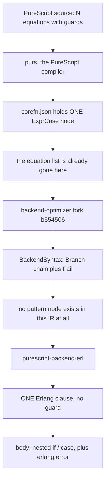

# 19 — Audit: `purescript-backend-erl`'s clause-head codegen

Research for [ticket 19](../issues/19-purescript-backend-erl-audit.md) · 2026-08-11
Feeds tickets 08, 12 and 13, and **corrects ticket 03**.

**Repo audited**: `id3as/purescript-backend-erl` — **not** `purerl/purescript-backend-erl`,
which does not exist (`git clone` → *"Repository not found"*). Cloned at HEAD
`1be3f069cdbb44b4083a256cc4696a4b225fc710`, 2026-07-30, *"Fix demand analysis: constructor
refinements must not escape Fun boundaries"*. Default branch `main`, 106 commits since
2023-09-06, 5,287 lines of PureScript across 13 modules under `src/`.

**Its optimiser dependency is a fork, not upstream.** `spago.lock:979-980` pins
`MonoidMusician/purescript-backend-optimizer` (ref `incremental-float-lets`) at rev
`b55450690959a5a16840f5bf539bfd6d8c79f35d`, not `aristanetworks/purescript-backend-optimizer`.
Every upstream-IR citation below is against that pinned rev.

**Evidence marks**: `src` = read in source, file:line given; `doc` = stated in the project's
own README; `local` = executed here, on Erlang/OTP 28 (`erlang:system_info(otp_release)` →
`"28"`). No secondary sources were used anywhere in this file.

---

## The decisive answer, up front

> **Does it emit one Erlang clause per PureScript equation, or merge into a `case`?**

**It merges — and more sharply than "merges into a `case`".** There is no path in this
backend by which any construct becomes a second Erlang clause head. A top-level Erlang
function emitted by `purescript-backend-erl` has **exactly one clause, always, with no
guard**, and that invariant is enforced by an assertion in its own source
(`Convert/After.purs:158-163`, which `unsafeCrashWith`es if the shape is anything else).

**Verified end to end** (`local`): all 44 golden-output `.erl` modules in `test-snapshots/`
compile clean under OTP 28, and across all **443** top-level functions in them, the maximum
clause count in the resulting abstract format is **1**. Not one multi-clause function head in
the entire corpus. *(Each module was compiled **in isolation**, with `-W0`, so cross-module
calls are unresolved. This is a syntactic and structural check on the committed golden files —
it is **not** a claim that the project's test suite passes, which was not run.)*

```
$ erlc -W0 *.erl                       # 44 modules, 0 failures
$ erlc +dabstr *.erl
files=44 functions=443 max_clauses_in_any_function=1
```

Nor is the merge into a `case`. Pattern matching arrives at this backend **already compiled
to a chain of boolean tests**, so the primary lowering is an Erlang **`if`** chain; a later
"mostly vanity" pass (its own words) reconstructs an idiomatic `case` where it can.

**This contradicts ticket 03**, which states the backend *"compiles PureScript's multiple
equations down to native Erlang clause heads"*. See §7 — the correction matters because
ticket 19's own framing inherits it, and because it **inverts what this audit contributes to
ticket 13**.



---

## 1. Which target form it emits, and why

**Erlang source text.** `.erl` files, printed from an internal AST by a `Dodo` pretty-printer.

- README, "Usage": *"compiles code from CoreFn in `./output` (`./output/Module.Name/corefn.json`)
  to Erlang modules in `./output-erl` (`./output-erl/Module.Name/module_name@{ps,foreign}.erl`).
  This is the same convention as purerl, just in `./output-erl` instead of `./output` to avoid
  conflicts."* `doc` [1]
- `PureScript.Backend.Erl.Printer` produces `Doc Void` documents; `printDefinition`
  (`Printer.purs:130-135`) emits text terminated by `"."`. `src` [2]

**No rationale is stated anywhere in the repo** for choosing source text over the Abstract
Format or Core Erlang. The README's "Optimizations" section discusses the pipeline in detail
and never raises the question. This is a **non-finding**, and it matches ticket 02's result
that no surveyed project except Gleam records a target rationale. Searched: `README.md` and
`opts/README.md` for `core erlang` / `abstract format` / `abstract syntax` (no matches in
either); all `-- |` doc comments in `src/`; and `git log --grep` over all 106 commits for
`core|abstract|target|emit|printer` (five hits, all about unrelated optimisations).
`src` + `doc` [3]

**Sharper still: the author demonstrably knew the alternative existed and never raised it.**
`opts/README.md:9-19` sets out the Erlang compilation pipeline — *"source (`.erl`), core
(`.core`/`.copt`), SSA (`.ssa`), BEAM (`.S`), JITted"* — as the stages to diff when studying
how `erlc` optimises code. Core Erlang appears there purely as something to *inspect*, never
as something to *emit*. And the pattern-matching experiments in `opts/matching/` are framed
entirely as competing **`case`** shapes (`no_repetition.erl` nests three `case`s;
`yes_repetition.erl` flattens to one `case` with nested tuple patterns) — **neither file uses
a multi-clause function head**, in a directory whose whole purpose is comparing ways of
writing the same Erlang. `src` [3]

**Interaction with its clause-head handling — the point ticket 19 asked for.** There is
none, in either direction. The backend does not emit a second clause head, so it never
exercises the one thing Erlang source text (like the Abstract Format, and unlike Core Erlang)
would have given it for free. **The target choice is not what constrains it** — §2 shows the
constraint arrives three hops upstream. This backend would emit identical single-clause
functions if it targeted the Abstract Format.

**Consequences carried forward to ticket 13**: source text has no line-number fidelity
(ticket 02 §7), and this backend emits no `-spec` — `Syntax.purs:20-34` has no attribute node
for one and `printAttribute` is called only for `module`, `export`, `compile` and `define`
(`Printer.purs:102-113`). So the Dialyzer question ticket 02 raised does not arise here; it is
forfeited a different way. `src` [4]

---

## 2. How multi-equation functions become Erlang

### 2.1 The decision happens three hops upstream, outside this backend

The equation list is destroyed by `purs` before this backend's input file is written.

**CoreFn has one `Case` node, not an equation list** (`CoreFn.purs:116-141`, pinned rev):

```purescript
data Expr a
  = ...
  | ExprCase a (Array (Expr a)) (Array (CaseAlternative a))
  | ExprLet a (Array (Bind a)) (Expr a)

data CaseAlternative a = CaseAlternative (Array (Binder a)) (CaseGuard a)
data CaseGuard a = Unconditional (Expr a) | Guarded (Array (Guard a))
data Guard a = Guard (Expr a) (Expr a)
```

`ExprCase` carries an `Array (Expr a)` of scrutinees and an `Array CaseAlternative` — a
multi-column pattern matrix. N source equations are already one node. `src` [5]

**backend-optimizer then compiles that matrix away entirely.** `BackendSyntax`
(`Syntax.purs:12-35`, pinned rev) has **no pattern-matching constructor at all**:

```purescript
  | Branch (NonEmptyArray (Pair a)) a
  | PrimOp (BackendOperator a)
  | Fail String
```

`Pair a a` is (condition, result) — both *expressions*. `Branch` is a boolean condition chain
with a default. Tag testing survives only as the primitive `OpIsTag (Qualified Ident)`, i.e. a
boolean operator. `Convert.purs:584` consumes `ExprCase`, `:876` builds `Branch pairs
fallback`, and `:1070-1071` defines `patternFail = make (Fail "Failed pattern match")`. `src` [6]

**So `purescript-backend-erl` never sees a pattern.** The pattern-match compilation ticket 02
priced as "the real cliff" for a BEAM-bytecode target has already been paid, twice, by the
time this backend runs — and paid into a form (boolean tests) from which clause heads cannot
be recovered. Its imports confirm it consumes exactly this IR:
`Convert.purs:35` imports `BackendSyntax(..)`, `Pair(..)` from
`PureScript.Backend.Optimizer.Syntax`. `src` [7]

**This is the answer to "where in the pipeline does the decision happen": in `purs`, and it is
not a decision anyone in the Erlang backend made or could reverse.**

### 2.2 The AST cannot express a multi-clause top-level function

`Syntax.purs:30-34`:

```purescript
data ErlDefinition
  = FunctionDefinition {- (Maybe EType) (Maybe SourceSpan) -} String (Array ErlPattern) ErlExpr
```

One name, **one** pattern array, **one** body. No clause list, no guard slot. Contrast the
anonymous-fun node three lines down at `:54`, which does have both:

```purescript
  | Fun (Maybe String) (Array (Tuple FunHead ErlExpr))
...
data FunHead = FunHead (Array ErlPattern) (Maybe Guard)
data CaseClause = CaseClause ErlPattern (Maybe Guard) ErlExpr   -- :94, ONE pattern
```

`src` [8]

The printer agrees. `printDefinition` (`Printer.purs:130-135`) emits
`name(args) -> body.` — always terminated with `"."`, never `";"`. The only `";"`-joining
paths are `Fun` heads (`Printer.purs:248`), `if` clauses and `case` clauses
(`:278`, `:288`, `trailingSemi` at `:321`). **There is no code path that prints a
`;`-separated top-level clause.** `src` [9]

And the invariant is asserted at runtime. `Convert/After.purs:158-163`:

```purescript
optimizePatternsDecl (FunctionDefinition name args expr) =
  case optimizePatterns (S.Fun Nothing [ Tuple (FunHead args Nothing) expr ]) of
    S.Fun Nothing [ Tuple (FunHead args' Nothing) expr' ] ->
      FunctionDefinition name args' expr'
    _ -> unsafeCrashWith "Did not rewrite to function of right shape in optimizePatternsDecl"
```

The definition is wrapped as a **singleton-head, `Nothing`-guard** fun for optimisation, and
the compiler **crashes** if the optimiser hands back anything else. `src` [10]

### 2.3 What the generated code actually looks like

The lowering is `Convert.purs:386-403`, twenty lines, and it is the whole story:

```purescript
  Branch b o -> do
    let
      goPair (Pair c e) = Tuple (codegenExpr codegenEnv c) (codegenExpr codegenEnv e)

      go (Tuple c e) ee | S.guardExpr c =
        S.If $ S.IfClause (S.Guard c) e NEA.: case ee of
          S.If clauses -> clauses
          _ -> NEA.singleton (S.IfClause (S.Guard $ S.Literal $ S.Atom "true") ee)
      go (Tuple c e) ee =
        S.Case c
          ( S.CaseClause (S.MatchLiteral (S.Atom C.true_)) Nothing e NEA.:
              NEA.singleton (S.CaseClause S.Discard Nothing ee) )

    foldr go (codegenExpr codegenEnv o) (goPair <$> b)
```

A right fold over the condition list into nested `if`/`case`. If the condition is
BEAM-guard-legal → an `if` clause; otherwise → `case Cond of true -> …; _ -> …`. See §3. `src` [11]

**Golden output, four two-column patterns** (`test-snapshots/src/snapshots-input/Snapshot.Branch.purs`
→ `snapshots-output/Snapshot.Branch.erl`). Source:

```purescript
i :: Boolean -> Boolean -> Boolean
i = case _, _ of
  true, true -> false
  false, false -> true
  false, true -> false
  true, false -> true
```

Emitted — **one clause**, `if` chain, and note the pattern structure is gone entirely, replaced
by boolean tests on the raw variables:

```erlang
i(V, V1) ->
  if
    V       -> not V1;
    not V1  -> true;
    V1      -> false;
    true    -> erlang:error({fail, <<"Failed pattern match">>})
  end.
```

`src` [12]

**Golden output, five equations with record patterns, a boolean guard and a pattern guard**
(`Snapshot.PatternGuardDemand.purs` → `.erl`). Five PureScript equations become **one**
`processE/3` clause whose body is ~120 lines of nested `case`, `if` and closures. Head:

```erlang
processE( V
        , V1 = #{ dropping := V1@1, metrics := V1@2, pending := V1@3, pipeline := V1@4 }
        , V2 = #{ payload := #{ p := V2@1, pts := V2@2 } }
        ) ->
```

Patterns *do* appear in that head — but they are not clause dispatch. They are
**demand-derived destructuring**, hoisted by `choosePattern` (`Convert/After.purs:185-190`),
which rewrites a `BindVar v` into a `MatchBoth v pat` when demand analysis proves every path
projects those fields. They must be **irrefutable**, because all five source equations share
this one head. That is exactly where its worst bug lives — §6. `src` [13]

**The one multi-clause construct in the whole corpus** is an anonymous `fun`, and it comes
from a hand-written foreign specialisation, not from equation codegen.
`Convert/Foreign.purs:152-163` maps over a record of variant handlers:

```purescript
  , func "Erl.Data.Variant.match" $ partial ado
    ...
    in S.Fun Nothing $ fns <#> \(Prop variantType fn) -> Tuple
      do S.FunHead [S.MatchMap [Tuple "type" (S.MatchLiteral (S.Atom variantType)),
                                Tuple "value" (S.BindVar "Value")]] Nothing
```

producing, in `Snapshot.Erl.Data.Variant.erl`:

```erlang
fun
  (#{ type := a, value := Value }) -> ...;
  (#{ type := b, value := Value }) -> ...
end
```

Multi-clause dispatch exists in this backend, is reachable, and is used for **exactly one
library function**. `src` [14]

---

## 3. Guards

**The backend emits zero Erlang guards.** `grep -n 'when ' test-snapshots/src/snapshots-output/*.erl`
returns **no matches** across all 44 golden files. `src` [15]

That is structural, not incidental. Every `FunHead` and `CaseClause` construction site in
`src/` passes `Nothing` in the guard slot (`Syntax.purs:429,438,507`; `Calling.purs:473,481`;
`Convert.purs:400-401,550`; `Convert/Foreign.purs:53,159`; `Convert/After.purs:436,664`;
`:677`). The `mg`/`mg'` occurrences in `Convert/After.purs:423,433,597,604` and
`Convert/Scoping.purs:178-194` only **thread an existing** `Maybe Guard` through
(`opdg mg = traverse (coerce opd) mg`, `After.purs:181-182`); none constructs a `Just`. `src` [16]

**Where BEAM guard restrictions are enforced instead: the `if` head.** Erlang's `if` clause
conditions *are* guard sequences, so the same restriction applies one level down.
`Syntax.purs:356-371` is the gate, and its own doc comment names the job:

> *"Check whether an expression is a guard expression, able to be used in if expressions and
> case guards"*

```purescript
guardExpr :: ErlExpr -> Boolean
guardExpr = case _ of
  Literal _ -> true
  Var _ _ -> true
  ...
  FunCall (Just (Literal (Atom mod))) (Literal (Atom fn)) args ->
    Array.elem (Tuple mod fn) guardFns && all guardExpr args
  BinOp _ e1 e2 -> guardExpr e1 && guardExpr e2
  Macro "IS_KNOWN_TAG" margs -> maybe false (all guardExpr <<< NEA.toArray) margs
  _ -> false
```

`guardFns` (`:373-412`) is a hardcoded whitelist of **36 `erlang:` function names**. Compared
with ticket 02's `erl_internal:guard_bif/2` set of 37 names, the only omission is
`is_record`, with the source comment `-- , "is_record" -- has some side-conditions`. It is
name-based, not arity-based, so `is_function/1` and `/2` are one entry. `src` [17]

**What happens to a guard that cannot be a BEAM guard: it is demoted to a `case` scrutinee**
— `Convert.purs:397-401`, the second `go` clause. The generated form is
`case <arbitrary expression> of true -> …; _ -> …`. Visible in the golden output for the
boolean-guarded equation of `processE`, whose condition calls a memoised `any` and so cannot
be a guard:

```erlang
case ?IS_KNOWN_TAG(just, 1, V1@4)
    andalso (not (((any())(fun (V3) -> V3 =:= (erlang:map_get(source, V2)) end))
                  (erlang:map_get(order, V1)))) of
  true -> fun () -> 1 end;
  _    -> V@1()
end
```

`src` [18]

**This is the cleanest answer this audit gives to ticket 08.** PureScript's guards are
unrestricted expressions; the backend does not attempt to translate them into BEAM guards and
then fall back. It classifies syntactically up front, routes guard-legal conditions into `if`
and everything else into `case … of true`, and **never uses a `when` at all** — sidestepping
ticket 02 §6's fail-to-false subtleties entirely, because a `case` scrutinee that raises
raises, with no clause-failure semantics to reason about.

A hand-rolled macro extends the guard-legal set: `IS_KNOWN_TAG` (`Syntax.purs:518-527`)
expands to `is_tuple(V) andalso (Arity+1 =:= tuple_size(V)) andalso (Tag =:= element(1,V))`
— all guard BIFs — so a constructor-tag test stays guard-legal after macro expansion, which
is why `guardExpr` whitelists the macro by name at `:370`. `src` [19]

---

## 4. Pattern coverage and the `Partial` constraint

**`Partial` does not survive to the backend.** It is a type-class constraint, and `purs`
erases constraints into dictionary arguments before CoreFn. The only trace in the entire
backend is one line of FFI codegen, `Convert/Foreign.purs:183`:

```purescript
  , func "Partial._unsafePartial" $ S.curriedApp <$> codegenArg <@> [S.atomLiteral "unit"]
```

`unsafePartial` is compiled to *applying the argument to the atom `unit`* — the `Partial`
dictionary is a value with no members and is discharged as `unit`. Every other `Partial` hit
in `src/` is PureScript's own `Partial.Unsafe` used **by the compiler's own code**
(`Utils.purs:60`, `Calling.purs:34`, `Foreign/Analyze.purs:9`), not codegen. `src` [20]

**Consequently the backend has no exhaustiveness knowledge and never reasons about coverage.**
It emits the failure arm unconditionally wherever the upstream IR put a `Fail`.
`Convert.purs:419-423`:

```purescript
  Fail i ->
    S.FunCall (Just $ atomLiteral C.erlang) (atomLiteral C.error)
      [ S.Tupled [ S.atomLiteral "fail", S.stringLiteral i ] ]
```

→ `erlang:error({fail, <<"Failed pattern match">>})`. The decision to insert it was made
upstream, at `backend-optimizer`'s `patternFail` (`Convert.purs:1070-1071`, pinned rev). `src` [21]

**Nothing is emitted that a partial function would not also get, and `function_clause` never
happens by design** — with a single clause and no head guard, an in-range call always matches
the head, and non-coverage surfaces as `erlang:error({fail, …})` from the fallthrough arm
instead. `function_clause` from a `purescript-backend-erl` module is therefore a *symptom of a
backend bug*, not of source partiality — which is precisely how the July 2026 regression in §6
manifested.

**Decision-relevant contrast for ticket 12.** Ticket 02 §2 established that the Erlang
compiler omits `primop 'match_fail'` when it can see the clauses are exhaustive
(present for `handle_call/3`, absent for `classify/1`). `purescript-backend-erl` **cannot make
that decision** — it has no coverage information at all — so it pays for a failure arm in
every non-total branch. beam-sharp is in the opposite position: ticket 04's checker computes
exactly the fact that would let it omit the arm. This backend is evidence of the cost of
*not* having that information, not a model for what to do with it.

---

## 5. Arity and currying

**Every declaration is emitted twice: a nullary curried entry point and an n-ary uncurried
one, and both are exported.** `Convert.purs:280-288`:

```purescript
    Abs vars e ->
      callThisAs (callPS (Curried (void vars))) (callErl (void (NEA.toArray vars)))
      let Tuple epats evars = locals vars in
      [ const $ FunctionDefinition i [] $ case NEA.length vars of
          1 -> S.FunName Nothing (S.Literal (S.Atom i)) 1
          _ -> S.curriedFun epats $ S.FunCall Nothing (S.Literal (S.Atom i)) evars
      , \codegenEnv -> FunctionDefinition i (toErlVarPat <$> NEA.toArray vars) $ codegenExpr codegenEnv e
      ]
```

Two `FunctionDefinition`s, same name, different arity. Exports follow mechanically —
`Convert.purs:160-163`:

```purescript
definitionExports = case _ of
  FunctionDefinition f a _ -> Export f (Array.length a)
```

`src` [22]

Visible in every golden module's export list, e.g. `Snapshot.Branch.erl`:
`-export([ i/0, i/2, h/0, h/1, g/0, g/1, f/0, f/3, result/0, dontInlineMe/0, dontInlineMe/1 ])`.
The `f/0` form returns nested closures; the `f/3` form does the work:

```erlang
f() -> fun (X) -> fun (Y) -> fun (Z) -> f(X, Y, Z) end end end.
f(X, Y, Z) -> if X -> ...; true -> 3 end.
```

At arity 1 the wrapper is optimised to `fun f/1` (`h() -> fun h/1.`), and nullary declarations
get only the `f/0` form, memoised via `?MEMOIZE_AS` when
`estimatedComplexity >= 16` (`Convert.purs:309-318`, `Syntax.purs:528-539`). `src` [23]

**How the arity is chosen, and the cost.** Ticket 03 recorded that purerl applies to the right
number of arguments "based on export arity" — via the Haskell compiler API. **This backend
works differently and the README says so explicitly**, which is the more useful finding:

> *"Unlike `purerl`, which can access externs through the Haskell API of the compiler,
> `backend-erl` does not have access to the types of declarations. This necessitates
> generating uncurrying based on the function **code** after optimization, not the **types**.
> This makes it less predictable and may change the public API of PureScript modules in their
> Erlang form."*
> — README, "Uncurrying" `doc` [24]

The mechanism is a `Conventions` map (`Convert.purs:73-84`, `Calling.purs`) threaded across
modules and accumulated into `AcrossModules`, plus a transitive pass `uncurryMore`
(`Convert.purs:70-73`): *"If `g` calls `f` with two arguments and a `f/4` uncurrying exists,
then a `g/2` uncurrying is also generated that calls `f/4`."* `doc` + `src` [25]

**The costs, stated by the project itself**: the public Erlang API is code-derived and
therefore unstable across optimiser changes; generated non-nullary functions may be curried,
uncurried or uncurried-effectful depending on their definition, whereas *FFI* non-nullary
functions are always curried; and generated nullary functions are guaranteed pure wrappers.
That last is a real convention: it is what makes `f()` safe to call for a closure. `doc` [26]

For beam-sharp this is a **counter-example, not a template**: the dual-arity export exists to
bridge a curried source language onto an arity-keyed VM. beam-sharp's surface is not curried,
so it inherits neither the mechanism nor the instability — but the map's open question about
"function identity — BEAM identifies functions by name *and* arity" gets a concrete data
point: purerl's successor answers it by exporting **both** and letting call sites pick.

---

## 6. Known limitations and failure modes

The brief asked for these prominently. They are the most valuable part of this audit, because
they are all in the same place: **the single shared head**.

### 6.1 The July 2026 production regression — refinements escaping into the head

HEAD commit `1be3f06`, and the code comment is worth quoting nearly in full
(`Convert/After.purs:376-395`):

> *"Demand that escapes a function boundary must not carry constructor refinements. A `Fun` is
> **defined** unconditionally but may only ever be **called** under the branch conditions that
> established the refinement — e.g. a fallthrough continuation for a pattern-guarded clause,
> whose body checks `?IS_KNOWN_TAG(just, ...)` with an unreachable `error({fail, _})` sibling,
> so the `{just, _}` refinement survives `alts`' additive combine (soundly: IF the body runs,
> the tag holds). Multiplying that demand into the definition site turns the conditional fact
> into an unconditional one, and `choosePattern` then stamps a refutable `{just, _}` into an
> enclosing pattern — in the worst case a function head, making the source function's
> `Nothing` clauses unreachable (live paths die with function_clause; this broke
> `Avp.Spectrum.Video.Processor.processInput` in norsk, 2026-07-30)."*

The fix strips ADT constructor tags from escaping demand while keeping record/field demand,
on the stated ground that *"map patterns over well-typed inputs are irrefutable, so they only
add correct destructuring"*:

```purescript
irrefutable :: Demand -> Demand
irrefutable (DemandADT n _ fields) = DemandADT n Nothing (irrefutable <$> fields)
irrefutable (DemandRecord n fields) = DemandRecord n (irrefutable <$> fields)
irrefutable d = d
```

`src` [27]

**The lesson generalises directly to beam-sharp, and it is a warning about the *opposite*
architecture.** Because all source equations share one Erlang head, any fact hoisted into that
head must hold on *every* path. The demand analysis derived a fact that held only on the path
where it was observed, and hoisting it silently deleted live branches — with no compile-time
error, in a shipped product, caught only at runtime as `function_clause`. **A backend that
emitted one clause per equation could not have had this bug**: a per-clause pattern is scoped
to its clause by construction, so there is nothing to over-generalise. This is a cost of
merging, paid in production.

Note also that `norsk` is id3as's commercial product — the same commercial dependency ticket
03 identified as the reason purerl survives where Hamler, Caramel and Alpaca did not.

### 6.2 The demand analysis is where the bugs cluster

`git log --grep` over 106 commits, plus the bug-named regression snapshots the project keeps:

| Snapshot | What it pins down |
|---|---|
| `Snapshot.PatternGuardDemand` | 6.1 — refinements escaping `Fun` boundaries |
| `Snapshot.DisappearingBindingBug` | commit `988d3d8` *"Repro for disappearing let body bug"* |
| `Snapshot.FnXLazyBug` | `FnX` + laziness interaction |
| `Snapshot.LazyInit.Fail` / `.Success` | initialisation order |
| `Snapshot.Dodgy`, `Snapshot.Scoping`, `Snapshot.Prime` | Erlang's scoping rules vs PureScript's |

Other fix commits: `7b9fe83` *"Fix bug in codegenList's appendImpl that was dropping data"*,
`1e9d4a2` *"Fix codegen bug around short-circuiting operators"*, `f4a96c9` *"Pass to fix
scoping mismatch between PureScript and Erlang"*, `efcd65f` *"Fix recursive functions, name
clash and arity > 1"*. `src` [28]

The README names the underlying hazard itself: *"Erlang has weird scoping rules, so the final
step of codegen is renaming local variables throughout the whole AST"* — a whole-AST rename
pass (`Convert/Scoping.purs`, 274 lines) run **twice** (`Convert/After.purs:168-174`,
*"Run it twice since otherwise there are gaps in the chosen numbered variables"*). `doc` + `src` [29]

### 6.3 Self-declared limitations

From the README, verbatim: `doc` [30]

- *"bigint literals are currently unsupported and you will get JSON decoding errors if you use
  them in your source code."*
- *"due to inlining, inlining of `div` for `Int` will occur more often, and this optimization
  is **unsafe** since it is optimized to `div` in Erlang which has different semantics for
  negative numbers and dividing by zero."*
- *"The generated Erlang files will not be compatible"* with purerl's, though FFI files are.
- *"Not all tests have assertions (yet)."*
- The `optimizeIf` → `caseOn` reconstruction is self-described as *"admittedly this is mostly
  vanity"* (`Convert/After.purs:650-652`) — it exists to make the output read like idiomatic
  Erlang, and bails out to a plain `if` chain whenever the shape does not fit
  (`caseOn` returns `Maybe`, `:668-679`). `src` [31]

### 6.4 Open issues: a non-finding

**The repository has zero issues, open or closed.** `list_issues` over `id3as/purescript-backend-erl`
with no state filter returns `totalCount: 0`. There is no tracker content to mine at all, so
everything in §6.1–6.3 comes from source comments, commit messages and the README instead.
Pull requests were **not** searched. The repo has 16 stars and 1 fork. `src` [32]

---

## 7. Correction to ticket 03 — and what it does to ticket 13

**The claim.** `wayfinder/research/03-prior-art-static-multiclause.md:15` and its comparison
table state that *"the successor backend emits **native Erlang clause heads**"*, sourced to
claim `[4]`, which cites this same commit `1be3f06`:

> *"Source clauses compile to native Erlang function heads — and a July 2026 bugfix describes a
> pattern being stamped 'in the worst case the function head, making the source function's
> Nothing clauses unreachable and crashing live code paths with `function_clause`'."*

**Why it is wrong.** The commit is being read backwards. It does not report that source
clauses become heads; it reports that a **demand-derived, over-generalised** pattern was
wrongly stamped into the one head that all the source clauses share, breaking them. The phrase
*"the source function's `Nothing` clauses"* refers to **PureScript** clauses, which is exactly
why the failure was a single `function_clause` — there is only ever one Erlang head to fail
against. Ticket 03's own §"Related, and less obvious" already half-sensed this, noting that
"source clauses surviving to native Erlang clause heads is a non-trivial optimisation, not a
free win"; the correction is that it is not an optimisation the backend performs at all.

**Scope note**: ticket 03's file and issue are outside this ticket's write scope. Neither was
edited. The correction is flagged here and to the team lead; the edit is ticket 03's to make.
The affected items are: `research/03…md:15`, its comparison-table row for
`purerl (+ purescript-backend-erl)` (column "Multi-clause heads?"), claim `[4]`, and
`issues/03…md:35-37` [33]. **The rest of ticket 03 is unaffected** — the commercial-dependency
finding, the Alpaca precedent, the Gleam analysis and the `Partial`-constraint characterisation
all stand, and this audit independently corroborates the norsk/commercial-dependency point.

**What this does to ticket 13 — the inversion.** Ticket 19's brief calls this backend *"the
closest existing implementation of the exact codegen beam-sharp needs."* It is not. What the
audit actually establishes is stronger and points the other way:

> **No BEAM backend fed by a curried functional frontend emits native clause heads.** Combined
> with ticket 02's survey — Gleam refuses multi-clause heads in the surface language; Hamler
> and Alpaca (both dormant) flatten to one `c_fun` + `c_case`; purerl emits one clause plus a
> `case`; and now its successor emits one clause plus an `if` chain — **every** surveyed
> functional-frontend BEAM compiler merges. Only LFE and Elixir, whose surface languages have
> multi-clause heads natively and which both target the **Abstract Format**, emit them.

That is not a discouraging result for beam-sharp. It says the merging is a property of the
*frontends* — curried, pattern-matrix-compiling, HM-descended — rather than of the BEAM.

**Be careful about the direction of causation here.** LFE and Elixir do not keep clause heads
*because* they target the Abstract Format; they keep them because their **surface syntax has
multi-clause heads**, so there are clauses to preserve in the first place. LFE preserved them
for years while emitting **Core Erlang**, and switched to the Abstract Format in 2018 for
`debug_info`, not for clause heads (ticket 02, claim 19). The honest statement is that the
target **enables** clause-head preservation; the frontend is what **decides** whether there is
anything to preserve.

That is precisely why this backend is a counter-example rather than a template. beam-sharp is
in **LFE's** position, not PureScript's: native multi-clause heads in the surface, and no
pattern-matrix flattening upstream to undo. So the merging observed here is not a constraint
beam-sharp inherits — and purescript-backend-erl's target choice is not what constrains it
either (§1), so this audit adds no evidence *against* the Abstract Format for ticket 13.

One incidental correction, outside scope and outside this ticket, flagged for whoever works
ticket 13: `issues/13-compilation-target-decision.md` says *"Gleam and LFE both route through
Core Erlang."* Ticket 02's own findings contradict both halves — Gleam has **never** emitted
Core Erlang (claim 15) and LFE **left** Core Erlang for the Abstract Format in January 2018
(claim 19).

---

## 8. What could not be established

1. **Any stated rationale for the target choice.** Searched `README.md` and `opts/README.md`
   for `core erlang` / `abstract format` / `abstract syntax` (no matches), all `-- |` doc
   comments in `src/`, and `git log --grep` over all 106 commits for
   `core|abstract|target|emit|printer`. Not found. Reported as "searched, not proven absent" —
   I did not read every commit diff, only messages.
2. **Whether the project ever considered emitting Abstract Format or Core Erlang.** No commit,
   comment or README text discusses it.
3. **Pull requests.** Issues were established to be zero, open *and* closed
   (`list_issues`, no state filter, `totalCount: 0`). PRs were **not** searched, so §6 is
   sourced entirely from code, commit messages and the README.
4. **Whether `purs` has ever represented multi-equation functions as anything but a single
   `ExprCase` in CoreFn.** Established for the CoreFn schema the pinned optimiser fork decodes
   (`CoreFn.purs:116-141`); the `purescript/purescript` compiler's own desugaring source was
   not read, and no version history was checked.
5. **Whether upstream `aristanetworks/purescript-backend-optimizer` differs from the pinned
   `MonoidMusician` fork** in the parts cited. The `BackendSyntax` and `Expr` definitions were
   spot-checked at upstream `main` and matched, but no systematic diff was done, and all
   citations are against the pinned rev.
6. **Nothing in this project was built or run.** No `spago`/`npm`/PureScript toolchain was
   installed and no compilation of PureScript to Erlang was attempted. All `local` claims are
   `erlc`/`erl` run against the **checked-in golden output files** on OTP 28 — which is why
   those files are marked `src` (they are committed source), and only the compilation results
   are `local`.
7. **Whether any real-world purerl codebase produces a multi-clause head** by some route the
   44-module snapshot corpus does not exercise. The AST and printer make it impossible (§2.2),
   but the corpus is the test corpus, not production code. Relatedly, the 44 modules were
   compiled **in isolation** with `-W0` — this is a structural check on committed golden files,
   **not** a run of the project's test suite, which was not attempted (see 6).
8. **The `Erl.Data.Variant.match` multi-head fun's provenance in the source language** — it is
   emitted by a hand-written specialisation and I did not trace what PureScript source shape
   triggers it beyond the snapshot.

---

## Claim → source

| # | Claim | Source | Kind |
|---|---|---|---|
| — | The repo is `id3as/purescript-backend-erl`, not `purerl/…`; HEAD `1be3f06`, 2026-07-30, 106 commits | `git clone`; `git log` | src |
| — | Its optimiser dependency is the fork `MonoidMusician/purescript-backend-optimizer` @ `b554506`, ref `incremental-float-lets` | `spago.yaml:140-143`; `spago.lock:979-980` | src |
| — | **All 44 golden `.erl` modules compile clean on OTP 28 (in isolation, `-W0`); across 443 functions the max clause count is 1.** Not a test-suite run | `erlc -W0 *.erl`; `erlc +dabstr` + `file:consult` clause count | local |
| 1 | It emits Erlang **source text**, `module_name@ps.erl`, from `corefn.json` | README, "Usage" | doc |
| 2 | `printDefinition` emits `name(args) -> body.` — terminated with `"."` | `Printer.purs:130-135` | src |
| 3 | No rationale for the target is stated anywhere in the repo | README, `opts/README.md`, module docs, `git log --grep` — searched, not found | src + doc |
| 4 | It emits no `-spec`; `printAttribute` is called only for `module`, `export`, `compile`, `define` | `Syntax.purs:20-34`; `Printer.purs:102-113,128` | src |
| 5 | CoreFn carries **one** `ExprCase` node with a multi-column matrix — the equation list is gone before this backend's input file exists | `CoreFn.purs:116-141` @ `b554506` | src |
| 6 | `BackendSyntax` has **no** pattern node: `Branch (NonEmptyArray (Pair a)) a`, `Fail String`, `OpIsTag` | `Syntax.purs:12-35`; `Convert.purs:584,876,1070-1071` @ `b554506` | src |
| 7 | The backend consumes exactly that IR | `Convert.purs:30-35` (imports) | src |
| 8 | `FunctionDefinition String (Array ErlPattern) ErlExpr` — one pattern list, one body, **no clause list, no guard slot**; `Fun`/`FunHead` do have both; `CaseClause` carries **one** pattern | `Syntax.purs:30-34,54,92-94` | src |
| 9 | No code path prints a `;`-separated top-level clause; `;` is used only for `Fun` heads, `if` and `case` | `Printer.purs:130-135,248,278,288,321` | src |
| 10 | The single-head, no-guard shape is **asserted**: `unsafeCrashWith "Did not rewrite to function of right shape"` | `Convert/After.purs:152-163` | src |
| 11 | The lowering: right fold over the `Branch` chain into nested `if` (guard-legal) or `case … of true` (not) | `Convert.purs:386-403` | src |
| 12 | Four two-column PureScript patterns → **one** `i/2` clause containing an `if` chain | `Snapshot.Branch.purs` → `Snapshot.Branch.erl` | src |
| 13 | Five equations with guards and a pattern guard → **one** `processE/3` clause; head patterns are demand-derived destructuring via `choosePattern`, not dispatch | `Snapshot.PatternGuardDemand.{purs,erl}`; `Convert/After.purs:184-200` | src |
| 14 | The only multi-clause construct emitted anywhere is an anonymous `fun` from the hand-written `Erl.Data.Variant.match` specialisation | `Convert/Foreign.purs:152-163`; `Snapshot.Erl.Data.Variant.erl` | src |
| 15 | **`when` appears zero times in all 44 golden output files** — no Erlang guard is ever emitted | `grep -n 'when ' snapshots-output/*.erl` → no matches | src |
| 16 | Every `FunHead`/`CaseClause` construction site passes `Nothing`; `opdg`/`oprg` only thread an existing guard | `Syntax.purs:429,438,507`; `Convert.purs:400-401,550`; `Convert/After.purs:181-182,423,433,597,604`; `Convert/Scoping.purs:178-194` | src |
| 17 | BEAM guard restrictions are enforced by `guardExpr` against a hardcoded 36-name `erlang:` whitelist; only `is_record` is omitted vs Erlang's set, commented *"has some side-conditions"* | `Syntax.purs:356-412` | src |
| 18 | A non-guard-legal condition is demoted to `case <expr> of true -> …; _ -> …` | `Convert.purs:397-401`; `Snapshot.PatternGuardDemand.erl` | src |
| 19 | The `IS_KNOWN_TAG` macro expands to guard BIFs only and is whitelisted by name, keeping tag tests guard-legal | `Syntax.purs:370,518-527` | src |
| 20 | `Partial` is erased before the backend; `unsafePartial` compiles to applying the argument to the atom `unit` | `Convert/Foreign.purs:183`; no other codegen hit for `Partial` in `src/` | src |
| 21 | Non-coverage always emits `erlang:error({fail, <<"Failed pattern match">>})`; the decision was made upstream | `Convert.purs:419-423`; `Convert.purs:1070-1071` @ `b554506` | src |
| 22 | Every declaration is emitted twice — nullary curried wrapper + n-ary uncurried — and both exported at their own arity | `Convert.purs:280-288,160-163` | src |
| 23 | Arity-1 wrappers optimise to `fun f/1`; nullary declarations memoise via `?MEMOIZE_AS` above complexity 16 | `Convert.purs:283,309-318`; `Syntax.purs:528-539`; `Snapshot.Branch.erl` | src |
| 24 | Uncurrying is derived from **code, not types**, because the backend has no access to externs — *"makes it less predictable and may change the public API"* | README, "Uncurrying" | doc |
| 25 | Uncurrying is transitive via a cross-module `Conventions` map and an `uncurryMore` pass | README, "Uncurrying"; `Convert.purs:70-73,73-84`; `Calling.purs` | doc + src |
| 26 | Generated nullary functions are guaranteed pure wrappers; generated non-nullary may be curried/uncurried/uncurried-effectful; FFI non-nullary are always curried | README, "Uncurrying" | doc |
| 27 | **The July 2026 regression**: a conditional constructor refinement was multiplied into the definition site and stamped into the function head, making the source `Nothing` clauses unreachable — live paths died with `function_clause`, breaking `Avp.Spectrum.Video.Processor.processInput` in norsk | `Convert/After.purs:376-395` (comment + `irrefutable`); commit `1be3f06` | src |
| 28 | Bug history clusters in demand analysis, scoping and laziness — regression snapshots plus fix commits `7b9fe83`, `1e9d4a2`, `f4a96c9`, `efcd65f`, `988d3d8` | `git log`; `test-snapshots/src/snapshots-input/` | src |
| 29 | Erlang's scoping rules force a whole-AST variable rename, run **twice** | README, "Optimizations"; `Convert/Scoping.purs`; `Convert/After.purs:165-175` | doc + src |
| 30 | Self-declared limitations: bigint literals unsupported; `Int` `div` inlining is **unsafe**; generated Erlang incompatible with purerl's; not all tests have assertions | README | doc |
| 31 | `optimizeIf`/`caseOn` reconstructs an idiomatic `case` from an `if` chain, is self-described as *"mostly vanity"*, and bails to a plain `if` when the shape does not fit | `Convert/After.purs:650-679` | src |
| 32 | The repo has **zero issues, open or closed** (`totalCount: 0`), 16 stars, 1 fork — no tracker content to mine; PRs not searched | `list_issues` on `id3as/purescript-backend-erl`, no state filter; GitHub repository search | doc |
| 33 | **Ticket 03 is wrong** that the backend emits native Erlang clause heads; commit `1be3f06` reports the opposite — an over-generalised pattern wrongly stamped into the one shared head | this file §2, §6.1 vs `research/03…md:15`, claim [4] | src |
